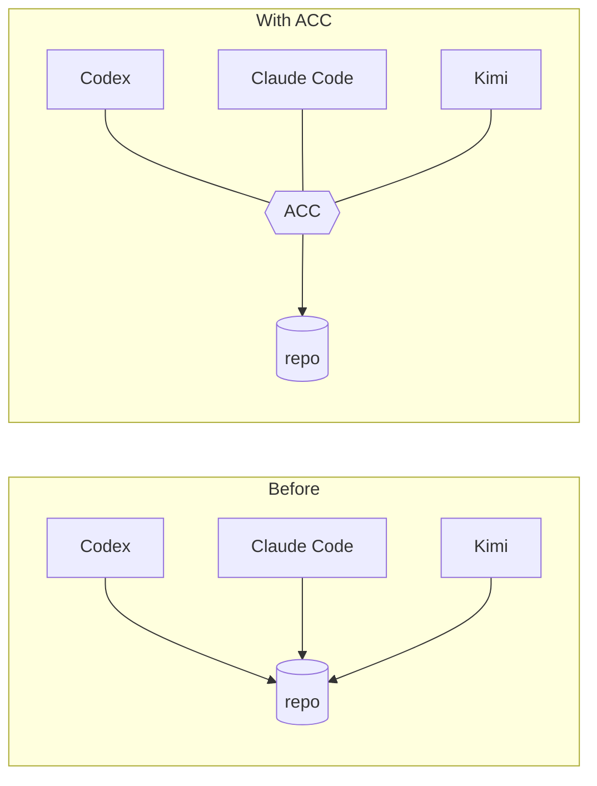
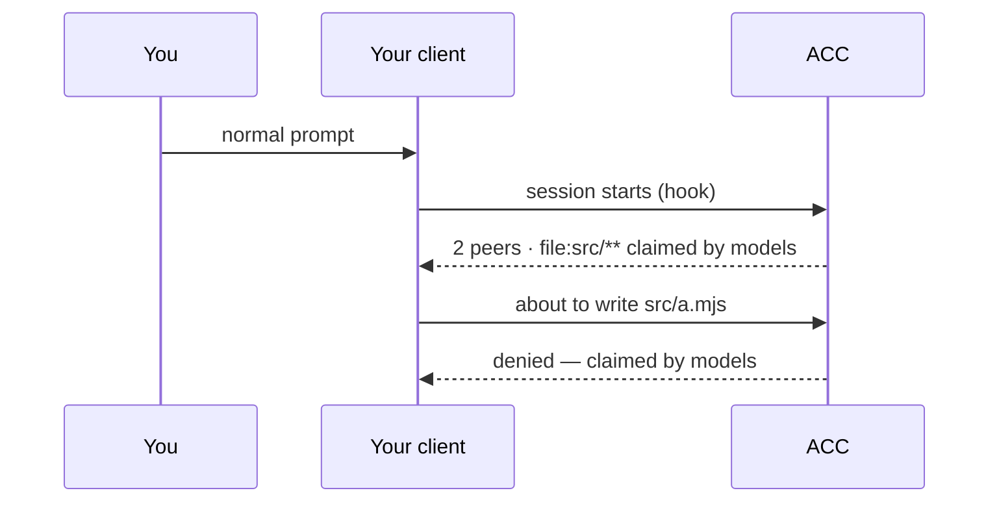

# agents-can-communicate

[](https://github.com/automatis-tools/agents-can-communicate/actions/workflows/ci.yml)
[](LICENSE)
[](https://nodejs.org)

Two agents editing the same repo don't know about each other. ACC is the layer that makes
them aware — without one of them being in charge.



Each session keeps its own model, permissions, context, and human. ACC adds only what they
share: **who is here, what they're doing, and what's already claimed.**

## Install

Not on npm yet. From a clone:

```bash
npm ci
npm pack
npm install -g ./agents-can-communicate-*.tgz
```

That gives you `acc`, `acc-hook`, and `acc-mcp`. Then wire up whichever clients you have:

<!-- test:command -->
```bash
acc install --dry-run
```

Shows exactly what would change. Drop the flag to apply it, and `acc uninstall` to take it
back out — it removes only what it wrote, and only if the bytes still match.

## What happens then



No new commands to learn. Attach, presence, and guards happen inside the session.

## Alone? Nothing changes

One session pays nothing: no injected context, no banners, no protocol. Coordination
starts when a second session shows up.

## Supported clients

| Client | Attach | Guard writes | Inject context | Heartbeat |
|---|---|---|---|---|
| Codex | yes | yes¹ | yes | – |
| Claude Code | yes | yes | yes | – |
| Gemini CLI | yes | yes² | yes | – |
| Kimi Code | yes | yes | yes | yes |
| Any MCP client | yes | – | – | – |

¹ models that use `apply_patch` · ² approval modes that expose edit tools ·
full detail in [CAPABILITIES.md](docs/CAPABILITIES.md)

## Docs

| Using it | Understanding it | Building on it |
|---|---|---|
| [Getting started](docs/GETTING_STARTED.md) | [Concepts](docs/CONCEPTS.md) | [Writing an adapter](docs/ADAPTER_AUTHORING.md) |
| [CLI](docs/CLI.md) | [Architecture](docs/ARCHITECTURE.md) | [Protocol](docs/PROTOCOL.md) |
| [Configuration](docs/CONFIGURATION.md) | [Capabilities, measured](docs/CAPABILITIES.md) | [Security model](docs/SECURITY_MODEL.md) |
| [MCP](docs/MCP.md) | [Design decisions](docs/DESIGN_DECISIONS.md) | [Threat model](docs/THREAT_MODEL.md) |
| [Troubleshooting](docs/TROUBLESHOOTING.md) | [Prior art](docs/PRIOR_ART.md) | [Releasing](docs/RELEASING.md) |

Examples: [three workstreams](examples/three-workstreams.md) ·
[research, no Git](examples/non-git-research.md)

Contributing: [AGENTS.md](AGENTS.md) — the rules, and why the tests are shaped that way.

## Requirements

Node 24+, macOS or Linux. No database, no daemon, no service. Git optional.

Windows is not supported yet — the reasons are measured and listed in
[CHANGELOG.md](CHANGELOG.md).

## License

MIT — see [LICENSE](LICENSE).
