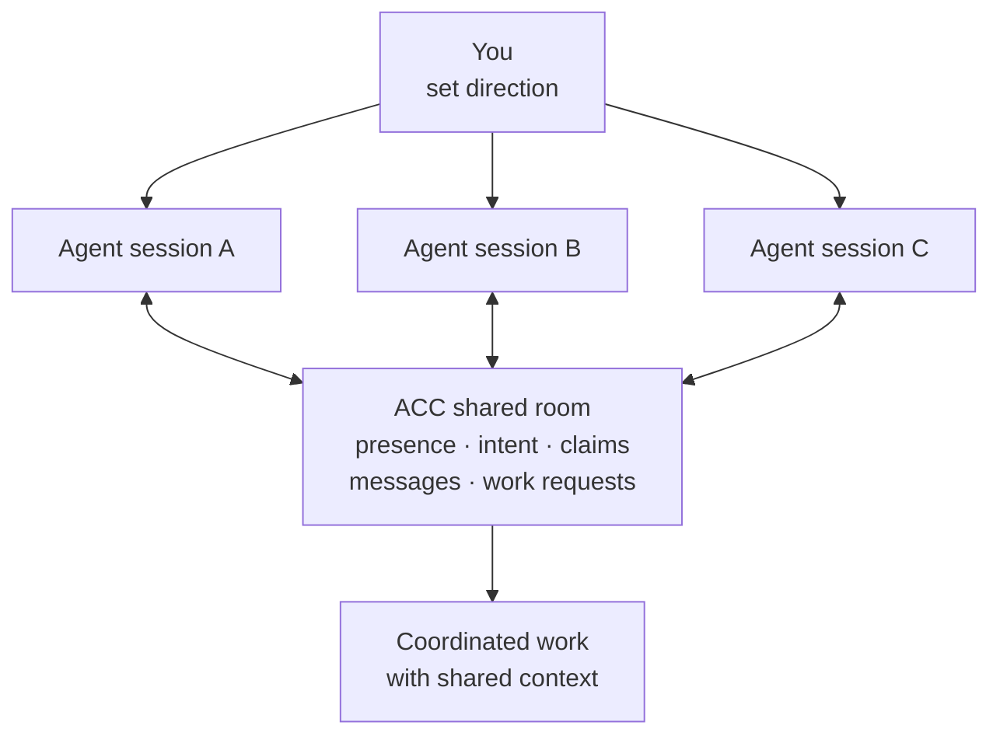
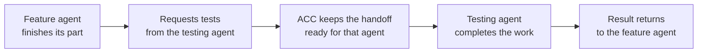

# agents-can-communicate

[](https://github.com/automatis-tools/agents-can-communicate/actions/workflows/ci.yml)
[](LICENSE)
[](https://nodejs.org)

**Give every agent session a shared room for coordination. Keep your attention on the
work.**

ACC is a local-first coordination layer for the AI agent sessions you already opened. It
gives them shared presence, intent, claims, messages, and work requests while every
session keeps its own authority.

Coordination runs locally on your machine. Raw transcripts stay private. The runtime is
built entirely on Node's standard library.



## You opened more agents. You became the coordinator.

One session implements. Another writes tests. A third reviews. At first, more agents means
more work gets done.

Then you start copying context between windows. You warn two agents away from the same
file. You relay a question, return with the answer, and try to remember which terminal was
waiting for what. The agents are capable; they need a room they can share.

ACC gives them that room. Each session stays in its original client, checkout, and trust
boundary. You still decide when it starts and stops. ACC only supplies the coordination
that was previously passing through you.

## A handoff the agents carry themselves

One agent finishes building a feature and sees that its final tests still need work. It
asks the testing agent to take over, including a short summary of what is ready and what
remains.



The request stays with the testing agent across terminal restarts. When that agent returns,
it receives the handoff, completes the tests, and sends the result back. You choose the
direction and review the outcome; the agents carry the context between them.

## Install

Run these commands in a terminal on each macOS or Linux machine where your agent clients
run:

```bash
npm install -g agents-can-communicate
acc install
```

The first command makes `acc` available across the machine. The second finds Codex,
Claude Code, Gemini CLI, and Kimi Code installations and activates the integrations that
are available. Codex completes activation after you trust the plugin; `acc doctor` shows
the current state.

`acc install` names every client setting it activated and how to undo it.

Open or restart your agent client inside a project. Each new session joins that project's
room automatically. Open another session in the same project and the two can coordinate;
run `acc status` from the project directory whenever you want to see the room yourself.

ACC stores coordination data in the standard application-data location for your system.
The defaults are `~/Library/Application Support/acc` on macOS and `~/.local/share/acc` on
Linux. `XDG_DATA_HOME` relocates the Linux default; `ACC_DATA_HOME` overrides either
platform, as described in [configuration](docs/CONFIGURATION.md). Project files stay
unchanged. Git worktrees from one repository share a room, and plain folders receive the
same coordination experience.

Keep ACC current with `acc update --apply`. It installs the latest release and refreshes
the client integrations together. `acc doctor` points to that action when their versions
drift.

Run `acc uninstall` to remove ACC's client integrations. Settings you changed remain
yours.

## What changes after installation

**Agents know when coordination matters.** A short hook line tells a session peers are
present; exact participants, focus, checkout, and claims remain available through status
instead of being repeated in every prompt.

**Parallel work becomes deliberate.** Agents claim shared files before editing. Supported
client edits respect those claims and identify the participant already working there.

**Questions and work find their way back.** A targeted inbox survives context compaction,
and one reply operation both answers and acknowledges the original request.

**Human authority stays clear.** Peer messages arrive with attribution and remain peer
context. Your instructions and approved policy continue to set the boundaries.

**Solo work stays quiet.** A single session receives the familiar client experience.
Only actionable shared context appears when a message, conflict, or pending handoff makes
it useful; ordinary peer presence stays one compact skill trigger.

## Fits the workflow you already have

Your agent client remains the place where sessions start, permissions are granted, and
work happens. ACC joins at natural moments, shares the relevant context, and returns
control to the client. Forward progress stays the priority during any coordination delay.

ACC currently connects directly to Codex, Claude Code, Gemini CLI, and Kimi Code. Other
clients that support MCP can join the same room, see its activity, and exchange work when
they sync.

When a client exposes supported file edits, ACC can protect a claimed file before another
agent changes it. Shell commands and separate local applications rely on visible claims
instead. `acc status` explains the protection available in the current room.

Current support focuses on multiple sessions working in one project on one machine, on
macOS or Linux. Each client retains its session lifecycle and full conversation history.
The [capability evidence](docs/CAPABILITIES.md) records exactly what each integration has
demonstrated in a real client.

ACC currently retains every coordination record. It is sized for an active project's
history; thousands of messages make each turn slower to assemble, so use your project
documentation for long-term archives.

## Everyday controls

The installed guidance teaches agents how to claim files, ask questions, request work,
and complete handoffs. These commands give you a direct view and control when you want it:

| Command | What it is for |
|---|---|
| `acc status` | See active sessions, claimed work, and the room's protection level |
| `acc inbox --message <id>` | Recover exactly one addressed message without a workspace dump |
| `acc reply --message <id> --body ...` | Answer and acknowledge in one operation |
| `acc doctor` | Confirm which client integrations are active |
| `acc update --apply` | Install the latest release and refresh integrations |
| `acc uninstall` | Remove ACC's client integrations safely |

Every operation is documented in the [CLI reference](docs/CLI.md).

## Keep exploring

- **Start using ACC:** [getting started](docs/GETTING_STARTED.md) ·
  [configuration](docs/CONFIGURATION.md) · [troubleshooting](docs/TROUBLESHOOTING.md)
- **Understand the promise:** [why ACC](docs/WHY_ACC.md) · [concepts](docs/CONCEPTS.md) ·
  [capabilities](docs/CAPABILITIES.md) · [security](docs/SECURITY_MODEL.md)
- **Build on ACC:** [MCP](docs/MCP.md) · [writing an adapter](docs/ADAPTER_AUTHORING.md) ·
  [protocol](docs/PROTOCOL.md)

See it in action: [three workstreams](examples/three-workstreams.md) ·
[research in a plain directory](examples/non-git-research.md). Contributions start with
[Repository Guidelines](AGENTS.md).

## Requirements

Node 24+, macOS or Linux. Git optional.

## License

Free and MIT-licensed. Use it, fork it, keep it — see [LICENSE](LICENSE).
