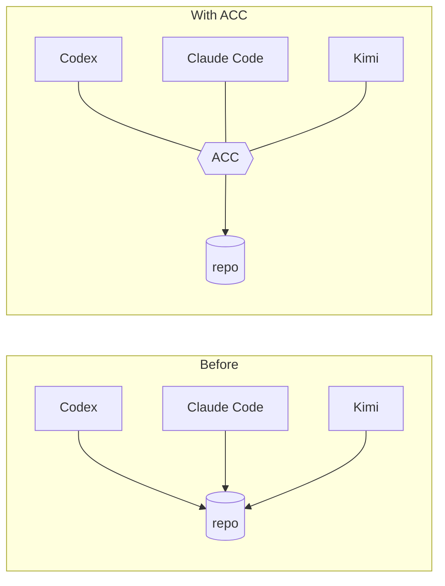

# agents-can-communicate

Two agents editing the same repo don't know about each other. ACC is the layer that makes
them aware — without one of them being in charge.



Each session keeps its own model, permissions, context, and human. ACC adds only what they
share: **who is here, what they're doing, and what's already claimed.**

## Install

<!-- test:command -->
```bash
acc install --dry-run
```

Shows exactly what would change. Drop the flag to apply it.

## What happens then

```mermaid
sequenceDiagram
  participant H as You
  participant C as Your client
  participant ACC
  H->>C: normal prompt
  C->>ACC: session starts (hook)
  ACC-->>C: 2 peers; file:src/** claimed by models
  C->>ACC: about to write src/a.mjs
  ACC-->>C: denied — claimed by models
```

No new commands to learn. Attach, presence, and guards happen inside the session.

## Alone? Nothing changes

One session pays nothing: no injected context, no banners, no protocol. Coordination
starts when a second session shows up.

## Supported clients

| Client | Attach | Guard writes | Inject context | Heartbeat |
|---|---|---|---|---|
| Codex | yes | yes¹ | yes | – |
| Claude Code | yes | yes | yes | – |
| Gemini CLI | yes | yes² | yes | – |
| Kimi Code | yes | yes | yes | yes |
| Any MCP client | yes | – | – | – |

¹ models that use `apply_patch` · ² approval modes that expose edit tools ·
full detail in [CAPABILITIES.md](docs/CAPABILITIES.md)

## Docs

[Getting started](docs/GETTING_STARTED.md) ·
[CLI](docs/CLI.md) ·
[MCP](docs/MCP.md) ·
[Configuration](docs/CONFIGURATION.md) ·
[Writing an adapter](docs/ADAPTER_AUTHORING.md) ·
[Troubleshooting](docs/TROUBLESHOOTING.md)

Examples: [workstreams](examples/papercut-workstreams.md) ·
[research, no Git](examples/non-git-research.md)

## Requirements

Node 24+, macOS or Linux. No database, no daemon, no service. Git optional.

Windows is not supported yet — the reasons are measured and listed in
[CHANGELOG.md](CHANGELOG.md).

MIT.
