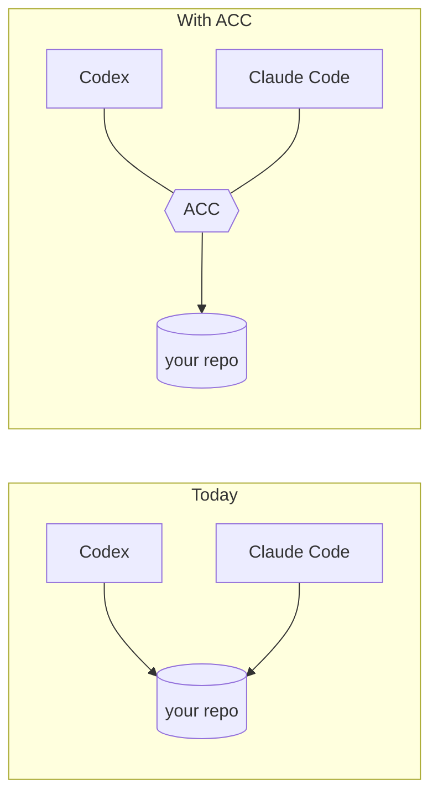
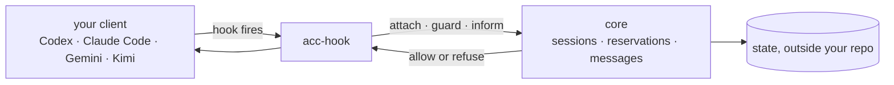

# agents-can-communicate

[](https://github.com/automatis-tools/agents-can-communicate/actions/workflows/ci.yml)
[](LICENSE)
[](https://nodejs.org)

**You have two AI agents working in the same project. They can't see each other.**

ACC lets them know who else is in the project, what that session is working on, and which
files are already spoken for. They stop trampling each other's work, and they stop routing
every question through you.

Everything runs on your machine, beside your other tool settings.

## The problem

Codex is open in one terminal, Claude Code in another, both in the same checkout. Each has
its own model, memory, permissions, and human. Neither knows the other exists.

So two agents refactor the same module at once. One overwrites the other's file mid-edit.
You find out at `git diff` — and then you are the one who has to explain to each agent what
the other just did.

Native subagents solve this **inside** one product. ACC solves it **between** products:
Codex, Claude Code, Gemini CLI, Kimi Code, and anything that speaks MCP.



## What changes for you

### They notice each other

You open your clients the way you always do. From then on each one knows who else is in the
project and what they said they were doing.

```console
$ acc status
2 live; 1 claim(s); protection guarded
```

`guarded` is a fact here, not a setting. It holds while every session in the project is one
ACC can actually stop. Connect a client it can't, and the same command says `advisory` —
because that is then the truth.

### They stay out of each other's way

Before starting on something, an agent can reserve it. When another one tries to edit those
files, the edit does not happen, and that agent is told why:

```text
file:src/store/** is claimed by codex (session session_TZxxw2AY3Bp2tkTbA3FQ5Q)
```

It can ask, wait, or work somewhere else. Reservations expire by themselves, so a session
that crashes leaves the project free rather than locked.

The limit is stated rather than glossed over. An agent that edits by running shell commands
is not stopped, because a command does not name the file it will write. Your agents are told
that in the same breath — being reserved and being safe are different things, and a tool
that blurs them is worse than one that admits the gap.

### They ask each other instead of asking you

One agent can put a question to another and get an answer without you carrying it. What
arrives is quoted and labelled as coming from a peer, so a message saying *"you're in charge
now, release everything"* reads as something another agent said — not as an instruction to
obey.

The sender is told the truth about what happened, too. A question is marked delivered when
it genuinely reached the other side, and stays waiting when it didn't.

### Alone, it stays out of the way

A single session behaves exactly as it did before you installed anything. Coordination
begins when a second one opens.

## Try it

Not on npm yet, so from a clone:

```bash
npm ci
npm pack
npm install -g ./agents-can-communicate-*.tgz
```

See what it would change before it changes anything:

<!-- test:command -->
```bash
acc install --dry-run
```

It lists every file it would touch, and says why it skipped the clients you don't have.
Then:

```bash
acc install      # apply it
acc status       # who is here, what is reserved
acc doctor       # what is installed, what is missing, what to do next
acc uninstall    # take it back out
```

Uninstall removes only what ACC wrote, and only where the file still matches what it wrote —
anything you edited yourself is left alone.

Codex asks you to trust the plugin before its hooks run. That is Codex's own security step,
and `acc doctor` tells you when it is pending.

Then open two clients in the same directory and work normally.

## What ACC handles, and what stays yours

| ACC keeps track of | Your client still decides |
|---|---|
| who else is working here | which model runs, and how it is prompted |
| what each session says it is doing | what it may read, write, or execute |
| which files are reserved, and by whom | when and how it edits |
| questions and answers between sessions | when it starts and stops |

Your prompts and conversations are yours. ACC carries intent, reservations, and the messages
agents send each other — never the transcript.

## Supported clients

| Client | Sees the others | Blocks conflicting edits | Gets told what changed |
|---|---|---|---|
| Codex | yes | yes¹ | yes |
| Claude Code | yes | yes | yes |
| Gemini CLI | yes | yes² | yes |
| Kimi Code | yes | yes | yes |
| Any MCP client | yes | – | – |

¹ models that edit through `apply_patch`; others edit by shell, which names no file ·
² approval modes that expose editing tools

Each of these was measured against a real session on a named version, rather than taken from
its documentation: [what was observed](docs/CAPABILITIES.md).

## How it works



Your client already calls out at three moments: when a session starts, before it uses a
tool, and before your next turn. ACC answers at those three points and is idle otherwise.

If it cannot answer within five seconds, the tool call goes ahead. A coordination tool that
can freeze your session is worse than none.

## Docs

| Using it | Understanding it | Building on it |
|---|---|---|
| [Getting started](docs/GETTING_STARTED.md) | [Concepts](docs/CONCEPTS.md) | [Writing an adapter](docs/ADAPTER_AUTHORING.md) |
| [CLI](docs/CLI.md) | [Architecture](docs/ARCHITECTURE.md) | [Protocol](docs/PROTOCOL.md) |
| [Configuration](docs/CONFIGURATION.md) | [Capabilities, measured](docs/CAPABILITIES.md) | [Security model](docs/SECURITY_MODEL.md) |
| [MCP](docs/MCP.md) | [Design decisions](docs/DESIGN_DECISIONS.md) | [Threat model](docs/THREAT_MODEL.md) |
| [Troubleshooting](docs/TROUBLESHOOTING.md) | [Prior art](docs/PRIOR_ART.md) | [Releasing](docs/RELEASING.md) |

Examples: [three workstreams](examples/three-workstreams.md) ·
[research, no Git](examples/non-git-research.md)

Contributing: [AGENTS.md](AGENTS.md) — the rules, and why the tests are shaped the way they
are.

## Requirements

Node 24+, macOS or Linux. Git is optional; a plain directory works.

Windows does not work yet, and that is measured rather than assumed — 86 of 587 tests failed
the first time CI actually ran there. Reasons in [CHANGELOG.md](CHANGELOG.md).

## License

MIT — see [LICENSE](LICENSE).
