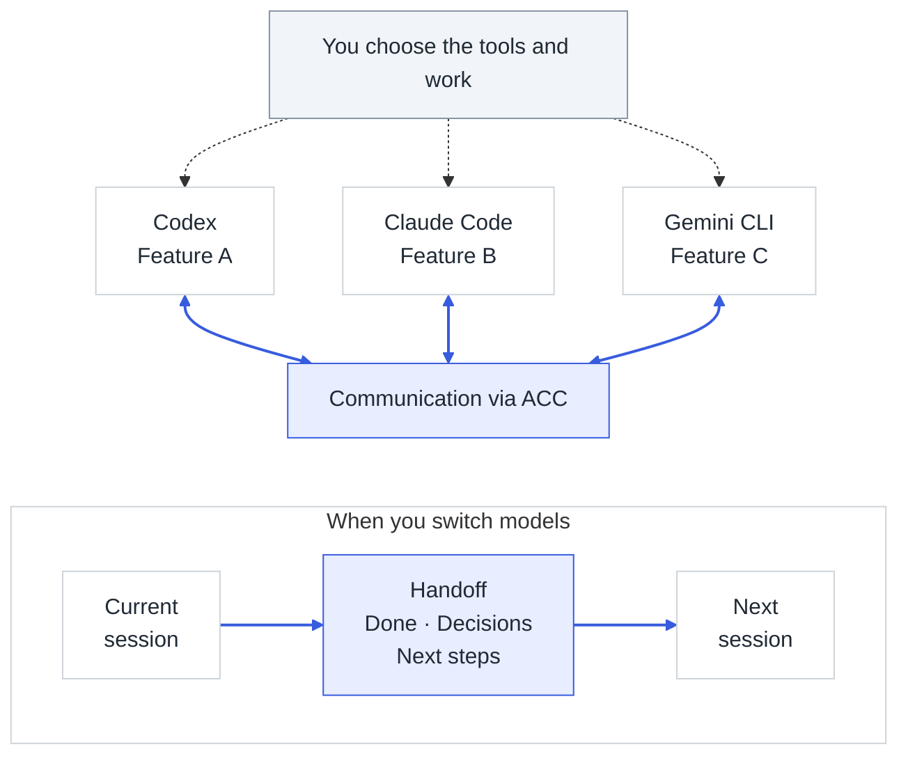

# Agents Can Communicate (ACC)

**Let your AI coding sessions talk to each other.**

ACC connects independent AI coding sessions in the clients you already use. They can ask each
other questions, exchange reviews, and leave handoffs for another session to continue.

You open each client normally and choose its work. Every session keeps its own model,
conversation, and permissions. Coordination runs locally, with no lead agent managing the
others.



## When ACC helps

- **Switch models mid-feature.** When a limit approaches or you want another model’s approach,
  leave a handoff with decisions and unfinished work for the next session.
- **Get a second opinion.** Ask another session to review a specific change and send its
  findings directly to the implementing agent.
- **Bring parallel features together.** Let sessions working on frontend and backend ask each
  other about a shared API before building around different assumptions.

## Try one handoff

You’ll need **macOS or Linux, Node.js 24 or newer**, and supported coding clients on the same
machine and operating-system user.

```bash
npm install -g agents-can-communicate
acc install
```

The installer connects supported clients it finds. Follow its activation instructions, review
any required hook or plugin trust, then restart your clients from the project directory. The
[setup guide](docs/GETTING_STARTED.md) covers client-specific steps.

For example, when pausing work on an account-registration feature, ask:

```text
Save a partial handoff in ACC for the registration feature. Include
what is done, our decisions, what remains, and what you actually
verified. I will continue in another session.
```

Open another supported client in the same project and ask:

```text
Continue the registration feature from its ACC handoff. Check the
saved decisions against the current files, then take the next
unfinished step. Ask me if the scope is unclear.
```

The next session should identify the saved decision and begin the remaining work. It can find
the handoff even if it was opened after the previous session stopped.

Save the handoff while the first model can still respond. ACC preserves explicitly recorded
context; it cannot recover details that were never saved.

## Client support

Integrations are available for **Claude Code, Codex, Gemini CLI, Grok, and Kimi Code**. Other
clients can connect through [MCP](docs/MCP.md) with their own configuration and coordination
instructions.

Automatic delivery depends on the client version and platform. Verified integrations can
provide messages at the next normal turn; other sessions read their ACC inbox explicitly.

Experimental live delivery can wake eligible Claude Code and Codex sessions on Apple Silicon
macOS. It requires opt-in and an active verified connection, is off by default, and can spend
model tokens. Messages for busy sessions queue until the current turn ends.

See [client capabilities](docs/CAPABILITIES.md) for exact support. Run `acc doctor` from your
project if a peer is missing or delivery differs from what you expect; see
[troubleshooting](docs/TROUBLESHOOTING.md). Agents decide when to coordinate; ACC does not
guarantee they will notice every dependency.

## Local and independent

Sessions share coordination within the same ACC workspace. Git is optional; worktrees of one
repository share that workspace while keeping separate files. Messages and handoffs are stored
in local app data outside your project. ACC never collects or shares raw session transcripts.

ACC needs no separate account, model API key, or hosted service. Your coding clients keep using
their existing provider access.

Automatic updates are enabled on first install. Use `acc update --auto off` to disable them,
`acc update` to update manually, and `acc uninstall` to remove integrations. See
[update controls](docs/UPGRADING.md) for details.

MIT-licensed and permanently noncommercial. Try it on one real task and
[tell us where you still had to carry messages yourself](https://github.com/automatis-tools/agents-can-communicate/discussions/categories/show-and-tell).
Report bugs in [issues](https://github.com/automatis-tools/agents-can-communicate/issues).

[Documentation](docs/index.md) ·
[Contributing](https://github.com/automatis-tools/agents-can-communicate/blob/main/AGENTS.md)
