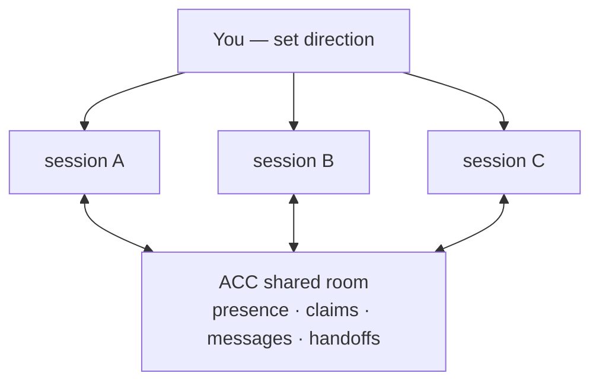

# agents-can-communicate

[](https://github.com/automatis-tools/agents-can-communicate/actions/workflows/ci.yml)
[](LICENSE)
[](https://nodejs.org)

**Give the agent sessions you already opened a shared room — and stop being the wire
between them.**

ACC is a local-first coordination layer for independent AI coding sessions on one repo.
They see who else is here, claim the files they touch, message each other directly, and
hand work across — while each keeps its own client, checkout, permissions, and human. It
runs entirely on your machine, on Node's standard library with **zero runtime
dependencies**, and your transcripts never leave the client.

## The wall is you

One session refactors and is about to remove a field called `item.drive`. Another, in a
file you're not looking at, still reads it. Neither terminal knows the other exists — so
either you carry the warning across by hand, or it ships broken.

**Without ACC**, every warning, question, and handoff between sessions stops at you and
starts again from you. **With ACC**, the sessions carry them to each other: the second
agent sees the claim, gets the measured impact as a message, and the change lands in one
piece. You go back to directing.



## Install

Two commands, once per macOS or Linux machine where your clients run:

```bash
npm install -g agents-can-communicate
acc install
```

`acc install` wires ACC into the clients you have — Codex, Claude Code, Gemini CLI, Grok,
Kimi Code — and names everything it changed. **Restart the client afterwards** (hooks load
at startup); Codex also needs you to trust the plugin. Then just open a session in a
project and it joins that project's room by itself; open a second and they coordinate.
`acc doctor` shows what's active, `acc update --apply` keeps it current, `acc uninstall`
removes only what ACC wrote.

Coordination data lives in the platform app-data directory (`~/Library/Application
Support/acc`, `~/.local/share/acc`; override with `ACC_DATA_HOME`), never in your repo.
Every worktree of a repo shares one room; a plain folder works the same.

## What the room holds

| | |
|---|---|
| **presence** | who's live, their client and branch, and what each intends — one `acc status`. |
| **claims** | the files each session is touching; on guardable clients a clashing edit is refused and the owner named. |
| **messages** | questions, decisions, notes — attributed, delivered on the recipient's next turn, and data they weigh rather than orders. |
| **requests & handoffs** | work addressed to a participant, so it waits across restarts and carries the answer back. |

A targeted `acc inbox` survives context compaction, and `acc reply` answers and
acknowledges in one operation. A session alone in a repo pays nothing — no banner, no
protocol, nothing left behind.

## Everyday controls

The installed guidance teaches your agents to claim, ask, request, and hand off on their
own. These give you a direct view when you want one:

| Command | For |
|---|---|
| `acc status` | who's here, what they claim, and the room's protection level |
| `acc inbox` | recover an addressed message without a workspace dump |
| `acc reply` | answer and acknowledge in one operation |
| `acc doctor` | confirm which client integrations are active and current |
| `acc update --apply` | install the latest release and refresh integrations |
| `acc uninstall` | remove ACC's integrations — settings you changed stay yours |

## Documentation

Start at the **[documentation map](docs/index.md)** — it lays out a path for whatever
brought you here: [why ACC](docs/WHY_ACC.md) and [concepts](docs/CONCEPTS.md) to evaluate
it, [getting started](docs/GETTING_STARTED.md) to run it, the [CLI](docs/CLI.md) /
[protocol](docs/PROTOCOL.md) / [capabilities](docs/CAPABILITIES.md) reference, and
[adapter authoring](docs/ADAPTER_AUTHORING.md) to extend it. New to the vocabulary? The
[glossary](docs/GLOSSARY.md) defines every term in one line.

See it run: [research in a plain folder](examples/non-git-research.md). Contributing starts
with [AGENTS.md](AGENTS.md).

## Requirements & license

Node 24+, macOS or Linux, Git optional. MIT — use it, fork it, keep it
([LICENSE](LICENSE)).
