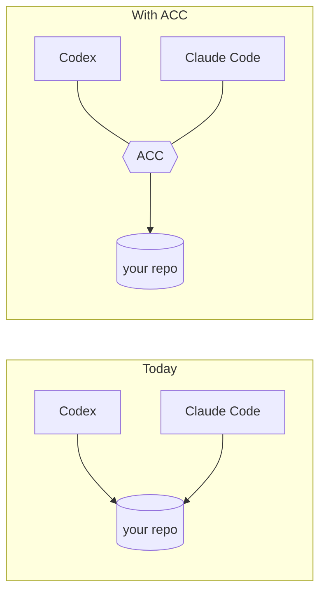
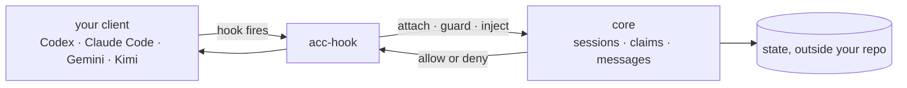

# agents-can-communicate

[](https://github.com/automatis-tools/agents-can-communicate/actions/workflows/ci.yml)
[](LICENSE)
[](https://nodejs.org)

**Two AI coding agents in the same project can't see each other. ACC is the layer that lets
them — and stops one writing over the other's work.**

It is a local CLI (`acc`) plus one small hook per client. No server, no database, no
account, no daemon. State lives on your machine, outside the repository.

## The problem

You have Codex open in one terminal and Claude Code in another, both in the same checkout.
Each has its own model, memory, permissions, and human. Neither knows the other exists.

So: two agents refactor the same module in parallel. One overwrites the other's file
mid-edit. You find out at `git diff`, and you are the one who has to explain to each agent
what the other did.

Native subagents solve this **inside** one product. ACC solves it **between** products —
Codex, Claude Code, Gemini CLI, Kimi Code, or anything that speaks MCP.



## What it does

Four things. Every output below is copied from a real run, not written by hand.

### 1. Sessions find each other by themselves

You open your clients as you always do. A `SessionStart` hook attaches each one — no
command, no prompt, no flag.

```console
$ acc status
2 live; 1 claim(s); protection guarded
```

`protection guarded` is a fact about the room, not a setting: it holds only while **every**
live session is one ACC can actually stop. One MCP client joins and it drops to `advisory`,
because that is then the truth.

### 2. An agent says what it is about to touch

Its skill does this; you don't type it. `$ACC_SESSION` and `$ACC_GENERATION` identify the
session — the generation is what stops a restarted process acting as the old one.

```console
$ acc work --session "$ACC_SESSION" --generation "$ACC_GENERATION" \
    --summary "porting the storage layer" --mode edit --hint 'file:src/store/**'
intent: porting the storage layer

$ acc claim --session "$ACC_SESSION" --generation "$ACC_GENERATION" \
    --resource 'file:src/store/**' --enforcement guarded --reason "porting"
claimed file:src/store/**
```

**Intent** is awareness — it never authorises anything. **Claim** is the one that can stop
a write. Claims are leases and expire on their own, so a crashed session can't hold the
repo hostage.

### 3. A write into someone else's claim is refused

The Claude Code session tries to write `src/store/index.mjs`. Its `PreToolUse` hook gets
back:

```json
{"hookSpecificOutput":{"hookEventName":"PreToolUse","permissionDecision":"deny","permissionDecisionReason":"file:src/store/** is claimed by codex (session session_TZxxw2AY3Bp2tkTbA3FQ5Q)"}}
```

The tool call does not run, and the agent is told who holds it. A write anywhere **else**
goes through untouched — the hook produces no output at all.

At that session's next turn, ACC injects this:

```text
2 session(s); cursor 0000000000000006
- [claim_conflict] file:src/store/** is claimed by session_TZxxw2AY3Bp2tkTbA3FQ5Q
- [claim] file:src/store/** held by codex - file edits are blocked; edits made through a shell are not
- session_ALYmBpY5dyGXltQ0vAJayw (claude_code, online)
- session_TZxxw2AY3Bp2tkTbA3FQ5Q (codex, online)
```

That second line is the part most tools get wrong. It states exactly how far the guard
reaches for **this** session: file edits are stopped, a shell command is not, because a
command names no file to match against a claim.

### 4. Agents can ask each other things

```console
$ acc message --session "$ACC_SESSION" --generation "$ACC_GENERATION" \
    --to codex --type question --subject "src/store" \
    --body "Need 20 minutes in src/store. Can you release it?" --requires-ack
sent message__Wejo2AqkI2JZO9Dnl57dg
```

At the codex session's next turn:

```text
2 session(s); cursor 0000000000000007
- [direct_request] src/store
- session_ALYmBpY5dyGXltQ0vAJayw (claude_code, online)
- session_TZxxw2AY3Bp2tkTbA3FQ5Q (codex, online)
```

The turn carries the subject and the fact that someone is waiting. The agent reads the body
with `acc sync --scope full`. Peer text is data, never instruction — it stays fenced,
attributed, and escaped, and cannot become ACC's own voice.

## Working alone? It does nothing

One session, no peers: the hook prints nothing, injects nothing, and the guard
short-circuits against an empty claim set. Zero files written into your project.

Coordination starts when a second session shows up, and not before.

## Install

Not on npm yet. From a clone:

```bash
npm ci
npm pack
npm install -g ./agents-can-communicate-*.tgz
```

That gives you `acc`, `acc-hook`, and `acc-mcp`. Then wire up whichever clients you have:

<!-- test:command -->
```bash
acc install --dry-run
```

It prints every path it would touch and why it skipped the clients you don't have. Drop
`--dry-run` to apply.

```bash
acc install      # apply
acc doctor       # clients, versions, install health, what to do next
acc uninstall    # removes only what ACC wrote, only if the bytes still match
```

Codex additionally needs you to trust the plugin — that is Codex's own security step, and
`acc doctor` will say so.

Then just open two clients in the same directory and work normally.

## How it works



Three hook points do all of it: session start (attach), before a tool call (guard), before
a turn (inject). Everything vendor-specific lives in that client's adapter — the core never
knows which client it is talking to.

A hook that cannot answer within 5 seconds **allows** the call. A coordination tool must
never be the reason your session stops working.

## Supported clients

| Client | Attach | Guard writes | Inject context | Heartbeat |
|---|---|---|---|---|
| Codex | yes | yes¹ | yes | – |
| Claude Code | yes | yes | yes | – |
| Gemini CLI | yes | yes² | yes | – |
| Kimi Code | yes | yes | yes | yes |
| Any MCP client | yes | – | – | – |

¹ models offering `apply_patch` — others edit through the shell, and a shell command names
no file · ² approval modes that expose edit tools

Every `yes` was captured from a real session on a named version. Nothing is inferred from
documentation: [CAPABILITIES.md](docs/CAPABILITIES.md).

## What it is not

- not a model, an agent runtime, or a way to spawn agents;
- not a replacement for Codex, Claude Code, or native subagents;
- not a task tracker that turns every action into a ticket;
- not a permanent lead session — no session is in charge;
- not transcript sharing. It carries intent, claims, and messages. Never your prompts.

## Docs

| Using it | Understanding it | Building on it |
|---|---|---|
| [Getting started](docs/GETTING_STARTED.md) | [Concepts](docs/CONCEPTS.md) | [Writing an adapter](docs/ADAPTER_AUTHORING.md) |
| [CLI](docs/CLI.md) | [Architecture](docs/ARCHITECTURE.md) | [Protocol](docs/PROTOCOL.md) |
| [Configuration](docs/CONFIGURATION.md) | [Capabilities, measured](docs/CAPABILITIES.md) | [Security model](docs/SECURITY_MODEL.md) |
| [MCP](docs/MCP.md) | [Design decisions](docs/DESIGN_DECISIONS.md) | [Threat model](docs/THREAT_MODEL.md) |
| [Troubleshooting](docs/TROUBLESHOOTING.md) | [Prior art](docs/PRIOR_ART.md) | [Releasing](docs/RELEASING.md) |

Examples: [three workstreams](examples/three-workstreams.md) ·
[research, no Git](examples/non-git-research.md)

Contributing: [AGENTS.md](AGENTS.md) — the rules, and why the tests are shaped the way they
are.

## Requirements

Node 24+, macOS or Linux. Git optional — a plain directory works.

Windows does not work yet, and that is measured rather than assumed: 86 of 587 tests failed
once CI actually ran there. Reasons in [CHANGELOG.md](CHANGELOG.md).

## License

MIT — see [LICENSE](LICENSE).
