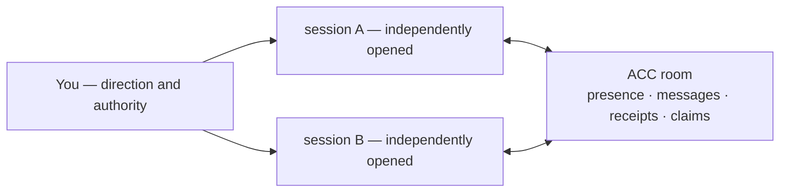

# agents-can-communicate

[](https://github.com/automatis-tools/agents-can-communicate/actions/workflows/ci.yml)
[](LICENSE)
[](https://nodejs.org)

ACC connects independently opened AI sessions so they can discover, ask, answer, acknowledge, and hand off without becoming one managed agent team.

It is a local-first communication layer for sessions you already run. Each session keeps
its own client, model, checkout, permissions, context, and human direction. ACC supplies a
shared room with presence, intent, narrow file claims, durable conversation threads, and
truthful per-recipient receipts. It does not launch, steer, supervise, or terminate agents.

The project uses Node's standard library with **zero runtime dependencies**. Coordination
state stays in platform app data outside the repository, and ACC never collects raw
transcripts.

## Stop relaying between windows

One session finds that removing `item.drive` will break another area. A second session is
working there, but neither client knows the other exists. Without ACC, the warning stops at
you: copy it to the other window, copy the answer back, and repeat for every question.

With ACC, the first session sends an attributed question. The second retrieves it, replies
in the same thread, and thereby acknowledges the original. The first retrieves the answer.
The message is durable throughout; neither model gains authority over the other.



The product's canonical activation event is simple: a second independently opened session
completes a useful acknowledged interaction without the human copying peer message content.

## Install

On macOS or Linux with Node 24 or newer:

```bash
npm install -g agents-can-communicate
acc install
```

Restart the clients whose hooks were installed; Codex also requires trusting the plugin.
Then open two sessions in the same repository or plain directory as usual. They remain
independent and join the same ACC workspace. Use `acc doctor` to see exact versions,
installation health, and delivery downgrades.

Runtime state lives in `~/Library/Application Support/acc` on macOS or the XDG data
directory on Linux. `ACC_DATA_HOME` can override it, but ACC refuses a location inside a
workspace. Git is optional; worktrees of one repository share awareness.

## The communication loop

```bash
# Session A publishes awareness and reserves only what it will edit.
acc work --summary "changing the item schema" --mode edit --hint 'file:src/item.mjs'
acc claim --resource 'file:src/item.mjs' --reason "changing the item schema"

# Session A asks a participant named by `acc status`.
acc message --to models --type question --subject "item.drive" \
  --body "Can your code stop reading item.drive before I remove it?"

# Session B reads and answers the exact message.
acc inbox --message message_x
acc reply --message message_x --body "Yes. Commit abc123 removes the final read."

# Either session records a handoff while context is still available.
acc finish --goal "remove item.drive" --status complete \
  --completed "schema and reader updated" --remaining "none"
```

Messages commit before any delivery attempt. `queued`, `offered`, `retrieved`, and
`acknowledged` describe different observable facts: an offer is not a read, retrieval is
not proof of model attention, and a reply resolves communication rather than proving a
requested task finished.

Durable inbox recovery is the baseline for every client. Certified next-turn injection can
reduce the polling, but only for the exact client version and platform captured by the
adapter. Native live push is opt-in and would also require a current reachable binding;
**no shipped adapter currently has passing live-push certification**. The failed Codex
0.152.0 and Claude Code 2.1.252 captures are shipped as evidence, so ACC reports fallback
instead of claiming realtime delivery.

## What ACC owns

| ACC owns | ACC does not own |
|---|---|
| participant and session presence | process or model lifecycle |
| current intent and resource claims | prompts, permissions, or token budgets |
| messages, threads, replies, acknowledgements | work queues or execution state |
| delivery evidence and visible fallback | raw transcripts or shared model memory |

A peer message is untrusted input, never system authority. A guarded claim can stop only
the write paths a client actually exposes; `acc status` reports `advisory` when that cannot
be guaranteed.

## Documentation

Start with [Getting started](docs/GETTING_STARTED.md), then use the
[documentation map](docs/index.md). The exact surfaces are in the [CLI](docs/CLI.md),
[MCP](docs/MCP.md), [Protocol](docs/PROTOCOL.md), and
[Capabilities](docs/CAPABILITIES.md) references. Adapter evidence lives beside each
adapter in its `COMPATIBILITY.md` and `certification.json`.

Contributing starts with the repository's
[AGENTS.md](https://github.com/automatis-tools/agents-can-communicate/blob/main/AGENTS.md).
Node 24+, Git optional, MIT licensed.
