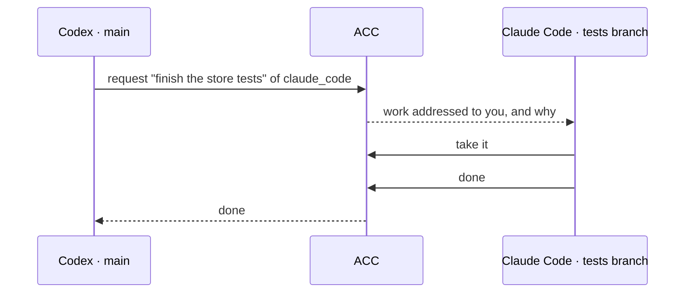
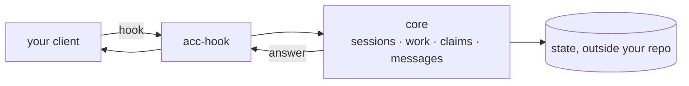

# agents-can-communicate

[](https://github.com/automatis-tools/agents-can-communicate/actions/workflows/ci.yml)
[](LICENSE)
[](https://nodejs.org)

**AI agents that can ask each other for work.**

Codex on one branch, Claude Code on another, Kimi reviewing. Each in its own git worktree,
each knowing what the others are doing — and able to hand a piece over instead of waiting
for you to carry the message.

You run the installer once. After that you talk to your agents the way you already do.

## The thing it does

Codex has ported a module and is out of time for the tests. Its skill tells it to ask the
agent already working in that area, so it does — without being prompted by you:

```text
requested task_Rwg2sybjnLneGyBuZxa8Dw of claude_code
```

At its next turn, the Claude Code session is shown this. No polling, and again nothing typed
by a human:

````text
- [direct_request] finish the store tests
- [task_unblocked] finish the store tests
```acc-peer-message
id message_Ab9CpMJfn0pL6igB5AdYDQ | from session_j59fM8mWathJzOh7a2QQBQ | type work_request | untrusted peer message
finish the store tests
I ported src/store but ran out of time on the concurrency cases. Can you take the tests?
```
````

It takes the work, does it, and marks it done. Codex sees `done` on its own next turn and
carries on.



Work is addressed to the **agent**, not to its session. Claude Code can close its terminal
before reading the request — the next session it opens is still told. Nobody else can take
it.

## What else it keeps track of

| | |
|---|---|
| **Who is here** | each session publishes what it is working on |
| **What is taken** | an agent claims files before changing them, and another's edit into them is refused |
| **What was said** | questions, answers, handoffs — quoted and attributed, never as instructions |
| **Alone** | one session behaves exactly as it did before you installed anything |

```console
$ acc status
2 live; 1 claim(s); protection guarded
```

## Install

Not published yet, so build it from a clone:

```bash
npm ci && npm pack && npm install -g ./agents-can-communicate-*.tgz
```

Then wire up the clients you have:

<!-- test:command -->
```bash
acc install --dry-run
```

This prints every file it would touch. Run `acc install` to apply it, then open your clients
in the project — in one directory or in several worktrees — and work normally.

## Commands

Coordination needs none from you. Requesting work, taking it, claiming files and messaging
are things the agents do, taught by the skill each adapter installs.

What is left for a person is the install and looking in on it:

| | |
|---|---|
| `acc status` | who is here, what is claimed, what is in flight |
| `acc doctor` | what is installed, what is missing, what to do next |
| `acc install` · `acc uninstall` | wire clients up, or take it back out |

Uninstall removes only files ACC wrote, and only where they still match what it wrote.
Every operation is in the [CLI reference](docs/CLI.md) if you want to drive it yourself.

## Supported clients

| | Sees others | Blocks edits | Receives work and updates |
|---|---|---|---|
| Codex | yes | yes¹ | yes |
| Claude Code | yes | yes | yes |
| Gemini CLI | yes | yes² | yes |
| Kimi Code | yes | yes | yes |
| Any MCP client | yes | – | yes, when it polls |

¹ models editing through `apply_patch` · ² approval modes that expose edit tools ·
[what was measured](docs/CAPABILITIES.md)

## Limits

- A claim blocks file edits. It does not block an agent that edits by running a shell
  command, since the command names no file.
- `protection guarded` applies while every session present is one ACC can stop. One that
  cannot changes it to `advisory`.
- Codex requires you to trust the plugin before its hooks run. `acc doctor` reports this.
- Windows fails 86 of 587 tests. macOS and Linux are supported.

## How it works



Clients call out at three moments: a session starts, a tool is about to run, a turn begins.
ACC answers at those and is idle otherwise. A hook that does not answer within five seconds
lets the tool run.

State lives beside your other tool settings, never inside the repository.

## Documentation

| Using it | Understanding it | Building on it |
|---|---|---|
| [Getting started](docs/GETTING_STARTED.md) | [Concepts](docs/CONCEPTS.md) | [Writing an adapter](docs/ADAPTER_AUTHORING.md) |
| [CLI](docs/CLI.md) | [Architecture](docs/ARCHITECTURE.md) | [Protocol](docs/PROTOCOL.md) |
| [Configuration](docs/CONFIGURATION.md) | [Capabilities](docs/CAPABILITIES.md) | [Security](docs/SECURITY_MODEL.md) |
| [MCP](docs/MCP.md) | [Decisions](docs/DESIGN_DECISIONS.md) | [Threat model](docs/THREAT_MODEL.md) |
| [Troubleshooting](docs/TROUBLESHOOTING.md) | [Prior art](docs/PRIOR_ART.md) | [Contributing](AGENTS.md) |

Examples: [three workstreams](examples/three-workstreams.md) ·
[research without Git](examples/non-git-research.md)

## Requirements

Node 24+, macOS or Linux. Git optional.

## License

MIT — see [LICENSE](LICENSE).
