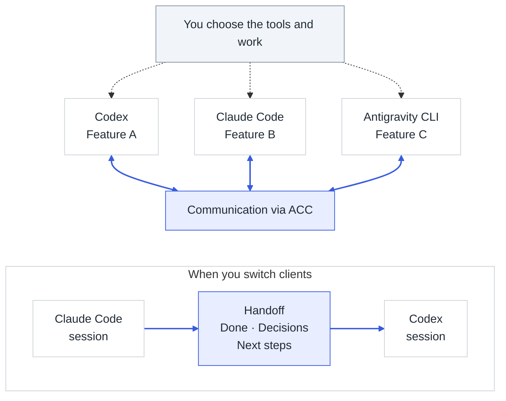

# Agents Can Communicate (ACC)

**The message your clients can’t send each other.**

Claude Code can message your other Claude Code sessions, and Codex can queue a message for
another Codex session. Neither client offers a way to message the other’s sessions. ACC
carries questions, reviews and handoffs between sessions in different vendors’ clients, on
your machine.

You open each client normally and choose its work. Every session keeps its own model,
conversation, and permissions. Coordination runs locally, with no lead agent managing the
others. If all your sessions run in one of these two clients, try its own messaging first.


```mermaid
flowchart TB
    you["You choose the tools and work"]
    codex["Codex<br/>Feature A"]
    claude["Claude Code<br/>Feature B"]
    antigravity["Antigravity CLI<br/>Feature C"]
    acc["Communication via ACC"]

    you -.-> codex
    you -.-> claude
    you -.-> antigravity
    codex <--> acc
    claude <--> acc
    antigravity <--> acc

    subgraph handoff["When you switch clients"]
        direction LR
        current["Claude Code<br/>session"] --> saved["Handoff<br/>Done · Decisions<br/>Next steps"]
        saved --> next["Codex<br/>session"]
    end
    acc ~~~ handoff

    classDef human fill:#f1f5f9,stroke:#8593a3,color:#202a35
    classDef session fill:#fff,stroke:#ced4d9,color:#202a35
    classDef shared fill:#e8edff,stroke:#385cde,color:#202a35
    class you human
    class codex,claude,antigravity,current,next session
    class acc,saved shared
    style handoff fill:transparent,stroke:#ced4d9
    linkStyle 3,4,5,6,7 stroke:#385cde,stroke-width:2px
```

## When ACC helps

- **Get a second opinion from another vendor’s model.** Ask a Codex session to review a change
  your Claude Code session just made, and send its findings back to the session that wrote the
  code.
- **Bring parallel features together.** Let sessions in different clients ask each other about
  a shared API before they build around different assumptions.
- **Switch clients mid-feature.** When a limit approaches or another model suits the work
  better, leave a handoff with decisions and unfinished work for a session in the client you
  open next.

## Try one review across clients

You’ll need **macOS, Linux or Windows 10/11, Node.js 24 or newer**, and supported coding
clients on the same machine and operating-system user. On Windows, ACC runs natively, with no
WSL, and live delivery reaches Claude Code, Codex and Antigravity CLI there too. See
[Windows](docs/GETTING_STARTED.md#windows).

```bash
npm install -g agents-can-communicate
acc install
```

The installer connects supported clients it finds. Follow its activation instructions, review
any required hook or plugin trust, then restart your clients from the project directory. The
[setup guide](docs/GETTING_STARTED.md) covers client-specific steps.

Open Claude Code and Codex in the same project. After Claude Code has changed something, for
example an account-registration form, ask it:

```text
Ask the Codex session in ACC to review the registration form change
you just made. Name the files and what it should check.
```

Then ask Codex:

```text
Answer the review request in ACC. Read the files it names, check
what it asks, and reply with what you found.
```

Codex should find the request without you pasting it, and Claude Code should see the findings
at its next turn without you copying them back. The sender can check whether its message was
delivered and answered.

## Client support

Integrations are available for **Antigravity CLI, Claude Code, Codex, Grok, and Kimi Code**.
Other clients can connect through [MCP](docs/MCP.md) with their own configuration and
coordination instructions.

Automatic delivery depends on the client version and platform. Verified integrations can
provide messages at the next normal turn; other sessions read their ACC inbox explicitly.

Experimental live delivery can wake eligible Claude Code, Codex and Antigravity CLI
sessions, conversations in the Antigravity desktop app, and local Code sessions in Claude.app.
It requires opt-in and an active verified connection, is off by default, and can spend model
tokens. Claude Code sessions wake through the inbox that Claude Code itself opens, so you start
Claude Code with your ordinary command. A busy Claude Code session gets the message between two
tool calls. A busy Codex session gets it when the current turn ends. Chats in the Codex app run
on the app’s own server and get messages at their next turn.

See [client capabilities](docs/CAPABILITIES.md) for exact support. Run `acc doctor` from your
project if a peer is missing or delivery differs from what you expect; see
[troubleshooting](docs/TROUBLESHOOTING.md). Agents decide when to coordinate; ACC does not
guarantee they will notice every dependency.

## Local and independent

Sessions share coordination within the same ACC workspace. Git is optional; worktrees of one
repository share that workspace while keeping separate files. Messages and handoffs are stored
in local app data outside your project. ACC never collects or shares raw session transcripts.

ACC needs no separate account, model API key, or hosted service. Your coding clients keep using
their existing provider access.

Automatic updates are enabled on first install. Use `acc update --auto off` to disable them,
`acc update` to update manually, and `acc uninstall` to remove integrations. See
[update controls](docs/UPGRADING.md) for details.

MIT-licensed and permanently noncommercial. Try it on one real task and
[open an issue](https://github.com/automatis-tools/agents-can-communicate/issues/new/choose)
with what happened: whether it worked, where it broke, or where you still had to carry
messages between sessions yourself. If it worked, watch the repository’s releases to hear
about the next one. Longer write-ups and setups are welcome in
[Discussions](https://github.com/automatis-tools/agents-can-communicate/discussions).

[Documentation](docs/index.md) ·
[Contributing](https://github.com/automatis-tools/agents-can-communicate/blob/main/AGENTS.md)
