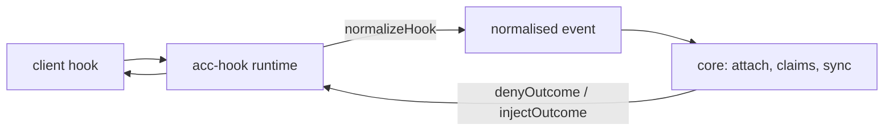
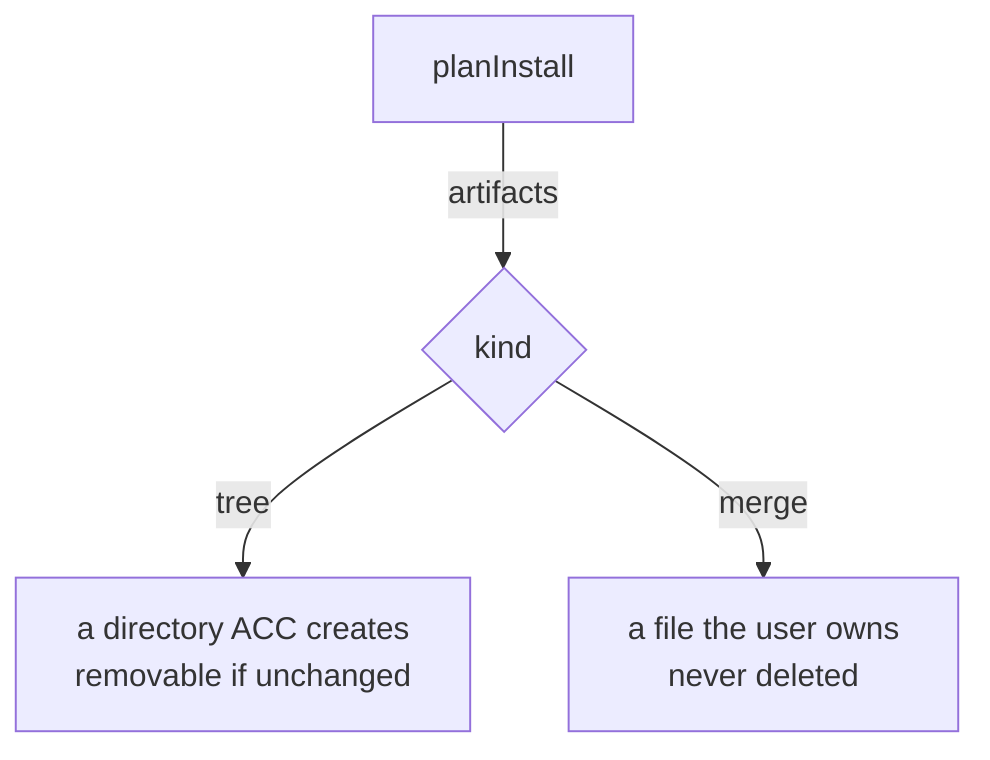

# Writing an adapter

Use this page to add one client without leaking vendor behavior into core. Start with the
[identity contract](PROTOCOL.md#identity), then compare the shipped evidence under
[certified support](CAPABILITIES.md#certified-support). The [documentation map](index.md)
links the surrounding concepts and runtime architecture.



## Define the manifest

```js
export function createExampleAdapter() {
  return defineAdapter({
    id: "example",                    // portable id
    displayName: "Example CLI",
    client: { command: "example", certificationName: "example-cli",
      versionArgs: ["--version"] },
    certification,                    // imported package-local certification.json
    capabilities: { delivery: { nextTurn: true } },

    detect, install, uninstall, doctor,
    planInstall,                      // what install would write
    preflightUninstall,               // optional read-only removal validation
    normalizeHook,                    // client payload -> normalised event
    renderContext,                    // SyncResult -> text
    renderContextResult,              // text + ids of complete rendered groups
    denyOutcome, injectOutcome,       // how this client is answered
  });
}
```

`preflightUninstall(context)` is optional and read-only. Throw to refuse unsafe
removal before the installer deactivates native integration or deletes recorded
artifacts. `uninstall` should retain its own validation for direct adapter callers;
recorded artifact fingerprint checks still determine the `keep` paths it receives.

`injectToolOwnerOutcome({ owner, tool })` is an optional identity-only hook callback.
The runner calls it after an allowed `beforeTool` handler only when that hook's
binding still names an open session with the same generation in this workspace.
Return `null` for an unsupported tool, or `{ stdout, stderr? }` using the client's
documented context envelope. The runner preserves the guard decision and the
owner line's byte budget. The callback receives no peer bodies or raw tool input;
it cannot create a session or advance receipts. Grok uses it to supply CLI owner
arguments after a terminal result. This does not certify general context or peer
delivery, and a tool such as `finish` can close the owner before the line arrives.

`continueTurnOutcome({ reason, payload })` is optional. A client whose end-of-turn hook can
hold a turn open implements it, and the runner's `turnEnd` handler calls it with the projected
peer context when - and only when - a peer body no invocation has shown yet is waiting. It
returns `{ stdout, stderr?, exitCode? }` in the client's own continuation shape, and prints
nothing to let the turn end. `payload` is the raw hook payload handed back unread, so the
adapter can apply its own ceiling from a counter the client supplies; nothing in core reads it.
An empty `stdout` records no offer, so the body stays queued for the next invocation. A
continuation costs the operator a model invocation, which is why an owner header or an
attention count is never a reason to call it. Antigravity CLI uses it for `Stop`, bounded to
one continuation per turn by the client's own `executionNum`.

`renderContextResult` is required wherever an adapter renders peer messages. It returns
`{ text, offeredMessageIds, includedAttentionIds }`, and the [receipt
lifecycle](PROTOCOL.md#receipt-lifecycle) advances only from those ids — never by searching
`text` for one, because peer text is untrusted and can imitate another message's header.
`projectContextResult()` implements this contract; `projectContext()` remains the text-only
convenience API for adapters that don't need it. An adapter with only the older
`renderContext()` gets pending bodies withheld and a visible `acc inbox` degradation warning
instead: repeating an untracked body every turn would be quieter in code and dishonest about
what was actually delivered.

The hook also supplies `reminderMessageIds`, derived from this participant's `offered` or
`retrieved` receipts with unresolved obligations. The standard projector combines those
reply/acknowledgement attention items into counts after new bodies. A missing body alone
is not evidence for compaction. Counts add no ids to `offeredMessageIds` or
`includedAttentionIds`; complete inbox and status results remain available.

`client.command` does double duty. `detect.mjs` uses it as the version-probe binary, and
presence liveness separately walks the hook's process ancestry for the first ancestor whose
executable basename matches it, to learn the client's own pid. Declare the binary the client
actually runs as — `command: "claude"` for a client that really runs as `node` resolves
nothing, and the failure is silent: the session gets `pid: null` and falls back to reading
presence by age alone, with nothing telling you why.

## Declare only proven capabilities

Fourteen booleans in four groups, declared in the manifest's `capabilities` object:

| Group | Entries |
|---|---|
| `lifecycle` | `sessionStart` `sessionResume` `sessionEnd` `heartbeat` `childSessions` |
| `context` | `startupInjection` `beforeTurnInjection` `safePointInjection` |
| `guards` | `beforeRead` `beforeWrite` `beforeShell` |
| `delivery` | `nextTurn` `livePush` `replyRoute` |

**False by default. `true` requires a backing method *and* an observed capture.**
`defineAdapter` enforces the method — declaring `guards.beforeWrite: true` without
`guardWrite()` is a usage error at construction. It also requires a passing entry in the
validated `certification.json`; method existence is never evidence. What each shipped
client was actually observed doing against this list is under
[certified support](CAPABILITIES.md#certified-support).

`lifecycle.heartbeat` is deliberately not a flavour of `delivery.nextTurn`. Next-turn
delivery happens only when the client reaches a normal turn boundary; heartbeat fires on a
timer even while the session is idle.

### Certification evidence

Every adapter ships `certification.json` and every referenced capture under `fixtures/`.
Each evidence entry contains `client`, exact `version`, exact `platform`, `observedAt`,
`capability`, package-relative `fixture`, `idleBehavior`, `busyBehavior`,
`authorityLevel`, `limitations`, and `result` (`pass` or `fail`). A copied documentation
example is not a capture. Failed experiments stay in the manifest as `fail`; they explain
the false value and can never enable it.

`effectiveCapabilities(adapter, { clientVersion, platform })` returns the full boolean
shape for the installed client, resolving each capability independently from the evidence
that client can reach:

1. Take the rows for that capability, and keep those whose version is at or below the
   client's. A prerelease is ordered by its release triple, so `1.3.0-rc.1` is judged as
   `1.3.0`, and a version that cannot be read reaches every row.
2. Among those, prefer the rows that name this platform; with none, use them all. A loss
   recorded for one platform at 1.3.0 says nothing about that platform at 1.2.3, where
   another platform's passing capture is the only evidence in reach.
3. The highest version left decides. The capability is on when every row at that version
   passes, so a recorded loss wins a tie between platforms.

A client older than every row gets nothing, and so does a capability whose deciding row
records a failure. `capabilityEvidence(adapter, facts, capability)` returns that verdict
with its reason - `undeclared`, `unobserved`, `older-than-evidence` or `recorded-failure` -
and the version that decided, so a refusal can name the evidence rather than the client.

Recording a regression is an ordinary capture with `result: "fail"` at the version where
the loss was observed; it applies forward until a later row passes again.

The backing methods for delivery are `renderContextResult()` for `nextTurn`,
`offerMessage()` for `livePush`, and `routeReply()` for `replyRoute`.

### Native delivery contract

An adapter that can push a message into a running session declares `nativeDelivery` next
to its capabilities:

```js
nativeDelivery: {
  minimumByPlatform: { "darwin-arm64": "2.1.282" },
  anchors: [{ platform: "darwin-arm64", version: "2.1.282",
    protocolContract: "claude-code-inbox-socket-v1" }],
  knownBad: [],
  activationKinds: ["native-service"],
  offerKind: "wake",
}
```

The rules `defineAdapter` enforces, and the ones the runtime applies:

- A minimum is the **first passing capture** on that platform, never a guessed first vendor
  release. Every anchor must have passing `delivery.livePush` evidence for the same client,
  version, and platform, and each minimum must itself be an anchor.
- There is intentionally **no maximum version**. A newer stable release is admitted only
  when a current read-only feature probe (`probeNativeDelivery()`) and a per-session
  handshake (`bindNativeSession()`) both report the anchored `protocolContract`;
  `evaluateNativeEligibility()` and `validateNativeHandshake()` are those two checks.
- Prereleases require their own passing capture; they are `prerelease_not_captured` even
  when numerically newer. `knownBad` names exact versions or inclusive intervals.
- Exact-version certification still governs every non-native capability;
  `effectiveCapabilities()` is unchanged. The native rule is used for live delivery alone.
- Native methods return closed facts (`validateNativeActivationPlan()` closes the
  activation plan) and never put vendor data - endpoints, sockets, raw errors - into core.

`nativeDelivery.policySource` accepts only `"installation-record"`, which is also the
default. Hooks and senders read the current recorded recipient consent, independently of
the vendor process environment. Installation records the requested policy even when
current activation is unavailable. An absent or invalid record means `off`. A previously
published binding cannot override it.

`nativeDelivery.offerKind` says what an accepted offer puts in front of the model. It is
`"message"` (the default) or `"wake"`:

- `"message"` carries the body. The router records the receipt as `offered` with the
  transport name and returns the outcome `offered`.
- `"wake"` carries only a notice that makes the client run a turn. The router records no
  offer and returns the outcome `woken`. The receipt stays `queued`. The next-turn hook
  records `offered` via `next-turn` after its output carried the body. Use `"wake"` only
  where the turn that the wake starts runs the client's next-turn hook, as Claude Code's
  `UserPromptSubmit` does.

A failed offer of either kind is recorded as a failed offer and leaves the receipt queued.

`nativeDelivery.activationKinds` names the mechanisms the adapter may plan:
`"native-config"` or `"native-service"`. A `native-service` mechanism with
`preExisting: true` and no commands describes a service that the client itself runs, such
as the Claude Code inbox. A `shell-bootstrap` mechanism can no longer be planned. Install
records of one stay readable, so that `acc install` and `acc update` can retire it.

The optional `refreshNativeSession()` method may revalidate an expired lease before
an offer. It returns the same closed handshake shape as `bindNativeSession()` and
must preserve the exact endpoint and protocol identity. The router rechecks the
current session, generation, retirement, uniqueness and policy before publishing
the refreshed lease. Refresh is not a heartbeat and cannot extend presence beyond
its own expiry. Optional `retireNativeSession()` cleans adapter-owned endpoint state
after confirmed core retirement; it must remain bounded and fail open for hooks.

A package-shipped passing Codex installed-hook capture additionally references its
complete real product matrix through the selected provenance record's
`productEvidence: { fixture, sha256 }`. Package verification checks the actual file,
raw digest and client/version/platform/package identity. A transport-only capture
cannot certify the installed product route. `historicalFixtures` may retain hashed
earlier failures without duplicating a certification tuple.

## Choose the integration depth

| Tier | You register | You get | You do not get |
|---|---|---|---|
| 0 | nothing — humans run `acc` | durable messages, status, claims | anything automatic |
| 1 | the MCP server | attach on first call, read, claim, message | guards, session end |
| 2 | hooks + skill | only the lifecycle, context, guard, and next-turn behaviors separately captured for this client | uncaptured hook behaviors |
| 3 | + native delivery surface | only captured live-push and reply-route modes | safe-point injection or child sessions unless separately captured |

Installed hook wiring may reach tier 2, but each effective hook capability still
requires exact client/version/platform evidence. Tier 3 has separate native
contracts: the Claude Code inbox wake from 2.1.282 and Codex LocalDaemon from 0.152.1 on
macOS arm64, with current probes and exact session handshakes. Codex's earlier
remote-wrapper failure remains historical evidence. Ordinary launch now preserves
workspace identity; the full installed product matrix, including negative controls
and fallback, backs its native claim.

## Normalize hook input

Whitelist, never a filter. Every client hands hooks the prompt, the transcript path, or the
tool output; none of it may survive.

```js
return normalizedEvent({
  kind, sessionId, cwd, model, parentSessionId, tool,
  targets,   // paths this call would WRITE. For a shell call, pass the command to
             // shellWriteTargets() — it reads write positions only, never reads.
});
```

Refuse an unrecognised payload. Inventing a session attaches the wrong one, or a new one
every hook, and looks like it is working.

`normalizeHook(payload, { args })` also receives the arguments the client's hook command
carried after the adapter id. Most clients name the event inside the payload and ignore this.
Antigravity CLI does not send one at all, and its `PreInvocation` and `PostInvocation` hand
over byte-identical envelopes - so for that client the registered command's own argument is
the only thing that knows which hook ran, and its install writes the event name into each
command. `args` is always an array; an adapter that does not need it may take one parameter.

## Measure response contracts

Measure them. Every client differs, and a wrong shape fails **silently**:

| | deny | inject |
|---|---|---|
| Codex | exit 2 + stderr | plain stdout (`developer` message) |
| Claude Code | `hookSpecificOutput.permissionDecision` | same envelope |
| Gemini CLI | `{"decision":"block"}` | `hookSpecificOutput` envelope |
| Antigravity CLI | no tool event loads, so a deny is unreachable | `{"injectSteps":[{"ephemeralMessage"}]}` from `PreInvocation` |
| Grok | `{"decision":"deny","reason"}` (documented; deny not yet captured) | UserPromptSubmit stdout discarded; own identity only via PreToolUse after a terminal result, observed on 1.0.24 |
| Kimi Code | `hookSpecificOutput.permissionDecision` | plain stdout |

`denyOutcome(reason)` returns `{ stdout, stderr, exitCode }`, so the runtime never has to
know which client it is talking to. This table is only the shape each shipped adapter
actually uses; the full experimental grid — every candidate shape tried against every
client, including which ones are silently ignored — is recorded in each adapter's
`COMPATIBILITY.md` and certification fixtures. The cross-client summary is under
[guard limitations](CAPABILITIES.md#guard-limitations).

## Preserve install ownership



Rules that are not negotiable:

- idempotent — installing twice equals installing once;
- reversible — uninstall restores the user's file byte for byte;
- absolute command paths — a hook's environment carries no PATH;
- honour `keep`: uninstall receives paths the user has since edited.

`planInstall` must use the same path helpers as `install`. A conformance test compares
them, because a plan that drifts makes `--dry-run` a decoration.

## Run conformance

```bash
node --test tests/conformance/*.test.mjs
node --test tests/process/hook-wiring.test.mjs
```

The second one *executes* what your install wrote. Three adapters once shipped a hook
command that did not exist anywhere; every test was green.

## Record the evidence

One `COMPATIBILITY.md` per adapter: client version, event names, payload fields, the deny
matrix, and what you could **not** observe. The next person's alternative is guessing.
