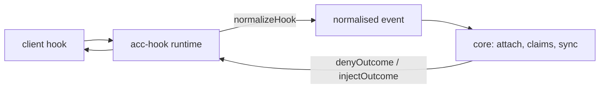
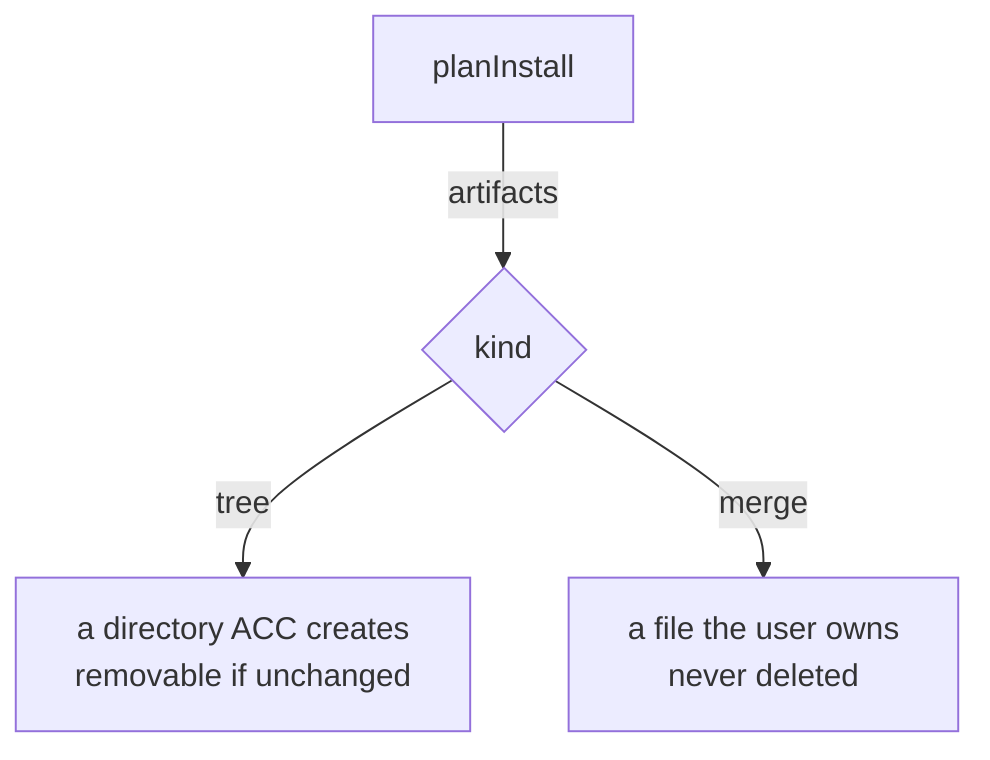

# Writing an adapter

An adapter teaches ACC one client. Nothing else in ACC knows that client exists.



## The manifest

```js
export function createExampleAdapter() {
  return defineAdapter({
    id: "example",                    // portable id
    displayName: "Example CLI",
    client: { command: "example", versionArgs: ["--version"] },
    capabilities: { lifecycle: { sessionStart: true } },

    startSession: async () => ({ ok: true, changes: [], diagnostics: [] }),

    detect, install, uninstall, doctor,
    planInstall,                      // what install would write
    normalizeHook,                    // client payload -> normalised event
    renderContext,                    // SyncResult -> text
    renderContextResult,              // text + ids of complete rendered groups
    denyOutcome, injectOutcome,       // how this client is answered
  });
}
```

`renderContextResult` is required when an adapter renders peer messages. It returns
`{ text, includedMessageIds, includedAttentionIds }`; the hook runner advances delivery
only from those ids. It deliberately never searches `text` for an id, because peer text is
untrusted and can imitate another message's header. `projectContextResult()` implements
this contract, while `projectContext()` remains the text-only convenience API.
For an older adapter that implements only `renderContext()`, the runner withholds
pending bodies and emits a visible `acc inbox` degradation warning. Repeating an
untracked body every turn would be quieter in code and dishonest in operation.

`client.command` has a second job beyond the version probe `detect.mjs` uses it for: presence
liveness walks the hook's process ancestry looking for the first ancestor whose executable
basename matches it, to learn the client's own pid. Declare the binary the client actually
runs as — `command: "claude"` for a client that runs as `node` resolves nothing, and fails
silently: the session gets `pid: null` and reads presence by age alone, with no error telling
you why.

## Capabilities

Seventeen booleans in five groups:

| Group | Entries |
|---|---|
| `lifecycle` | `sessionStart` `sessionResume` `sessionEnd` `heartbeat` `childSessions` |
| `context` | `startupInjection` `beforeTurnInjection` `safePointInjection` |
| `guards` | `beforeRead` `beforeWrite` `beforeShell` |
| `delivery` | `polling` `activeNotification` `wakeDormantSession` |
| `execution` | `launch` `resume` `terminate` |

**False by default. `true` requires a backing method *and* an observed capture.**

`defineAdapter` enforces the method — declaring `guards.beforeWrite: true` without
`guardWrite()` is a usage error at construction. Nothing enforces the capture except you, so
declare only what you have watched happen, and say in the code why the rest is false.

`lifecycle.heartbeat` is deliberately not a flavour of `delivery.polling`. Polling happens
when the client reaches a hook, which for most harnesses means when the user takes a turn —
an idle session stops refreshing and goes stale while its process is alive. Heartbeat fires
on a timer instead.

## How far you can get

| Tier | You register | You get | You do not get |
|---|---|---|---|
| 0 | nothing — humans run `acc` | durable messages, status, claims | anything automatic |
| 1 | the MCP server | attach on first call, read, claim, message | guards, session end |
| 2 | hooks + skill | automatic attach, turn context, write guards, cleanup | realtime |
| 3 | + realtime surface | delivery receipts, safe-point injection, child sessions | — |

Every shipped adapter is tier 2. Tier 3 is claimed only where a public harness contract
genuinely supports it — no client observed so far does.

## normalizeHook

Whitelist, never a filter. Every client hands hooks the prompt, the transcript path, or the
tool output; none of it may survive.

```js
return normalizedEvent({
  kind, sessionId, cwd, model, parentSessionId, tool,
  targets,   // paths this call would WRITE. For a shell call, pass the command to
             // shellWriteTargets() — it reads write positions only, never reads.
});
```

Refuse an unrecognised payload. Inventing a session attaches the wrong one, or a new one
every hook, and looks like it is working.

## Response contracts do not port

Measure them. Every client differs, and a wrong shape fails **silently**:

| | deny | inject |
|---|---|---|
| Codex | exit 2 + stderr | plain stdout (`developer` message) |
| Claude Code | `hookSpecificOutput.permissionDecision` | same envelope |
| Gemini CLI | `{"decision":"block"}` | `hookSpecificOutput` envelope |
| Kimi Code | `hookSpecificOutput.permissionDecision` | plain stdout |

`denyOutcome(reason)` returns `{ stdout, stderr, exitCode }`, so the runtime never has to
know which client it is talking to.

## Install and ownership



Rules that are not negotiable:

- idempotent — installing twice equals installing once;
- reversible — uninstall restores the user's file byte for byte;
- absolute command paths — a hook's environment carries no PATH;
- honour `keep`: uninstall receives paths the user has since edited.

`planInstall` must use the same path helpers as `install`. A conformance test compares
them, because a plan that drifts makes `--dry-run` a decoration.

## Conformance

```bash
node --test tests/conformance/*.test.mjs
node --test tests/process/hook-wiring.test.mjs
```

The second one *executes* what your install wrote. Three adapters once shipped a hook
command that did not exist anywhere; every test was green.

## Record what you learned

One `COMPATIBILITY.md` per adapter: client version, event names, payload fields, the deny
matrix, and what you could **not** observe. The next person's alternative is guessing.
