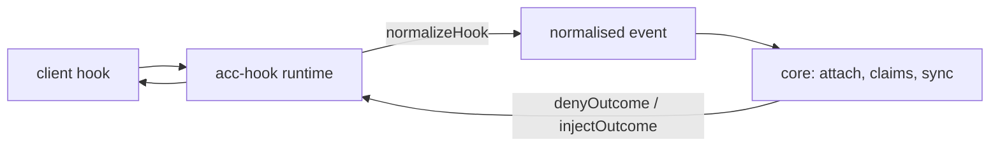
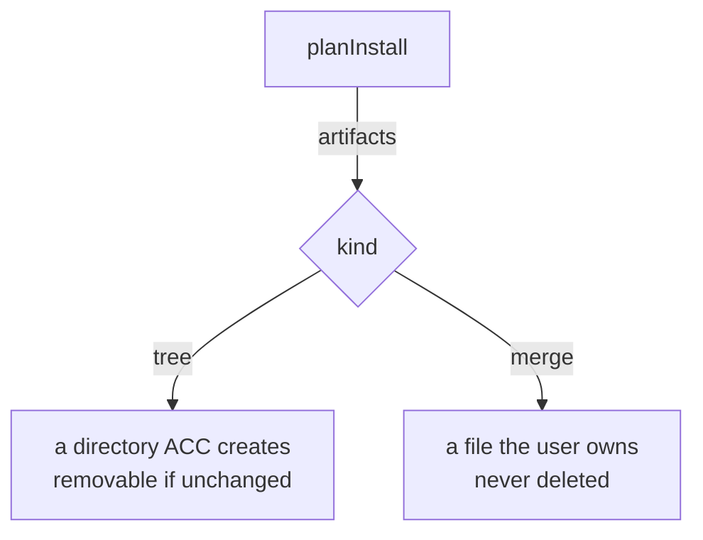

# Writing an adapter

An adapter teaches ACC one client. Nothing else in ACC knows that client exists. This page
assumes the vocabulary in [Protocol](PROTOCOL.md#identity-hierarchy) — session, participant,
claim — and points to [Capabilities](CAPABILITIES.md) for what was actually measured per
client; see the [documentation map](index.md) for where both fit among the rest.



## The manifest

```js
export function createExampleAdapter() {
  return defineAdapter({
    id: "example",                    // portable id
    displayName: "Example CLI",
    client: { command: "example", certificationName: "example-cli",
      versionArgs: ["--version"] },
    certification,                    // imported package-local certification.json
    capabilities: { delivery: { nextTurn: true } },

    detect, install, uninstall, doctor,
    planInstall,                      // what install would write
    normalizeHook,                    // client payload -> normalised event
    renderContext,                    // SyncResult -> text
    renderContextResult,              // text + ids of complete rendered groups
    denyOutcome, injectOutcome,       // how this client is answered
  });
}
```

`renderContextResult` is required wherever an adapter renders peer messages. It returns
`{ text, includedMessageIds, includedAttentionIds }`, and the [delivery
lifecycle](PROTOCOL.md#delivery-lifecycle) advances only from those ids — never by searching
`text` for one, because peer text is untrusted and can imitate another message's header.
`projectContextResult()` implements this contract; `projectContext()` remains the text-only
convenience API for adapters that don't need it. An adapter with only the older
`renderContext()` gets pending bodies withheld and a visible `acc inbox` degradation warning
instead: repeating an untracked body every turn would be quieter in code and dishonest about
what was actually delivered.

`client.command` does double duty. `detect.mjs` uses it as the version-probe binary, and
presence liveness separately walks the hook's process ancestry for the first ancestor whose
executable basename matches it, to learn the client's own pid. Declare the binary the client
actually runs as — `command: "claude"` for a client that really runs as `node` resolves
nothing, and the failure is silent: the session gets `pid: null` and falls back to reading
presence by age alone, with nothing telling you why.

## Capabilities

Fourteen booleans in four groups, declared in the manifest's `capabilities` object:

| Group | Entries |
|---|---|
| `lifecycle` | `sessionStart` `sessionResume` `sessionEnd` `heartbeat` `childSessions` |
| `context` | `startupInjection` `beforeTurnInjection` `safePointInjection` |
| `guards` | `beforeRead` `beforeWrite` `beforeShell` |
| `delivery` | `nextTurn` `livePush` `replyRoute` |

**False by default. `true` requires a backing method *and* an observed capture.**
`defineAdapter` enforces the method — declaring `guards.beforeWrite: true` without
`guardWrite()` is a usage error at construction. It also requires a passing entry in the
validated `certification.json`; method existence is never evidence. What each shipped
client was actually observed doing against this list is [Capabilities](CAPABILITIES.md#matrix).

`lifecycle.heartbeat` is deliberately not a flavour of `delivery.nextTurn`. Next-turn
delivery happens only when the client reaches a normal turn boundary; heartbeat fires on a
timer even while the session is idle.

### Certification evidence

Every adapter ships `certification.json` and every referenced capture under `fixtures/`.
Each evidence entry contains `client`, exact `version`, exact `platform`, `observedAt`,
`capability`, package-relative `fixture`, `idleBehavior`, `busyBehavior`,
`authorityLevel`, `limitations`, and `result` (`pass` or `fail`). A copied documentation
example is not a capture. Failed experiments stay in the manifest as `fail`; they explain
the false value and can never enable it.

`effectiveCapabilities(adapter, { clientVersion, platform })` returns the full boolean
shape for the installed client. Only an exact passing version/platform match remains true.
Unreadable, unknown, or mismatched clients degrade every uncertified row to false.

The backing methods for delivery are `renderContextResult()` for `nextTurn`,
`offerMessage()` for `livePush`, and `routeReply()` for `replyRoute`.

### Native delivery contract

An adapter that can push a message into a running session declares `nativeDelivery` next
to its capabilities:

```js
nativeDelivery: {
  minimumByPlatform: { "darwin-arm64": "2.1.258" },
  anchors: [{ platform: "darwin-arm64", version: "2.1.258",
    protocolContract: "claude-code-channel-mcp-v1" }],
  knownBad: [],
  activationKinds: ["shell-bootstrap"],
}
```

The rules `defineAdapter` enforces, and the ones the runtime applies:

- A minimum is the **first passing capture** on that platform, never a guessed first vendor
  release. Every anchor must have passing `delivery.livePush` evidence for the same client,
  version, and platform, and each minimum must itself be an anchor.
- There is intentionally **no maximum version**. A newer stable release is admitted only
  when a current read-only feature probe (`probeNativeDelivery()`) and a per-session
  handshake (`bindNativeSession()`) both report the anchored `protocolContract`;
  `evaluateNativeEligibility()` and `validateNativeHandshake()` are those two checks.
- Prereleases require their own passing capture; they are `prerelease_not_captured` even
  when numerically newer. `knownBad` names exact versions or inclusive intervals.
- Exact-version certification still governs every non-native capability;
  `effectiveCapabilities()` is unchanged. The native rule is used for live delivery alone.
- The three native methods return closed facts (`validateNativeActivationPlan()` closes the
  activation plan) and never put vendor data - endpoints, sockets, raw errors - into core.

## How far you can get

| Tier | You register | You get | You do not get |
|---|---|---|---|
| 0 | nothing — humans run `acc` | durable messages, status, claims | anything automatic |
| 1 | the MCP server | attach on first call, read, claim, message | guards, session end |
| 2 | hooks + skill | automatic attach, turn context, write guards, cleanup | realtime |
| 3 | + realtime surface | delivery receipts, safe-point injection, child sessions | — |

Installed hook wiring may reach tier 2, but the effective capability is still limited to
an exact certified client/version/platform. Tier 3 ships for one client: Claude Code, from
2.1.258 on macOS arm64, behind the native delivery contract above. Codex reached a passing
queue capture and was withdrawn anyway - the mode its transport needs reports the daemon's
workspace as the session's - which is the standard: a capture that works is not the same
claim as a capability that is safe to ship.

## normalizeHook

Whitelist, never a filter. Every client hands hooks the prompt, the transcript path, or the
tool output; none of it may survive.

```js
return normalizedEvent({
  kind, sessionId, cwd, model, parentSessionId, tool,
  targets,   // paths this call would WRITE. For a shell call, pass the command to
             // shellWriteTargets() — it reads write positions only, never reads.
});
```

Refuse an unrecognised payload. Inventing a session attaches the wrong one, or a new one
every hook, and looks like it is working.

## Response contracts do not port

Measure them. Every client differs, and a wrong shape fails **silently**:

| | deny | inject |
|---|---|---|
| Codex | exit 2 + stderr | plain stdout (`developer` message) |
| Claude Code | `hookSpecificOutput.permissionDecision` | same envelope |
| Gemini CLI | `{"decision":"block"}` | `hookSpecificOutput` envelope |
| Grok | `{"decision":"deny","reason"}` (documented; deny not yet captured) | UserPromptSubmit stdout discarded on 1.0.13 |
| Kimi Code | `hookSpecificOutput.permissionDecision` | plain stdout |

`denyOutcome(reason)` returns `{ stdout, stderr, exitCode }`, so the runtime never has to
know which client it is talking to. This table is only the shape each shipped adapter
actually uses; the full experimental grid — every candidate shape tried against every
client, including which ones are silently ignored — is measured in
[Capabilities](CAPABILITIES.md#response-contracts-which-do-not-port).

## Install and ownership



Rules that are not negotiable:

- idempotent — installing twice equals installing once;
- reversible — uninstall restores the user's file byte for byte;
- absolute command paths — a hook's environment carries no PATH;
- honour `keep`: uninstall receives paths the user has since edited.

`planInstall` must use the same path helpers as `install`. A conformance test compares
them, because a plan that drifts makes `--dry-run` a decoration.

## Conformance

```bash
node --test tests/conformance/*.test.mjs
node --test tests/process/hook-wiring.test.mjs
```

The second one *executes* what your install wrote. Three adapters once shipped a hook
command that did not exist anywhere; every test was green.

## Record what you learned

One `COMPATIBILITY.md` per adapter: client version, event names, payload fields, the deny
matrix, and what you could **not** observe. The next person's alternative is guessing.
