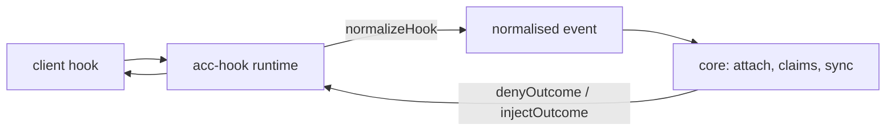
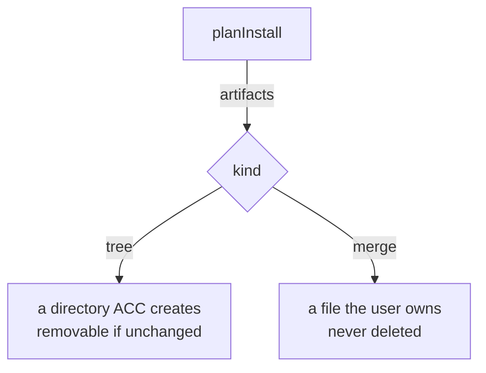

# Writing an adapter

An adapter teaches ACC one client. Nothing else in ACC knows that client exists.



## The manifest

```js
export function createExampleAdapter() {
  return defineAdapter({
    id: "example",                    // portable id
    displayName: "Example CLI",
    client: { command: "example", versionArgs: ["--version"] },
    capabilities: { lifecycle: { sessionStart: true } },

    startSession: async () => ({ ok: true, changes: [], diagnostics: [] }),

    detect, install, uninstall, doctor,
    planInstall,                      // what install would write
    normalizeHook,                    // client payload -> normalised event
    renderContext,                    // SyncResult -> text
    denyOutcome, injectOutcome,       // how this client is answered
  });
}
```

## Capability rule

**False by default. `true` requires a backing method *and* an observed capture.**

`defineAdapter` enforces the method. Nothing enforces the capture except you — so declare
only what you have watched happen, and say in the code why the rest is false.

## normalizeHook

Whitelist, never a filter. Every client hands hooks the prompt, the transcript path, or the
tool output; none of it may survive.

```js
return normalizedEvent({
  kind, sessionId, cwd, model, parentSessionId, tool,
  targets,   // paths this call would WRITE. [] for shell — a command names no resource.
});
```

Refuse an unrecognised payload. Inventing a session attaches the wrong one, or a new one
every hook, and looks like it is working.

## Response contracts do not port

Measure them. Every client differs, and a wrong shape fails **silently**:

| | deny | inject |
|---|---|---|
| Codex | exit 2 + stderr | plain stdout (`developer` message) |
| Claude Code | `hookSpecificOutput.permissionDecision` | same envelope |
| Gemini CLI | `{"decision":"block"}` | `hookSpecificOutput` envelope |
| Kimi Code | `hookSpecificOutput.permissionDecision` | plain stdout |

`denyOutcome(reason)` returns `{ stdout, stderr, exitCode }`, so the runtime never has to
know which client it is talking to.

## Install and ownership



Rules that are not negotiable:

- idempotent — installing twice equals installing once;
- reversible — uninstall restores the user's file byte for byte;
- absolute command paths — a hook's environment carries no PATH;
- honour `keep`: uninstall receives paths the user has since edited.

`planInstall` must use the same path helpers as `install`. A conformance test compares
them, because a plan that drifts makes `--dry-run` a decoration.

## Conformance

```bash
node --test tests/conformance/*.test.mjs
node --test tests/process/hook-wiring.test.mjs
```

The second one *executes* what your install wrote. Three adapters once shipped a hook
command that did not exist anywhere; every test was green.

## Minimal Tier 1

No hooks at all — register the MCP server and stop. You get attach, read, claim, message.
You do not get guards or session end, and the roster will say so.

## Record what you learned

One `COMPATIBILITY.md` per adapter: client version, event names, payload fields, the deny
matrix, and what you could **not** observe. The next person's alternative is guessing.
