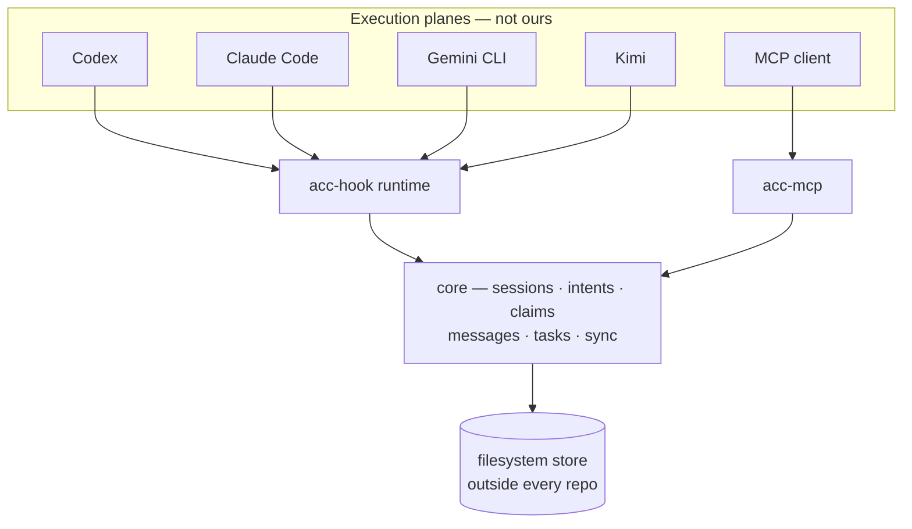
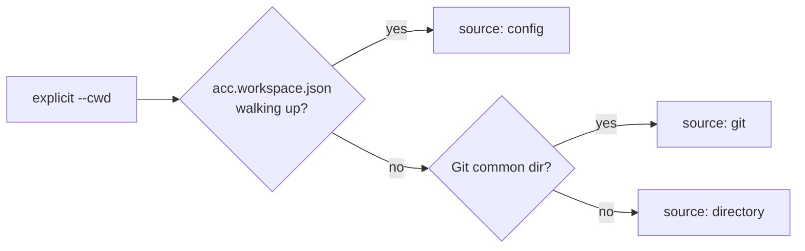

# Architecture

ACC is a control plane. It owns coordination state and nothing else — not inference, not
conversation history, not permissions, not process lifecycle.

That boundary is the reason ACC can improve independently opened sessions without taking
them over. Clients keep their own execution and trust models; the shared layer supplies
only the facts needed to avoid isolation, duplicate work, and unsafe handoffs.



## Packages

| Package | Owns |
|---|---|
| `protocol` | Ids, schemas, error codes, exit codes, project-config validation |
| `core` | The rules. No Git, no vendor, no filesystem |
| `storage-filesystem` | The durable store behind `CoordinationStore` |
| `adapter-sdk` | Shared adapter machinery: hook shim, context projector, TOML block editing |
| `adapter-*` | One client each. Everything vendor-specific lives here |
| `hook-runner` | The `acc-hook` binary every adapter's hook actually invokes |
| `mcp-server` | The `acc-mcp` binary for clients with no adapter |
| `installer` | Detect → plan → apply, with content-hashed ownership |
| `cli` | The `acc` binary; the universal adapter boundary |

`core` cannot import a vendor, a harness, or `node:child_process`. That is enforced by
`tests/package-boundaries.test.mjs`, not by convention.

## The storage port

```js
transaction(callback)                    // atomic: read, write, append events
eventsSince(workspaceId, cursor, limit)  // ordered page of events
snapshot(workspaceId)                    // materialised state
store.ephemeral                          // presence and Intent before materialisation
```

Ephemeral records hang off the store rather than becoming a fourth port. They append no
events and vanish with their session — deliberately outside transactions.

Ports are validated at construction. A core that silently falls back to ambient time or
randomness produces tests that pass for the wrong reason.

## Workspace discovery



Every branch returns the same descriptor — `{ id, roots, source, displayName, git? }` — so
nothing downstream knows or cares which one produced it. Multiple Git worktrees of one repository share
awareness while keeping distinct checkout metadata: each session records its
`checkoutRoot` and `branch`, so the roster answers which agent is in which worktree.

The boundary is the repository, not the machine. Two unrelated projects resolve to two
workspaces and share nothing.

## Lazy materialisation

A lone session writes only ephemeral presence and Intent. Durable state — protocol
identity, event log, materialised views — appears exactly once, at the first moment
coordination exists: a second live session attaches, or the session creates its first
durable object. Workspaces that never got there vanish without a trace.

A lone session also pays no attention cost: adapters inject nothing while the roster has no
peers, and guards short-circuit against the empty claim set.

## Events

Every meaningful mutation appends an immutable event and updates materialised state in one
transaction. Sequence numbers are zero-padded strings, so a lexical sort is a chronological
sort and a cursor is just the last sequence seen.

Adapters sync with that cursor and receive `{ cursor, events, attention }`.

## Attention

Computed from explicit rules, never from a hidden classifier. Lower sorts first:

| Priority | Kind | Fires when |
|---|---|---|
| 1 | `direct_request` | A message addressed to you requires an ack and has not had one |
| 2 | `claim_conflict` | Your declared resource hints overlap a live claim you do not own |
| 3 | `task_unblocked` | Work addressed to your participant is `pending` — every dependency is `done` |
| 4 | `coordinator_missing` | An open workstream has no coordinator |
| 5 | `request_stalled` | You asked for something and nobody is on it: work you requested is held by a session that has gone quiet or addressed to a participant that is not here, or a question of yours needing an answer is addressed to a participant that is not here |
| 6 | `claim_expired` | A claim you took has run out. Peers can write to it again, and until now nothing said so |

A task with unmet dependencies is `blocked`, and finishing the last one flips its dependents
to `pending`. So `pending` already means ready, and nothing has to re-evaluate the graph.

Semantic relevance is the receiving model's job. Correctness is not allowed to depend on it.

## Consistency

- Workspace identity is checked before any mutation.
- Claims are acquired and conflict-checked atomically.
- Event publication and state update are one transaction.
- Acknowledgements never overwrite messages or earlier receipts.
- Force operations record actor, reason, and the replaced generation.
- Doctor fails closed on ambiguous ownership.
- A weaker adapter capability never silently becomes a stronger claim.

## Presence

Three observable states: online, stale, offline. Heartbeats arrive only where a harness
exposes them — hook safe points, or tool calls for MCP. An idle-but-open session degrades
to `stale`, and that is truthful reporting rather than an error. Only Kimi Code fires on a
timer; see [CAPABILITIES.md](CAPABILITIES.md).

Lease expiry decides when ownership may be replaced. Presence staleness alone never does —
an idle session may resume at any moment.

## A hook never fails closed

The runtime has a 5-second budget and allows the tool call on anything it cannot answer in
time. A coordination tool must not be the reason a session stops working.
