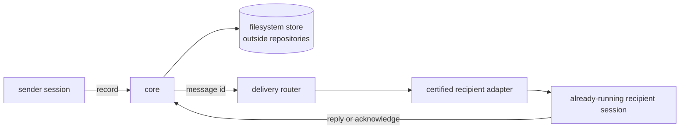

# Architecture

ACC is a local control plane for communication facts. The execution planes remain the AI
clients the user opened. Core records the truth before a delivery adapter is asked to make
it arrive sooner.



ACC never starts, resumes, interrupts, supervises, or terminates the target client. A
transport that requires owning that lifecycle is outside the product boundary.

## Packages and dependency direction

| Package | Owns |
|---|---|
| `protocol` | ids, closed schemas, semantic validation, receipt transitions, error and exit codes |
| `core` | sessions, intent, claims, conversations, inbox, receipts, attention, ephemeral delivery bindings |
| `storage-filesystem` | atomic transactions, event journal, materialised views, recovery, writer lock |
| `adapter-sdk` | capability validation, exact-version certification, context projection, hook and install helpers |
| `adapter-*` | vendor-specific hooks, responses, installation, evidence, and optional transport |
| `delivery-router` | recipient policy, one-generation selection, safe offer, then receipt commit |
| `hook-runner` | bounded adapter hook entry point |
| `mcp-server` | polling participation for clients without a native adapter |
| `cli` | universal local command boundary |

Core cannot branch on a vendor name or import an adapter, Git, or
`node:child_process`. Package-boundary tests enforce this rather than relying on
convention.

## Record, then offer

The order is part of the public guarantee:

1. validate and commit the message plus one `queued` receipt per resolved recipient;
2. resolve the recipient's current delivery bindings;
3. check recipient policy, current reachability, and exact client-version certification;
4. ask one adapter to cross its transport boundary;
5. only after acceptance, commit `offered` and an immutable success event.

A failed offer records the selected recipient session id and generation with a safe
diagnostic code, then leaves the receipt queued. Core validates that target provenance and
derives the event actor from it. A crash after bytes cross the boundary but before the
receipt commit may duplicate a later offer; ACC prefers that truthful underclaim to
claiming delivery before it happened.

## Delivery router is not a session manager

Messages address participants. The router may choose a live path only when exactly one
unexpired session generation is eligible. It does not open a session to make one eligible.
Zero candidates, several candidates, an unknown version, recipient policy `off`, or an
adapter refusal all produce durable fallback.

The binding is ephemeral and stores:

```text
sessionId · generation · adapterId · clientVersion · availableModes
livePolicy · opaqueEndpointRef · leaseUntil
```

Core validates identity and expiry but never interprets the opaque endpoint. That remains
inside the owning adapter. `acc status` reports available modes, policy, reachability, and
lease without exposing the endpoint.

## Certified capability versus current reachability

A capability says an exact client version on an exact platform passed a captured behavior.
It does not say one particular session is reachable now. A binding says what that current
generation exposes and whether its lease is current. Recipient policy says whether it may
spend a turn. All three must agree before live delivery is possible.

Codex and Claude Code currently ship failed native-delivery captures, so their
`delivery.livePush` and `delivery.replyRoute` capabilities resolve false. Gemini CLI and
Kimi Code have exact-version next-turn evidence only. Grok and generic MCP use inbox
polling. The architecture includes a live seam without pretending the current clients
proved it.

## Storage and workspace identity

The filesystem store is the durable source of truth. Every meaningful mutation updates
materialised records and appends an immutable event in one transaction. Sequence ids sort
lexically, so a cursor is simply the last sequence returned.

Workspace discovery checks an explicit config first, then the Git common directory, then
the plain directory. Multiple worktrees share a workspace id while each session records
its checkout and branch. Nothing written by ACC lands inside those roots.

A lone session can remain ephemeral. Durable state materialises when a second live session
appears or the first claim, message, or handoff is committed. This makes “silent when
alone” an architectural behavior, not a UI preference.

## Inbox, attention, and projection

Inbox reads only messages addressed to the calling participant and advances that
participant's receipt to `retrieved`. Reply validates ownership, creates an `answer` in the
same thread, and acknowledges the original atomically. No participant can advance another
participant's receipt.

Attention is computed from six explicit rules:

| Priority | Kind | Observable trigger |
|---|---|---|
| 1 | `reply_required` | this participant owns an unacknowledged receipt whose message requires a reply |
| 2 | `acknowledgement_required` | this participant owns an unacknowledged receipt whose message requires acknowledgement |
| 3 | `recipient_unavailable` | a required recipient of this participant's message has no online session |
| 4 | `claim_conflict` | this session's intent hint overlaps another live claim |
| 5 | `claim_contended` | a peer intent hint overlaps a live claim this session owns |
| 6 | `claim_expired` | a claim this session owned has reached its lease time |

Semantic relevance belongs to the receiving model; correctness never depends on a hidden
classifier.

Adapters project peer bodies in an attributed untrusted frame. If a complete body cannot
fit, the projection keeps the message id and points to `acc inbox --message <id>` instead
of silently truncating it.

## Hooks fail open

Hook execution is bounded. If coordination state cannot be read or a decision cannot be
made in time, the client action continues. ACC may warn or guard where a real hook allows
it, but a coordination tool must not be the reason a session stops working.

Next: [Protocol](PROTOCOL.md) · [Capabilities](CAPABILITIES.md) ·
[Security model](SECURITY_MODEL.md)
