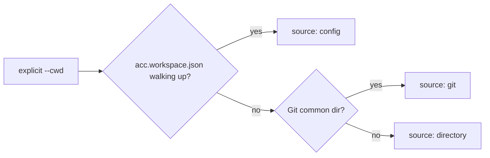

# Architecture

ACC is a control plane. It owns coordination state and nothing else — not inference, not
conversation history, not permissions, not process lifecycle. That boundary is why ACC can
improve independently opened sessions without taking them over: clients keep their own
execution and trust models, and the shared layer supplies only the facts needed to avoid
isolation, duplicate work, and unsafe handoffs.


## Packages

| Package | Owns |
|---|---|
| `protocol` | Ids, schemas, error codes, exit codes, project-config validation |
| `core` | The rules. No Git, no vendor, no filesystem |
| `storage-filesystem` | The durable store behind `CoordinationStore` |
| `adapter-sdk` | Shared adapter machinery: hook shim, context projector, TOML block editing |
| `adapter-*` | One client each. Everything vendor-specific lives here |
| `hook-runner` | The `acc-hook` binary every adapter's hook actually invokes |
| `mcp-server` | The `acc-mcp` binary for clients with no adapter |
| `installer` | Detect → plan → apply, with content-hashed ownership |
| `cli` | The `acc` binary; the universal adapter boundary |

`core` cannot import a vendor, a harness, or `node:child_process`. That is enforced by
`tests/package-boundaries.test.mjs`, not by convention.

## The storage port

```js
transaction(callback)                    // atomic: read, write, append events
eventsSince(workspaceId, cursor, limit)  // ordered page of events
snapshot(workspaceId)                    // materialised state
store.ephemeral                          // presence and Intent before materialisation
```

Ephemeral records hang off the store rather than becoming a fourth port: they append no
events and vanish with their session, deliberately outside transactions. Ports are
validated at construction — a core that silently falls back to ambient time or randomness
produces tests that pass for the wrong reason.

## Workspace discovery



Every branch returns the same descriptor — `{ id, roots, source, displayName, git? }` — so
nothing downstream cares which one produced it. Multiple Git worktrees of one repository
share awareness while keeping distinct checkout metadata: each session records its
`checkoutRoot` and `branch`, so the roster answers which agent is in which worktree. The
boundary is the repository, not the machine — two unrelated projects share nothing.

## Lazy materialisation

A lone session writes only ephemeral presence and Intent. Durable state — protocol
identity, event log, materialised views — appears exactly once, at the first moment
coordination exists: a second live session attaches, or the session creates its first
durable object. Workspaces that never got there vanish without a trace.

A lone session also pays no attention cost: adapters inject nothing while the roster has no
peers, and guards short-circuit against the empty claim set. With peers, ambient projection
is one compact instruction to load the ACC skill, deduplicated by participant rather than
enumerating the roster or unrelated claims. Addressed messages and intent-aware conflicts
keep their ids and detail; an over-budget body points to `acc inbox --message <id>`.

## Session continuation

A harness binding carries the ACC session id and generation between hook processes. Some
clients fire SessionStart again after compacting model context; the runner resumes the
exact open generation named by that binding, refreshing heartbeat and process metadata
without appending another `session.opened` event. A missing, closed, or invalid binding
opens a genuinely new session — compaction is not a second participant arriving.

## Events

Every meaningful mutation appends an immutable event and updates materialised state in one
transaction. Sequence numbers are zero-padded strings, so a lexical sort is a chronological
sort and a cursor is just the last sequence seen. Adapters sync with that cursor and
receive `{ cursor, events, attention }`.

## Attention

Computed from explicit rules, never from a hidden classifier. Lower sorts first:

| Priority | Kind | Fires when |
|---|---|---|
| 1 | `reply_required` | Your receipt carries an unresolved `reply` obligation |
| 2 | `acknowledgement_required` | Your receipt carries an unresolved `acknowledge` obligation |
| 3 | `recipient_unavailable` | Your addressed message has an unresolved obligation and its recipient has no online session |
| 4 | `claim_conflict` | Your declared resource hints overlap a live claim you do not own |
| 5 | `claim_contended` | A peer's declared resource hints overlap a live claim you hold |
| 6 | `claim_expired` | A claim you took has run out, so peers can write to it again |

Semantic relevance is the receiving model's job; correctness is not allowed to depend on it.

## Consistency

- Workspace identity is checked before any mutation.
- Claims are acquired and conflict-checked atomically.
- Event publication and state update are one transaction.
- Acknowledgements never overwrite messages or earlier receipts.
- Force operations record actor, reason, and the replaced generation.
- Doctor fails closed on ambiguous ownership.
- A weaker adapter capability never silently becomes a stronger claim.

## Presence

Three observable states: online, stale, offline. Heartbeats arrive only where a harness
exposes them — hook safe points, or tool calls for MCP — so an idle-but-open session
degrading to `stale` is truthful reporting, not an error. Pid liveness and how long a
session has been silent decide the transition to `offline`; a claim is never released by
presence alone. The full presence and pid-reuse rationale is archived in
[internal notes](internal/presence-model.md).

## A hook never fails closed

The runtime has a 5-second budget and allows the tool call on anything it cannot answer in
time. A coordination tool must not be the reason a session stops working.

---

See also: [README](index.md) for navigation, [Glossary](GLOSSARY.md) for terms, and
[Protocol](PROTOCOL.md) for interfaces.
