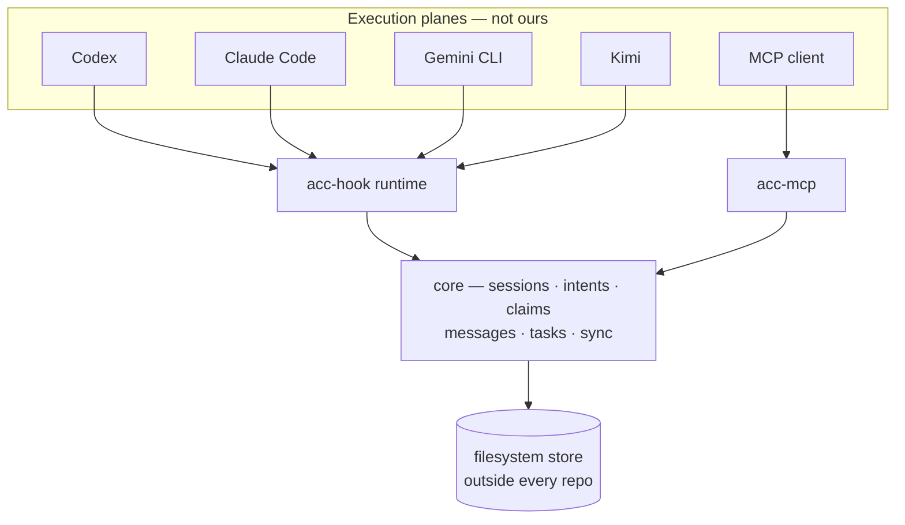
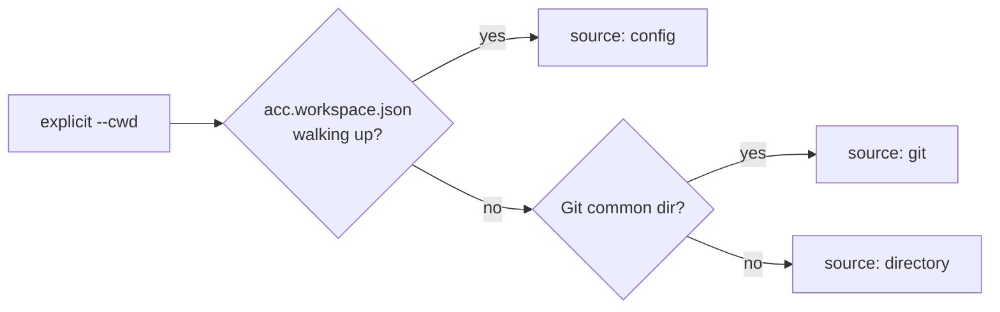

# Architecture

ACC is a control plane. It owns coordination state and nothing else — not inference, not
conversation history, not permissions, not process lifecycle.

That boundary is the reason ACC can improve independently opened sessions without taking
them over. Clients keep their own execution and trust models; the shared layer supplies
only the facts needed to avoid isolation, duplicate work, and unsafe handoffs.



## Packages

| Package | Owns |
|---|---|
| `protocol` | Ids, schemas, error codes, exit codes, project-config validation |
| `core` | The rules. No Git, no vendor, no filesystem |
| `storage-filesystem` | The durable store behind `CoordinationStore` |
| `adapter-sdk` | Shared adapter machinery: hook shim, context projector, TOML block editing |
| `adapter-*` | One client each. Everything vendor-specific lives here |
| `hook-runner` | The `acc-hook` binary every adapter's hook actually invokes |
| `mcp-server` | The `acc-mcp` binary for clients with no adapter |
| `installer` | Detect → plan → apply, with content-hashed ownership |
| `cli` | The `acc` binary; the universal adapter boundary |

`core` cannot import a vendor, a harness, or `node:child_process`. That is enforced by
`tests/package-boundaries.test.mjs`, not by convention.

## The storage port

```js
transaction(callback)                    // atomic: read, write, append events
eventsSince(workspaceId, cursor, limit)  // ordered page of events
snapshot(workspaceId)                    // materialised state
store.ephemeral                          // presence and Intent before materialisation
```

Ephemeral records hang off the store rather than becoming a fourth port. They append no
events and vanish with their session — deliberately outside transactions.

Ports are validated at construction. A core that silently falls back to ambient time or
randomness produces tests that pass for the wrong reason.

## Workspace discovery



Every branch returns the same descriptor — `{ id, roots, source, displayName, git? }` — so
nothing downstream knows or cares which one produced it. Multiple Git worktrees of one repository share
awareness while keeping distinct checkout metadata: each session records its
`checkoutRoot` and `branch`, so the roster answers which agent is in which worktree.

The boundary is the repository, not the machine. Two unrelated projects resolve to two
workspaces and share nothing.

## Lazy materialisation

A lone session writes only ephemeral presence and Intent. Durable state — protocol
identity, event log, materialised views — appears exactly once, at the first moment
coordination exists: a second live session attaches, or the session creates its first
durable object. Workspaces that never got there vanish without a trace.

A lone session also pays no attention cost: adapters inject nothing while the roster has no
peers, and guards short-circuit against the empty claim set. With peers, ambient projection
is one compact instruction to load the ACC skill. It deduplicates legacy sessions by
participant and does not enumerate the roster or unrelated claims. Addressed messages and
intent-aware conflicts keep their ids and detail; an over-budget body points to
`acc inbox --message <id>`.

## Session continuation

A harness binding carries the ACC session id and generation between hook processes. Some
clients fire SessionStart again after compacting model context. The runner resumes the
exact open generation named by that binding, refreshing heartbeat and process metadata
without appending another `session.opened` event. A missing, closed, or invalid binding
opens a genuinely new session. Compaction is not a second participant arriving.

## Events

Every meaningful mutation appends an immutable event and updates materialised state in one
transaction. Sequence numbers are zero-padded strings, so a lexical sort is a chronological
sort and a cursor is just the last sequence seen.

Adapters sync with that cursor and receive `{ cursor, events, attention }`.

## Attention

Computed from explicit rules, never from a hidden classifier. Lower sorts first:

| Priority | Kind | Fires when |
|---|---|---|
| 1 | `direct_request` | A message addressed to you requires an ack and has not had one |
| 2 | `claim_conflict` | Your declared resource hints overlap a live claim you do not own |
| 3 | `task_unblocked` | Work addressed to your participant is `pending` — every dependency is `done` |
| 4 | `coordinator_missing` | An open workstream has no coordinator |
| 5 | `request_stalled` | You asked for something and nobody is on it: work you requested is held by a session that has gone quiet or addressed to a participant that is not here, or a question of yours needing an answer is addressed to a participant that is not here |
| 6 | `claim_expired` | A claim you took has run out. Peers can write to it again, and until now nothing said so |
| 7 | `claim_contended` | A peer's declared resource hints overlap a live claim you hold. The mirror of `claim_conflict`: a claim is advice, not a lock, so the holder is told early that someone means to touch it |
| 8 | `unread_note` | A message shown to you once that you have not acknowledged, and which raised no `direct_request` because it asks for no ack. It surfaces as a single low-priority breadcrumb the turn after delivery, then goes quiet — so a delivered note (agents put decisions in them) stays recoverable without becoming a standing nag |

A task with unmet dependencies is `blocked`, and finishing the last one flips its dependents
to `pending`. So `pending` already means ready, and nothing has to re-evaluate the graph.

Semantic relevance is the receiving model's job. Correctness is not allowed to depend on it.

## Consistency

- Workspace identity is checked before any mutation.
- Claims are acquired and conflict-checked atomically.
- Event publication and state update are one transaction.
- Acknowledgements never overwrite messages or earlier receipts.
- Force operations record actor, reason, and the replaced generation.
- Doctor fails closed on ambiguous ownership.
- A weaker adapter capability never silently becomes a stronger claim.

## Presence

Three observable states: online, stale, offline. Heartbeats arrive only where a harness
exposes them — hook safe points, or tool calls for MCP. An idle-but-open session degrades
to `stale`, and that is truthful reporting rather than an error. Only Kimi Code fires on a
timer; see [CAPABILITIES.md](CAPABILITIES.md).

A session reads `offline` when it is closed; when its recorded process is confirmed dead;
when it has no recorded process and has been silent past thirty minutes — the point past
which nobody can tell whether it is alive; or when it has been silent past twenty-four
hours regardless of its process, because a process number can be reissued to something
unrelated and a pid that still answers is not proof it is the same session. `online` and
`stale` are unaffected: they still come from the session's own declared heartbeat cadence.

A recorded process to confirm dead is not something every client gets, either - it comes
from matching the adapter's own binary name against the operating system's name for the
process, which fails for a client that is a script rather than an executable. Half of the
shipped adapters resolve one and half do not; see [CAPABILITIES.md](CAPABILITIES.md).

An open session's id is reused only once its recorded process is confirmed dead — a closed
one is already free, since closing is the session's own choice, not a presence judgment
made about it. Presence staleness alone never reuses an open session's id: an idle session
may resume at any moment, and a session with no recorded pid stays owner of its id however
long the silence, regardless of age. Only the operating system's word that the process is
gone is authority to hand it to someone else.

One gap in that rule is left open rather than fixed: a pid the OS has reissued to an
unrelated long-lived process answers alive forever, past even the twenty-four-hour floor
that retires everything else, because a pid that answers past that floor is either a live
idle session or a recycled number and there is no way to tell which. "Cannot tell" is never
authority for reusing a session's id, so this reads offline in presence but stays live for
replacement — a wrong answer no more frequent than pid recycling itself, and reachable only
through `acc attach --session <id>`, since the hook path always mints a fresh id rather than
naming an existing one.

A claim follows the same restraint for its own reason: presence never releases one, only
an expired lease or an explicit force release does — see
[PROTOCOL.md](PROTOCOL.md#claim-lifetime-and-stale-owners).

A workstream coordinator is one role presence staleness alone *does* replace: it is
contestable by any peer the moment its holder reads `offline`, silence-based cases
included, with no confirmed death and no human or policy authority required. That is
deliberate, not an oversight — a coordinator whose process was killed used to leave its
workstream stuck with an uncontestable coordinator forever, the same failure this branch
exists to fix. The role can afford it where a session id cannot: taking a coordinator
destroys nothing and the original holder can reacquire it the moment it is back, while
reusing a session id cannot be undone — the displaced session's own heartbeats fail with
CONFLICT from then on.

Task assignment is the other. `acc task --take` on a task already held by someone else's
session refuses outright while the holder reads `online`, and requires `--force` while it
reads `stale` — but once the holder reads `offline`, the task is simply taken, silence-based
cases included, with no force and no confirmation that the holder's process is actually
dead. A holder attached over MCP, which never records a pid, reads `offline` from silence
alone after thirty minutes with no tool call to heartbeat it. This is acceptable for the
same two reasons the coordinator case is: the participant guard still refuses a different
participant's session regardless of presence, so the blast radius is one participant taking
its own work back from itself, and a task taken back is reversible — nothing is destroyed,
and the original holder can pick it back up the moment it resumes.

## A hook never fails closed

The runtime has a 5-second budget and allows the tool call on anything it cannot answer in
time. A coordination tool must not be the reason a session stops working.
