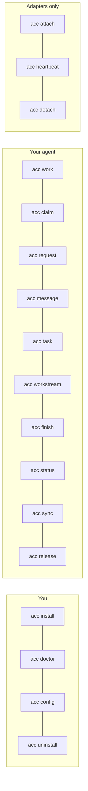

# CLI

Every command takes `--json` for machine output and `--cwd` to pick the workspace.



## Setup

| Command | Does |
|---|---|
| `acc install` | Install adapters for the clients on this machine |
| `acc install --dry-run` | Print the exact plan, change nothing |
| `acc install --adapter kimi` | One client only |
| `acc uninstall` | Remove what ACC wrote, keep what you edited |
| `acc doctor` | Clients, versions, install health, what to run next |
| `acc doctor --repair` | Repair store state; refuses if it is ambiguous |
| `acc config init` | Write `acc.workspace.json` after showing it |
| `acc config validate` | Read-only check |

## In a session

| Command | Does |
|---|---|
| `acc status` | Who is here, claims, protection level |
| `acc sync` | New events since a cursor; silent when alone |
| `acc work` | Publish what this session is doing |
| `acc claim` | Reserve a resource. Exit `5` on conflict |
| `acc release` | Give it back |
| `acc ack` | Answer a message that asked for one, so it stops asking |
| `acc message` | Send a typed message to participants |
| `acc request` | Ask another agent to do something. One call: the work plus why |
| `acc task` | Create work, `--take` it, or `--state` it along |
| `acc workstream` | Group related work. Optional |
| `acc finish` | Write the handoff and release claims |

## Adapters only

`acc attach`, `acc heartbeat`, `acc detach` — driven by hooks, not by people.

## Exit codes

| Code | Meaning |
|---|---|
| 0 | ok |
| 2 | usage |
| 3 | timeout |
| 4 | data |
| 5 | conflict — someone holds the claim |
| 6 | attention |

## Ownership arguments

Anything that mutates needs `--session` and `--generation`. The generation is what stops a
restarted process from acting as the old one.

## Asking another agent

```bash
acc request --session "$ACC_SESSION" --generation "$ACC_GENERATION" \
  --to claude_code --title "finish the store tests" \
  --detail "I ported src/store but ran out of time on the concurrency cases."
```

Finishing the task answers the request it came from, so the message stops demanding an
acknowledgement. `acc ack --message <id>` does the same for messages that are not tied to a
task — and a session can only mark its own receipt, since reading something is a statement
only the reader can make.

One write. The recipient learns about it twice, and the two facts are different: the work
appears as an attention item addressed to them, and the message explains why. A task with
no message is work nobody understands; a message with no task is a request nothing tracks.

Work is addressed to a **participant**, not a session. The agent can close its terminal and
the next session it opens is still told. Only that participant can take it:

```bash
acc task --session … --generation … --task task_x --take     # exit 5 if it is not yours
acc task --session … --generation … --task task_x --state review
```

`--assignee` on `acc task` addresses work without sending a message. `acc request` is the
same thing with the explanation attached, which is almost always what you want.

A workstream is optional. `acc request --to models --title "review the migration"` needs no
project around it. Create one when several pieces belong together:

```bash
acc workstream --session … --generation … \
  --title "Storage" --objective "port the store and its tests"
```
