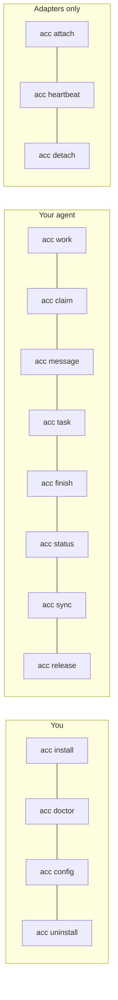

# CLI

Every command takes `--json` for machine output and `--cwd` to pick the workspace.

## Setup

| Command | Does |
|---|---|
| `acc install` | Install adapters for the clients on this machine |
| `acc install --dry-run` | Print the exact plan, change nothing |
| `acc install --adapter kimi` | One client only |
| `acc uninstall` | Remove what ACC wrote, keep what you edited |
| `acc doctor` | Clients, versions, install health, what to run next |
| `acc doctor --repair` | Repair store state; refuses if it is ambiguous |
| `acc config init` | Write `acc.workspace.json` after showing it |
| `acc config validate` | Read-only check |

## In a session

| Command | Does |
|---|---|
| `acc status` | Who is here, claims, protection level |
| `acc sync` | New events since a cursor; silent when alone |
| `acc work` | Publish what this session is doing |
| `acc claim` | Reserve a resource. Exit `5` on conflict |
| `acc release` | Give it back |
| `acc message` | Send a typed message to participants |
| `acc task` | Create a task in a workstream |
| `acc finish` | Write the handoff and release claims |

## Adapters only

`acc attach`, `acc heartbeat`, `acc detach` — driven by hooks, not by people.

## Exit codes

| Code | Meaning |
|---|---|
| 0 | ok |
| 2 | usage |
| 3 | timeout |
| 4 | data |
| 5 | conflict — someone holds the claim |
| 6 | attention |

## Ownership arguments

Anything that mutates needs `--session` and `--generation`. The generation is what stops a
restarted process from acting as the old one.
