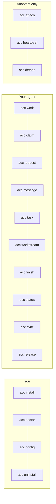

# CLI

ACC keeps setup commands human-facing and coordination commands agent-facing. That split
lets it disappear into sessions you already use instead of becoming a new console that
owns the work.

Every command takes `--json` for machine output and `--cwd` to pick the workspace.

`acc help` prints this list in short form, and `acc version` prints what is installed.
Both work anywhere, including a directory that is no workspace at all.

`acc update` is the only command that touches the network. `acc doctor` reads what it
remembered, asking at most once a day, and `ACC_NO_UPDATE_CHECK=1` turns both off. Nothing
on the hook path ever asks: a hook runs every turn inside a five-second budget.

Updating matters in two places at once. `npm install -g` replaces this CLI and the hook
runtime — the shim a client runs points into the npm directory rather than at a copy — and
leaves the bundle written into the client alone, including the skills the agents read. That
is why an upgrade is two commands, and why `acc doctor` says so when they disagree.

<!-- test:command -->
```bash
acc help
acc version
acc uninstall --dry-run
```



## Setup

| Command | Does |
|---|---|
| `acc install` | Install adapters for the clients on this machine |
| `acc install --adapter kimi` | One client only |
| `acc uninstall` | Remove what ACC wrote, keep what you edited — including for a client that has since left the machine |
| `acc doctor` | Clients, versions, install health, what to run next |
| `acc doctor --repair` | Repair store state; refuses if it is ambiguous |
| `acc config init` | Write `acc.workspace.json` after showing it |
| `acc config validate` | Read-only check |

## In a session

| Command | Does |
|---|---|
| `acc status` | Who is here, claims, protection level. `--all` adds everyone who has been |
| `acc sync` | New events since a cursor; silent when alone |
| `acc work` | Publish what this session is doing. `--hint` names a resource so a claim holder is warned; `--clear` when it has stopped |
| `acc claim` | Reserve a resource. Exit `5` on conflict |
| `acc release` | Give it back. `--resource` for what you claimed, `--claim` for its id |
| `acc ack` | Answer a message that asked for one, so it stops asking |
| `acc message` | Send a typed message to participants |
| `acc request` | Ask another agent to do something. One call: the work plus why |
| `acc task` | Create work, `--take` it, or `--state` it along |
| `acc workstream` | Group related work. Optional. `--take` / `--release` steer one |
| `acc decide` | Record what was settled, so the next session does not reopen it |
| `acc finish` | Write the handoff and release claims |

## Adapters only

`acc attach`, `acc heartbeat`, `acc detach` — driven by hooks, not by people.

## About acc

| Command | Does |
|---|---|
| `acc help` | Every command with one line each. `--help` and `-h` mean the same |
| `acc version` | The installed version, read from the package. `--version` and `-v` too |
| `acc update` | Ask npm whether a newer acc exists |
| `acc update --apply` | Install it, then re-run `acc install` so the clients get the new bundle |

## Exit codes

| Code | Meaning |
|---|---|
| 0 | ok |
| 2 | usage |
| 3 | timeout |
| 4 | data |
| 5 | conflict — someone holds the claim |
| 6 | attention |

## Ownership arguments

Anything that mutates acts as a session, and proves it with that session's generation —
which is what stops a restarted process from acting as the old one. You do not pass
either. `acc` works out which session is running it, from the binding the adapter wrote
when the session started:

| It uses | When |
|---|---|
| `--session` and `--generation` | you passed them — adapters and scripts do |
| `--session` alone | you have an id from `acc status --json`; the rest is looked up |
| the client's own session id in the environment | the client exports one, under any name |
| the checkout you are in | several sessions here, each in its own worktree |
| the only live session | you are the only one attached |

If two live sessions in one checkout both fit, it stops and names them rather than
guessing — acting as the wrong session is exactly what the generation prevents.

The generation is never printed by `acc status`, on purpose: it is proof of ownership, not
public information.

## Who has been here

`acc status` lists the sessions that are present. A closed session is kept — a message is
attributed to whoever sent it, and the roster is the only place that answers which checkout
an agent was working in, which is a question its session cannot answer once it has gone.

```bash
acc status --all
```

That is how a cleanup asks: each entry carries `checkoutRoot`, `branch` and `presence`, so
a worktree with no live session behind it can be told apart from someone's desk.

## Recording what was settled

A decision outlives the conversation that produced it, which is why it is a durable object
rather than another message in the log.

```bash
acc decide --title "hull clamps at half height" \
  --outcome "settle() clamps to GROUND_Y + height/2; renderer draws what physics returns"
```

`--authority` is who settled it: `workstream` (the default) for an agreement between
agents, `policy` for a rule that already existed, and `human` only when a person actually
said so — which needs `--human` as well. A peer proposal cannot become a human-authority
decision on its own; that is the one way this record could launder an agent's opinion into
a ruling.

`--supersedes` points at the decision this replaces, and the one it names has to exist.

## Asking another agent

`--to` and `--assignee` name a participant from the roster. One nobody here has is refused
rather than accepted: a message to a name that does not exist used to report `sent` and go
nowhere, and a request made a task assigned to nobody that its author then waited on. A
participant who has closed their terminal is still a participant — that is the whole reason
work is addressed to one.

```bash
acc request --to claude_code --title "finish the store tests" \
  --detail "I ported src/store but ran out of time on the concurrency cases."
```

Finishing the task answers the request it came from, so the message stops demanding an
acknowledgement. `acc ack --message <id>` does the same for messages that are not tied to a
task — and a session can only mark its own receipt, since reading something is a statement
only the reader can make.

One write. The recipient learns about it twice, and the two facts are different: the work
appears as an attention item addressed to them, and the message explains why. A task with
no message is work nobody understands; a message with no task is a request nothing tracks.

Work is addressed to a **participant**, not a session. The agent can close its terminal and
the next session it opens is still told — as long as that agent has a name of its own.
Without one, each run is a new participant, so nothing addressed to the last one reaches it:

```bash
ACC_PARTICIPANT=backend-codex codex
```

Only that participant can take the work:

```bash
acc task --task task_x --take     # exit 5 if it is not yours
acc task --task task_x --state review
```

`--assignee` on `acc task` addresses work without sending a message. `acc request` is the
same thing with the explanation attached, which is almost always what you want.

A workstream is optional. `acc request --to models --title "review the migration"` needs no
project around it. Create one when several pieces belong together:

```bash
acc workstream \
  --title "Storage" --objective "port the store and its tests"
```

An open workstream with nobody steering it raises `coordinator_missing` for everyone, every
turn, until somebody takes it on. Taking it is saying so; releasing it asks again.

```bash
acc workstream --workstream workstream_x --take
acc workstream --workstream workstream_x --release
```

Only the session holding the lease can hand it back.
