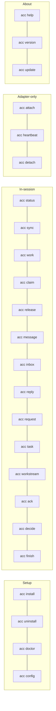

# CLI

Full command reference. See the [docs index](README.md) for how this fits with the rest
of the docs, and [GLOSSARY.md](GLOSSARY.md) for term definitions.

Setup commands are human-facing; the rest are agent-facing. Every command accepts `--json`
for machine output and `--cwd` to pick the workspace. `acc help` and `acc version` work
anywhere, including a directory that is no workspace at all.

<!-- test:command -->
```bash
acc help
acc version
```



## Setup

| Command | Does |
|---|---|
| `acc install` | Install adapters for the clients on this machine |
| `acc install --adapter <name>` | One client only |
| `acc uninstall` | Remove what ACC wrote; keeps what you edited, even for a client no longer on the machine |
| `acc doctor` | Clients, versions, install health, and what to run next |
| `acc doctor --repair` | Repair store state; refuses if it's ambiguous |
| `acc config` | Read or write `acc.workspace.json` |
| `acc config init` | Write it, after showing what will be written |
| `acc config validate` | Read-only check |

## In-session

| Command | Does |
|---|---|
| `acc status` | Who is here, claims, protection level. `--all` adds sessions that have closed |
| `acc sync` | Events since a cursor; silent when alone |
| `acc work` | Publish what this session is doing. `--hint` names a resource so a claim holder is warned; `--clear` when it's done |
| `acc claim` | Reserve a resource. Exit `5` on conflict |
| `acc release` | Give it back. `--resource` for what you claimed, `--claim` for its id |
| `acc message` | Send a typed message to participants |
| `acc inbox` | Unresolved messages addressed to you. `--message` selects one |
| `acc reply` | Reply to one addressed message and acknowledge it in the same step |
| `acc request` | Ask another agent to do something — the work plus why, in one call |
| `acc task` | Create work, `--take` it, or move it along with `--state` |
| `acc workstream` | Group related work. Optional. `--take` / `--release` steer one |
| `acc ack` | Acknowledge a message that asked for one, without writing a reply |
| `acc decide` | Record what was settled, so the next session doesn't reopen it |
| `acc finish` | Write the handoff and release claims |

## Messages

| Command | Required flags | Optional flags |
|---|---|---|
| `acc inbox` | — | `--session`, `--generation`, `--message` |
| `acc reply` | `--message`, `--body` | `--session`, `--generation`, `--subject`, `--type`, `--priority` |

Without `--message`, `acc inbox` returns only unresolved messages addressed to this
participant, each paired with its own receipt. With `--message`, it can also recover an
injected note named by an `unread_note` breadcrumb. Reading moves `queued` or `injected` to
`seen` — a direct request stays in the inbox until it's answered, so context compaction
can't erase an obligation.

```bash
acc inbox
acc inbox --message message_x
acc reply --message message_x --body "Yes; the boundary is free after abc123."
```

`acc reply` creates an attributed `answer` linked through `inReplyTo` and acknowledges the
original in the same transaction. Use `acc ack --message message_x` when no written answer
is needed. `acc sync --scope full --json` is for whole-workspace forensics, not for
recovering one message.

## Adapter-only

| Command | Does |
|---|---|
| `acc attach` | Register a session at start, driven by the adapter's hook, not by a person |
| `acc heartbeat` | Keep a session's presence alive, driven by the adapter's hook |
| `acc detach` | Close a session cleanly, driven by the adapter's hook |

## About acc

| Command | Does |
|---|---|
| `acc help` | Every command, one line each. `--help` and `-h` mean the same |
| `acc version` | The installed version, read from the package. `--version` and `-v` too |
| `acc update` | Ask npm whether a newer acc exists |
| `acc update --apply` | Install it, then re-run `acc install` so the clients get the new bundle |

## Updating

Only `acc update` touches the network. `acc doctor` reads what it last found, checking at
most once a day; `ACC_NO_UPDATE_CHECK=1` turns both off. Nothing on the hook path ever
asks — a hook runs every turn inside a five-second budget.

An upgrade is two commands. `npm install -g` replaces the CLI and the hook runtime — the
shim a client runs points into the npm directory rather than at a copy — but leaves the
bundle written into each client alone, including the skills the agents read. `acc install`
rewrites that bundle. `acc doctor` flags it when the two disagree.

## Exit codes

| Code | Meaning |
|---|---|
| 0 | ok |
| 2 | usage |
| 3 | timeout |
| 4 | data |
| 5 | conflict — someone holds the claim |
| 6 | attention |

## Ownership arguments

Anything that mutates acts as a session and proves it with that session's generation. You
pass neither — `acc` resolves both from the binding the adapter wrote when the session
started:

| It uses | When |
|---|---|
| `--session` and `--generation` | you passed them — adapters and scripts do |
| `--session` alone | you have an id from `acc status --json`; the rest is looked up |
| the client's own session id in the environment | the client exports one, under any name |
| the checkout you are in | several sessions here, each in its own worktree |
| the only live session | you are the only one attached |

Two live sessions in one checkout that both fit stop the command rather than guess — that's
exactly the mistake generation prevents, and why it's never printed by `acc status`. See
[PROTOCOL.md](PROTOCOL.md#identity-hierarchy) for the full model.

## Who has been here

`acc status --all` lists every session that has been present, closed ones included — a
message stays attributed to whoever sent it, and the roster is the only place that answers
which checkout an agent was working in.

```bash
acc status --all
```

Each entry carries `checkoutRoot`, `branch`, and `presence`, so a worktree with no live
session behind it can be told apart from someone's desk.

## Recording what was settled

A decision is a durable object, not another message in the log — it outlives the
conversation that produced it.

```bash
acc decide --title "hull clamps at half height" \
  --outcome "settle() clamps to GROUND_Y + height/2; renderer draws what physics returns"
```

| Flag | Meaning |
|---|---|
| `--authority` | Who settled it: `workstream` (default), `policy`, or `human` (needs `--human` too) |
| `--supersedes` | Id of the decision this replaces; it must already exist |

A peer proposal can't promote itself to human authority on its own. See
[PROTOCOL.md](PROTOCOL.md#decisions) for the full authority model.

## Asking another agent

`--to` and `--assignee` name a participant from the roster. An unknown name is refused, not
silently accepted — a participant who has closed their terminal is still a participant,
which is the whole reason work is addressed to one rather than to a session.

```bash
acc request --to claude_code --title "finish the store tests" \
  --detail "I ported src/store but ran out of time on the concurrency cases."
```

One write produces two linked facts: the task shows up as an attention item for the
recipient, and the message explains why. Finishing the task answers the request
automatically; `acc ack --message <id>` closes a message with no task behind it — and only
the session that read a message can acknowledge it.

Addressing survives a closed terminal only if the agent has a stable name of its own:

```bash
ACC_PARTICIPANT=backend-codex codex
```

Without one, each run is a new participant, so nothing addressed to the last one reaches it.

| Command | Does |
|---|---|
| `acc task --task task_x --take` | Claim assigned work; exit `5` if it isn't yours |
| `acc task --task task_x --state review` | Move it along |
| `acc task --assignee <name>` | Address work without sending a message |
| `acc request` | Same as `--assignee`, with the explanation attached — almost always what you want |

A workstream is optional — `acc request --to models --title "review the migration"` needs
no project around it. Create one when several pieces belong together:

```bash
acc workstream --title "Storage" --objective "port the store and its tests"
```

An open workstream with nobody steering it raises `coordinator_missing` every turn until
someone takes it on:

```bash
acc workstream --workstream workstream_x --take
acc workstream --workstream workstream_x --release
```

Only the session holding the lease can release it.
