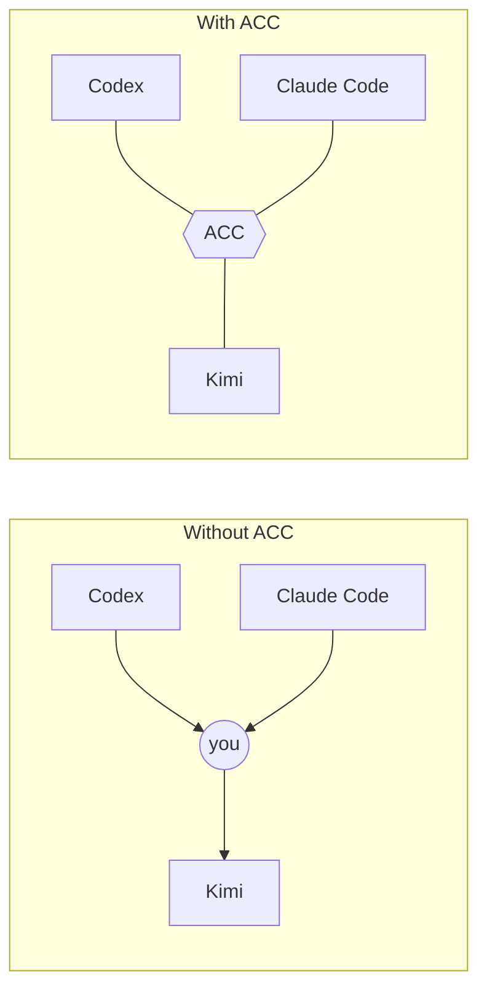
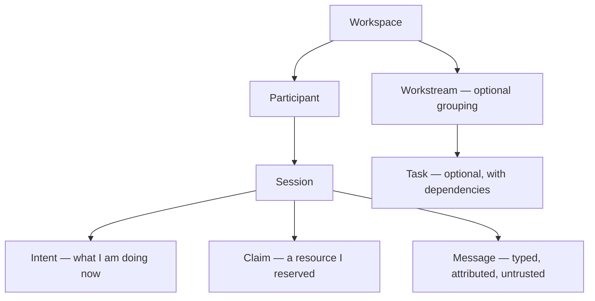
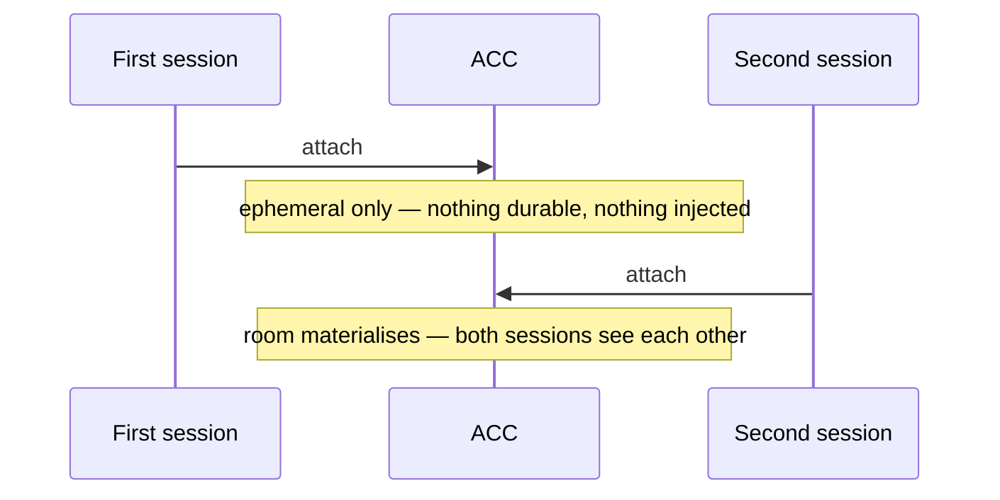

# Concepts

## You are the transport

You keep several agent sessions open at once — often different clients, on different
branches, in different git worktrees. Each has its own model, memory, permissions, and
human. None of them can see what the others are doing, and none can ask another for
anything.

So the coordination runs through you. One session is about to delete a field called
`item.drive`; another, in a file you're not looking at, still reads it. Nothing in either
terminal knows about the other — so you carry the warning across by hand, or it ships
broken. You copy context between windows, repeat decisions, and relay questions. You are
the wire.

ACC gives the sessions a shared room instead, so they carry those things to each other.

Subagents spawned *inside* one session solve a different problem — delegated work under a
single owner. ACC connects sessions **you** opened, and leaves each one's lifecycle,
permissions, context, and human direction independent. (New to a term below? The
[Glossary](GLOSSARY.md) defines each in one line.)

## Peers, not workers

The sessions ACC joins may run different models, clients, trust settings, or people.
Making one of them the standing authority would misrepresent that, and would make
coordination die the moment that one process did.

So ACC keeps the durable state *below* every session. Peers ask, answer, reserve, hand
off, and steer a workstream; none can quietly become the owner of another. That is the
useful middle ground between isolated terminals and a managed runtime that replaces them.

| Idea | What it means |
|---|---|
| **Ambient** | Attach, presence, and guards happen inside your normal session — no extra process to run. |
| **Peer equality** | No session is in charge. Any session can answer for the whole room. |
| **Durable first** | State is recorded before delivery is attempted. Realtime would only make it faster. |
| **Truthful capability** | An adapter declares only what was measured. Degradation is visible, never silent. |
| **Silent when alone** | One session pays nothing — no injected context, no protocol, no banners. |

## Asking, not commanding

The move at the center is one agent asking another for something. It writes the request
and the reason as one thing; the other agent sees it on its next turn. A **message is data
the recipient weighs, never a command it obeys** — authority differences apply to *mutation
only*, never to knowledge and never to who may ask whom.

A message is either a fire-and-forget **note** or a **question** that wants an answer. A
note is shown once and owes no reply; a question stands in front of the recipient until it
is acknowledged, and if it goes unanswered while its asker waits, that waiting is surfaced.
So a decision or warning the other agent must act on is a question (`--requires-ack`) or a
recorded `acc decide` — not a note. A note that still reads like it wants a reply gets
flagged when you send it, and a delivered note leaves one low-priority breadcrumb so it
stays recoverable without nagging.

`acc inbox` is the narrow recovery path: only unresolved messages addressed to this
participant, `--message` to select one by id. `acc reply` writes the answer, links it to
the original, and acknowledges it — one operation, so a compacted session need not scan a
whole snapshot or remember a separate ack.

Work is addressed to a **participant**, not a session, so it survives that agent
restarting. Only the named participant can take it; work addressed to nobody is open to
anyone.

## Intent is cheap; a claim commits

**Intent** is awareness — published with `acc work`, it authorises nothing. **Claim** is the
thing that can stop a write. Keeping them separate is deliberate: saying "I'm editing here"
should be cheap and constant, while reserving a resource is a commitment other sessions are
held to.

A file is named relative to the **repository**, not to where a session started:
`file:src/physics.mjs` is one file in the project whether the agent opened at the root, in
`src/`, or in another worktree. One name for one file is what makes a claim mean anything —
two agents calling it two things is the same as no claim.

The spelling is settled for you: `./src/a.mjs`, `src//a.mjs`, and `src/x/../a.mjs` all
store as `file:src/a.mjs`, and case is resolved by asking the filesystem. A directory is
`file:src/**` — only that trailing glob is understood, so `file:src`, `file:src/`,
`file:src/*`, and `file:src/*.mjs` are refused rather than stored: each covers nothing while
reading like protection. `acc claim` echoes back the name it stored — the name peers see.

## Where state lives, and when it appears

Everything ACC records — presence, claims, messages, tasks, decisions — lives in the
platform's app-data directory (`~/Library/Application Support/acc` on macOS,
`~/.local/share/acc` on Linux), **never inside your repository**, and every worktree of one
repo shares it. Your transcripts stay on the client; ACC does not copy them.

Durable state appears at the first moment coordination actually exists — a second live
session, or the first claim, message, task, or handoff. A room that never got a second
session leaves nothing behind.

## Protection is a property of the room

A claim is `guarded` only while every live session can actually be stopped. Put one MCP
client in the room and it reports `advisory` — because that is the truth. And being
stoppable is not the same as being unevadable: a guarded claim stops file edits and the
shell writes ACC can read, but a language runtime opening the file gets past either way.
[MCP](MCP.md) explains the downgrade; [Capabilities](CAPABILITIES.md) records what each
client was measured doing.

## Joining someone else's work

| Situation | What a session does |
|---|---|
| Explicit invitation, or the same workstream id | join |
| Exact conflicting resource | stop before writing; ask or negotiate |
| Merely similar topic | mention it; do not merge work |
| Unrelated | continue, silently |
| Human said "work independently" | stay independent — claims still apply |

A workstream may have one **coordinator**: it plans and synthesises, but it is not the
transport and not the owner of durable state. If it disappears, claims and tasks stay
valid and another participant can take the lease. Authority is about mutation only — any
session can still be asked what the whole system is doing.

---

Next: [Getting started](GETTING_STARTED.md) · [Capabilities](CAPABILITIES.md) · [the full docs map](index.md)
