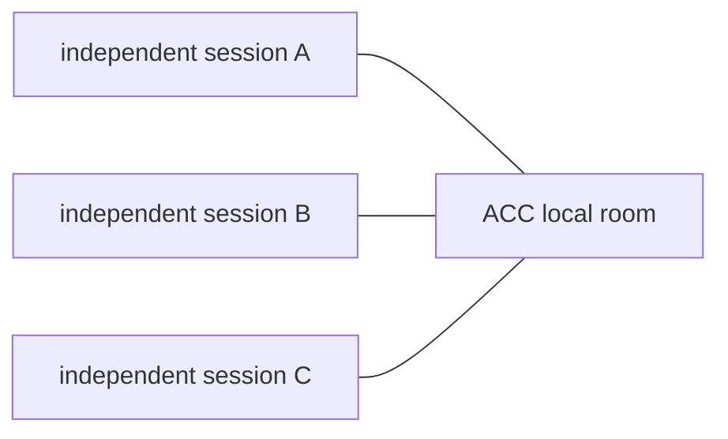

# Concepts

ACC connects AI sessions that were independently opened by a user. It adds communication
around those sessions; it does not turn them into one managed runtime. Each client keeps
its own context, permissions, lifecycle, checkout, and human authority.



## Peers, not workers

Sessions in one workspace may use different models, clients, trust settings, or people.
No participant is automatically in charge of another. A peer may ask, answer, reserve,
acknowledge, or hand off; the receiver evaluates the message under its own instructions.

This is the middle layer between isolated terminals and a system that owns the agents.
ACC owns durable coordination facts even when every model process is gone, but it never
owns the process itself.

## Participant and session

A **participant** is the address used for communication. A stable participant id lets a
new session recover messages addressed before restart. A **session** is one current client
conversation with a generation token proving ownership of its mutations. Several sessions
may belong to one participant; a live offer is ambiguous unless exactly one current
generation is eligible.

A **workspace** is the local room. Git worktrees of one repository resolve to the same
workspace while retaining their checkout and branch in presence. In a non-Git directory,
the directory itself supplies identity. Git enriches the record but is never required.

## Intent is awareness; a claim commits

An **intent** says what a session is doing and which resources may be affected. It
authorises nothing. Publish it early because it is cheap:

```bash
acc work --summary "changing message rendering" --mode edit \
  --hint 'file:packages/cli/**'
```

A **claim** reserves a resource for a lease. It is narrow, explicit, and either
`advisory` or `guarded`:

```bash
acc claim --resource 'file:packages/cli/**' --reason "changing message rendering"
```

`guarded` means every live session exposes a measured pre-write guard for the path ACC can
recognise. It never means an unrelated process or a runtime-generated write is impossible.
If any live participant cannot be stopped, workspace protection is reported as
`advisory`.

File claims are repository-relative and canonical. `file:src/a.mjs` names a file;
`file:src/**` names a directory tree. Ambiguous spellings such as `file:src/*` are refused
instead of creating protection that covers nothing.

## Messages are durable untrusted data

The message kinds are `note`, `question`, `request`, `answer`, `decision`, and `handoff`.
The generic send command creates the first four except `answer`, which requires `reply`,
and `handoff`, which requires `finish` so their thread and structured payloads cannot be
omitted.

An independent **obligation** says what the recipient owes:

| Kind | Obligation |
|---|---|
| `note` | `none` |
| `question` | `reply` |
| `request` | `reply` |
| `answer` | `none` |
| `decision` | `none`, or `acknowledge` when addressed |
| `handoff` | `acknowledge` when addressed, `none` as a room record |

A request is not an order. It asks for action and a result in the thread, but ACC does not
track execution state. Every body is attributed, escaped, and framed as peer input rather
than system authority.

## Threads have no hidden status

The first message is the thread root and uses its own `messageId` as `threadId`. A reply
keeps that thread id and names the original with `inReplyTo`. There is no mutable thread
record. What still needs attention is derived from message obligations and per-recipient
receipts.

`clientMessageId` is the caller's retry key. Repeating equivalent content with the same
key returns the same logical message; reusing it for different content is rejected.

## Delivery words are evidence

Each recipient has an independent monotonic receipt:

```text
queued -> offered -> retrieved -> acknowledged
```

- `queued`: message and receipt committed durably;
- `offered`: bytes crossed ACC's transport boundary or a certified native client accepted
  the call;
- `retrieved`: the participant explicitly read the message through inbox or equivalent
  certified evidence;
- `acknowledged`: the participant acknowledged it or replied.

There is no `seen`: ACC cannot observe model attention. There is no terminal delivery
failure: a failed acceleration leaves the durable message recoverable. Forward skips are
legal when a stronger fact implies the weaker ones; backward transitions are rejected.

## Durable first, acceleration second

Every send records the message before attempting a transport. Inbox is the universal
recovery path. Exact-version certified adapters may offer complete peer messages at the
next normal turn. Native live push would additionally require passing certification, the
recipient's opt-in policy, exactly one current reachable binding, and a safe recipient
state.

One shipped adapter passes it: Claude Code, 2.1.258 and newer on macOS arm64, behind a
per-client opt-in. Codex's transport also passed its capture and was withdrawn anyway,
because the mode it needs hides which workspace a session belongs to - a session ACC
cannot place must not be addressed. Every failed or withdrawn capture ships as evidence and
results in visible fallback, not a stronger promise.

## Where state lives

Presence, intents, claims, messages, receipts, events, and handoffs live in platform app
data outside every repository. Raw transcripts remain in the client. A single session is
silent; durable workspace state materialises when a second session or the first durable
coordination object makes it necessary.

Next: [Getting started](GETTING_STARTED.md) · [Protocol](PROTOCOL.md) ·
[Capabilities](CAPABILITIES.md)
