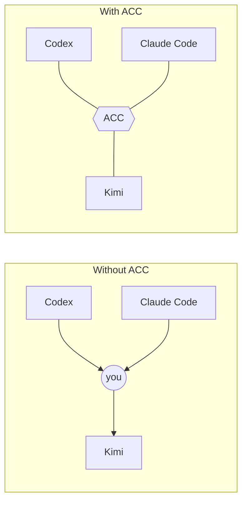
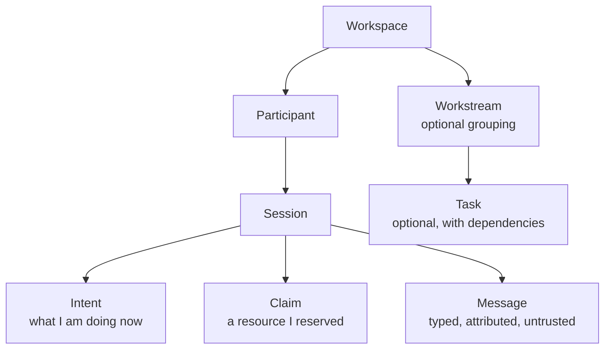
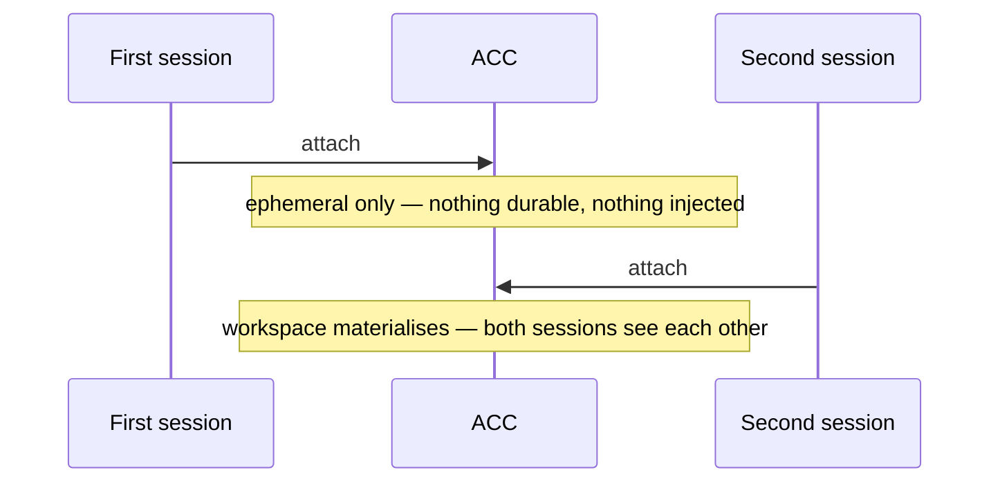

# Concepts

## The problem

You keep several agent sessions open at once — often on different branches, in different
git worktrees. Each has its own model, memory, permissions, and human. None of them knows
what the others are doing, and none can ask another for anything.

So you become the transport. You carry questions between them, repeat decisions, and hand
over pieces of work by pasting context from one window into another.

Subagents created inside one session solve a different problem: delegated work under an
owner. ACC connects sessions you opened yourself while leaving their lifecycle,
permissions, context, and human direction independent.

## Why peers instead of workers

The sessions ACC joins may have different models, clients, trust settings, or people
behind them. Treating one as the permanent authority would misrepresent that reality and
make coordination depend on its process staying alive.

ACC therefore keeps durable state below every session. Peers may ask, answer, reserve,
handoff, or coordinate a workstream; none can silently acquire ownership of another. This
is the useful middle ground between isolated terminals and a managed runtime.

## Asking, not commanding

The central move is one agent asking another for a piece of work. It writes the request and
the reason as one thing, and the other agent is told at its next turn.

Nobody is in charge. A request is a request: the recipient can take it, leave it, or answer
the message instead. Authority differences apply to mutation only — never to knowledge, and
never to who may ask whom.

A message can be a fire-and-forget **note** or a **question** that asks for an answer. A note
is shown to the recipient once and owes no reply; a question stands in front of them until it
is acknowledged, and if it goes unanswered while its asker waits, that waiting is surfaced. So
a decision or a warning the other agent must act on is a question (`--requires-ack`) or a
recorded decision (`acc decide`), not a note — and if a note reads like it wants a reply, `acc
message` says so when you send it. A note that does slip past is not lost either: delivered
once, it leaves a single low-priority breadcrumb so it stays recoverable without nagging.

`acc inbox` is the narrow recovery path. It returns only unresolved messages addressed to
the current participant; `--message` selects one stable id. A direct request remains there
after it is seen until it is acknowledged. `acc reply` writes the answer, links it to the
original, and acknowledges that original as one operation. Context compaction therefore
does not require scanning a whole workspace snapshot or remembering a separate ack.

Work is addressed to a **participant** rather than a session, so it survives that agent
restarting. Only the named participant can take it. Work addressed to nobody is open to
anyone.

## What ACC is not

- not a model or an agent runtime;
- not a replacement for Codex, Claude Code, Gemini CLI, or Kimi;
- not a task tracker that turns every action into a ticket;
- not a permanent central orchestrator;
- not transcript synchronisation;
- not Git-only, and not coding-only.

## Five ideas

| Idea | What it means |
|---|---|
| **Ambient** | Attachment, presence, and guards happen inside your normal session. Peer presence is a short skill trigger; detailed state is pulled only when useful. |
| **Peer equality** | No session is in charge. Any session can answer for the whole workspace. |
| **Durable first** | State is recorded before delivery is attempted. Realtime would only accelerate it. |
| **Truthful capability** | An adapter declares only what was observed. Degradation is visible, never silent. |
| **Silent when alone** | One session pays nothing: no injected context, no protocol, no banners. |

## Objects

**Intent** is awareness — it never authorises anything. **Claim** is the thing that can stop
a write. The two are deliberately separate: announcing that you are editing is cheap and
constant; reserving a resource is a commitment other sessions are held to.

A file resource is named relative to the **repository**, not to wherever a session happens
to have been started: `file:src/physics.mjs` means one file in the project, whether the
agent that names it opened at the root, in `src/`, or in another worktree of the same
repository. One name for one file is what makes a claim mean anything — two agents calling
it two things is the same as no claim at all.

A directory is claimed as `file:src/**`. Only that trailing glob is understood, so
`file:src`, `file:src/`, `file:src/*` and `file:src/*.mjs` are refused rather than stored:
each of them used to be accepted and cover nothing, which reads like protection and is not.

The spelling is settled for you. `./src/a.mjs`, `src//a.mjs` and `src/x/../a.mjs` are
stored as `file:src/a.mjs`, and letter case is resolved by asking the filesystem rather
than by a rule: where `src/A.mjs` and `src/a.mjs` are one file they become one resource,
and where they are two files they stay two. `acc claim` echoes back the name it stored,
which is the name peers will see.

## When coordination starts

Durable state appears at the first moment coordination actually exists: a second live
session, or the first claim, message, task, or handoff. A workspace that never got a second
session leaves nothing behind.

## Joining someone else's work

| Situation | What a session does |
|---|---|
| Explicit invitation, or the same workstream id | join |
| Exact conflicting resource | stop before writing, ask or negotiate |
| Merely similar topic | mention it, do not merge work |
| Unrelated | continue, silently |
| Human said "work independently" | stay independent — claims still apply |

## Coordinators

A workstream may have one coordinator. It plans and synthesises; it is not the transport
and not the owner of durable state. If it disappears, claims and tasks stay valid, and
another participant can take the lease.

Authority differences apply to **mutation only, never to knowledge**. Any session can be
asked what the whole system is doing.

## Protection is a property of the room

A claim is `guarded` only while every live session can actually be stopped. One MCP client
and the workspace reports `advisory` — because that is the truth.

Being stoppable is not the same as being unevadable. A guarded claim stops file edits and
the shell writes ACC can read; a language runtime opening the file gets past either way.

See [CAPABILITIES.md](CAPABILITIES.md) for what each client was measured doing.
