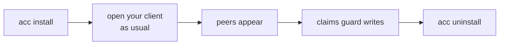
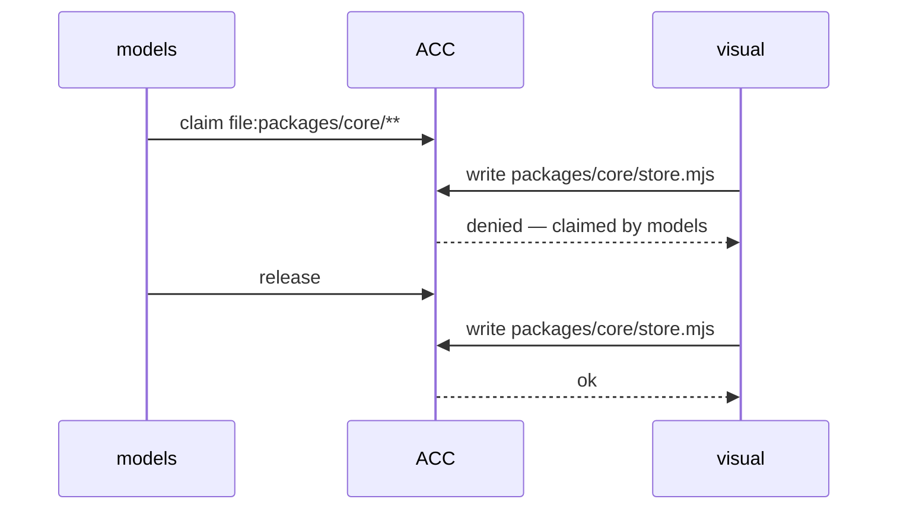
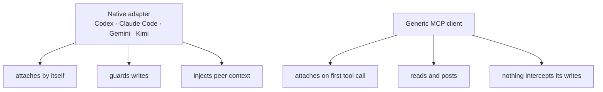

# Getting started

Three minutes, end to end.



## 1. Install

Getting the `acc` binary itself: [README](../README.md#install). Then:

<!-- test:command -->
```bash
acc install --dry-run
```

Prints every path it would touch. Run without `--dry-run` to apply.

It only installs for clients you actually have. Missing ones are listed with the reason.

## 2. Open a session — normally

No ACC command. Just start Codex, Claude Code, Gemini, or Kimi as you always do. A hook
attaches the session.

## 3. See who is here

<!-- test:command -->
```bash
acc status
```

```text
2 live; 1 claim(s); protection advisory
```

## 4. Claim before touching shared files

Inside a session your agent runs this for you:

```bash
acc claim --resource 'file:packages/core/**' --reason "porting the store"
```

Another session that tries to write there is refused — with the owner's name.



Exit code `5` means conflict.

## 5. Say something

```bash
acc message --to models --subject "Slots" --body "Which names are stable?" --type question
```

Messages are **data, not orders**. A peer cannot change your instructions.

## 6. Optional: shared settings

Nothing above needs a config file. A team adds one when identity has to survive a move, or
when a claim policy should be agreed once rather than per machine:

<!-- test:command -->
```bash
acc config validate
```

With no config present it reports the defaults — not having one is a valid state. See
[Configuration](CONFIGURATION.md).

## 7. Remove it

```bash
acc uninstall
```

Removes only what ACC wrote, and only if it still matches. Anything you edited stays.

## Native vs MCP



An MCP participant shows as `advisory` on the roster, and a workspace with one in it
reports `advisory` protection — a guarded claim is advice while it is connected.

## Next

[CLI reference](CLI.md) · [Configuration](CONFIGURATION.md) ·
[Troubleshooting](TROUBLESHOOTING.md)
