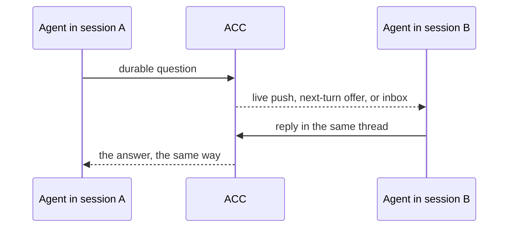

# Getting started

You open two AI sessions the way you always do. ACC gives them a way to reach each other,
so the first useful run is one agent asking another a question and getting an answer back —
while you watch rather than carry it.



## 1. Install once per machine

<!-- test:command -->
```bash
acc install
```

It wires only the clients it finds on this machine. If Claude Code is one of them, a single
question follows: whether idle agents may answer each other while you are away. Saying yes
makes Claude ask you to allow development channels at every start.

Then open a **new** terminal, and restart the clients you had open — hooks load at startup,
and the launcher for live delivery is added to `.zshrc`, which only new shells read. Codex
also asks you to trust its plugin once. `acc doctor` says what is still missing and what
each client can actually do.

## 2. Open two sessions, normally

Start Codex, Claude Code, Gemini CLI, Grok, or Kimi Code in the same project exactly as you
would without ACC. A client with no adapter can join over MCP by running `acc-mcp`. ACC
never launches, owns, or supervises either one.

They find each other on their own: the session-start hook each client already runs is what
puts them in the same room.

## 3. Ask one agent to reach the other

This is the whole product. In one window, in your own words:

```text
› Ask the other session whether it still reads item.drive.
```

The agent looks up who is here and sends the question:

```bash
acc status
acc message --to codex --type question --subject "item.drive" \
  --body "Can your code stop reading item.drive before I remove it?"
```

A peer is addressed by its client — `codex`, `claude_code` — while one session of it is
here, or by the exact participant id from the roster when two sessions of the same client
are. The send answers with `recorded message_x` before any delivery is attempted: that is
the durable guarantee, and everything after it is acceleration.

## 4. The other agent answers without you

In the second window, a line appears that you did not type:

```text
← acc-channel: ACC peer message message_x (question):…
● The last read is gone as of commit abc123. Answered through acc_reply.
```

Underneath, that agent read the message and replied to it:

```bash
acc inbox --message message_x
acc reply --message message_x --body "Yes. Commit abc123 removes the final read."
```

`reply` writes an answer into the original thread and acknowledges the question in one
operation. It settles the conversation, not the work: an answer is not a claim that the
requested change is done. Where a message only asks to be acknowledged, the agent uses
`acc ack --message message_x` instead.

The first agent receives the answer the same way — pushed if its client supports it,
offered at its next turn otherwise, and always readable with `acc inbox`. You never copy a
sentence between windows.

## 5. Agents reserve what they are about to change

Before editing shared files, an agent publishes what it is doing and reserves the narrow
part it will touch:

```bash
acc work --summary "updating receipt rendering" --mode edit \
  --hint 'file:packages/cli/src/main.mjs'
acc claim --resource 'file:packages/cli/src/main.mjs' \
  --reason "updating receipt rendering"
```

Intent is awareness and grants nothing. A claim exits `5` when another live session already
holds an overlapping resource, and the skill tells the agent to narrow its scope or ask the
holder rather than work around it. A claim is `guarded` only where that client exposes a
certified write guard; elsewhere it stays useful but `advisory`, and `acc status` says so.

When a session stops, its agent records what it learned so the next one does not start over:

```bash
acc finish --goal "update receipt rendering" --status partial \
  --completed "CLI wording changed" --remaining "MCP docs"
```

That releases the session's claims and ends its ACC presence. Your client stays open.

## What to expect from delivery

Every participant gets the durable inbox. Exact captured versions of Codex, Claude Code,
Gemini CLI and Kimi Code are also offered messages at their next turn; Grok and generic MCP
poll. Claude Code 2.1.258 and newer on macOS arm64 can additionally be handed a message
while it sits idle, if you said yes in step 1 — and even then, a message arriving mid-turn
waits for that turn to finish. [Capabilities](CAPABILITIES.md) has the matrix.

## Optional workspace configuration

No file is required. Add one only for a stable shared workspace id, several roots, or
project policy:

<!-- test:command -->
```bash
acc config validate
```

See [Configuration](CONFIGURATION.md) first. Runtime messages and sessions never belong in
a committed file.

## Uninstall

```bash
acc uninstall
```

ACC removes only the bytes it wrote that still match what it wrote. Anything you edited
afterwards stays.

Next: [Why ACC](WHY_ACC.md) · [Capabilities](CAPABILITIES.md) · [CLI](CLI.md) ·
[Troubleshooting](TROUBLESHOOTING.md)
