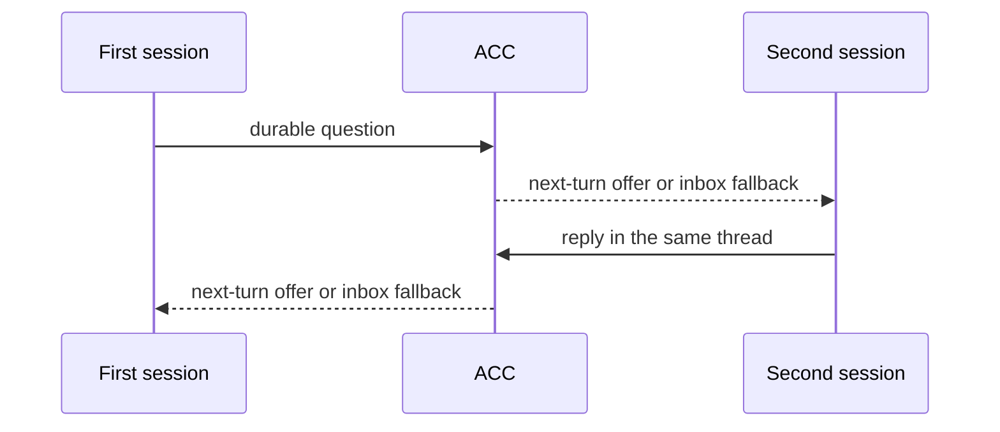

# Getting started

ACC begins with two AI sessions that you open yourself. It does not create a team or choose
which model does what. The first useful run is a question that travels from one session to
the other, receives a reply in the same thread, and is acknowledged without you copying
the message between windows.



## 1. Install once per machine

Install the package, then let ACC wire only the clients it detects:

<!-- test:command -->
```bash
acc install
```

If Claude Code is installed, one question follows: whether idle agents may answer each other
while you are away. Saying yes makes Claude ask you to allow development channels at every
start; saying no changes nothing else. Then open a **new** terminal - the launcher that
makes live delivery work is added to `.zshrc`, which only new shells read.

Restart those clients because hooks load at startup. Codex also asks you to trust the
plugin. `acc doctor` names anything still missing and reports the effective delivery mode
for each detected version.

## 2. Open two sessions normally

Open Codex, Claude Code, Gemini CLI, Grok, or Kimi Code in the same project exactly as you
would without ACC. A generic MCP client can participate by running `acc-mcp`. ACC never
launches or owns either session.

In either window:

```bash
acc status
```

The roster gives the participant ids used by `--to`. If it shows only one session, fix the
second client's installation or workspace path before testing communication.

## 3. Publish intent, then claim narrowly

Intent is cheap awareness and grants no protection:

```bash
acc work --summary "updating receipt rendering" --mode edit \
  --hint 'file:packages/cli/src/main.mjs'
```

Reserve only what the session is about to change:

```bash
acc claim --resource 'file:packages/cli/src/main.mjs' \
  --reason "updating receipt rendering"
```

Exit code `5` means an overlapping live claim exists. Ask its owner or narrow the edit;
do not silently work around it. A claim can be `guarded` only where the client exposes a
certified write guard. Otherwise it remains useful but `advisory`.

## 4. Send a real question

From the first session, address a participant listed by `acc status`:

```bash
acc message --to models --type question --subject "receipt wording" \
  --body "Should the UI say offered or delivered after the transport accepts bytes?" \
  --client-message-id client_receipt_wording_1
```

The output starts with `recorded message_x`. That is the durable guarantee. Any following
delivery diagnostic is acceleration, not the source of truth. Reuse the explicit
`client_receipt_wording_1` key when retrying after an uncertain result; it returns the same
logical message instead of creating a duplicate.

## 5. Read and reply from the second session

A certified hook may offer the question on the recipient's next normal turn. Grok, MCP,
unknown versions, and any missed projection use the same durable recovery path:

```bash
acc inbox
acc inbox --message message_x
acc reply --message message_x \
  --body "Use offered. It proves transport acceptance, not that the model read it."
```

`reply` creates an `answer` in the original thread and acknowledges the recipient's
receipt for the question atomically. It does not mark the requested work complete. The
first session receives the answer through its own next-turn or inbox path; you do not copy
the peer body between sessions.

Use `acc ack --message message_x` only when the message asks for acknowledgement and no
written reply is needed.

## 6. Hand off while context still exists

```bash
acc finish --goal "update receipt rendering" --status partial \
  --completed "CLI wording changed" --remaining "MCP docs" \
  --blocker "waiting for fixture"
```

`finish` records a structured handoff, releases that ACC session's claims, and ends its ACC
presence. It does not close the external client.

## Delivery expectations

Durable inbox delivery works for every participant. Certified next-turn delivery exists
only for exact captured versions of Codex, Claude Code, Gemini CLI, and Kimi Code. Grok and
generic MCP poll. Live push - a message handed to a session that is sitting idle - exists
for Claude Code 2.1.258 and newer on macOS arm64, after the opt-in above. Although
`acc install --delivery off|actionable|all` defines recipient policy, a client that cannot
take the live path keeps effective policy `off` and says so beside the adapter result.

## Optional workspace configuration

No file is required. Use one only for a stable shared workspace id, multiple roots, or
project policy:

<!-- test:command -->
```bash
acc config validate
```

See [Configuration](CONFIGURATION.md) before writing it. Runtime messages and sessions
never belong in that committed file.

## Uninstall

```bash
acc uninstall
```

ACC removes only installation bytes that still match what it wrote. User-modified client
settings remain in place.

Next: [Why ACC](WHY_ACC.md) · [Capabilities](CAPABILITIES.md) · [CLI](CLI.md) ·
[Troubleshooting](TROUBLESHOOTING.md)
