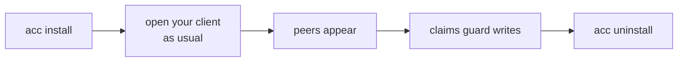
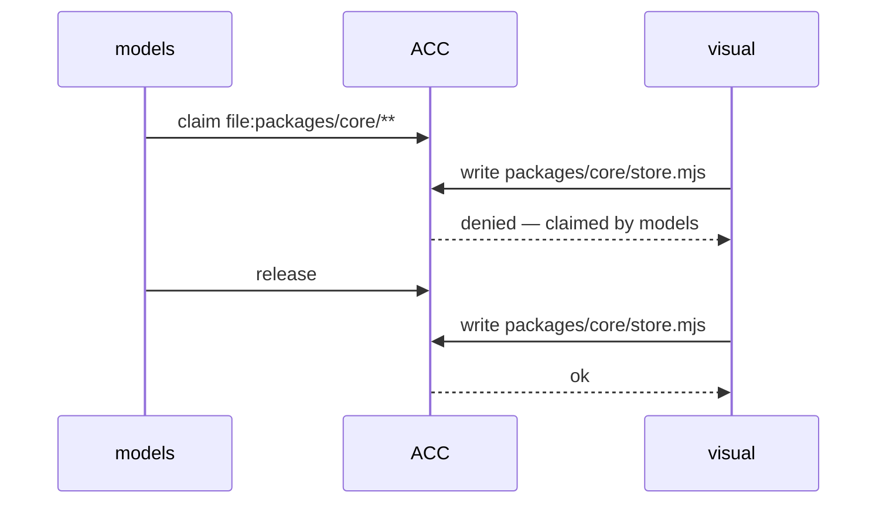

# Getting started

A few minutes, end to end. The short setup is part of the design: ACC coordinates sessions
you already open, so there is no scheduler, daemon, or dashboard to stand up first.



## 1. Install — once per machine

Get the `acc` binary first ([README](../README.md#install)), then wire it into the clients
you have:

<!-- test:command -->
```bash
acc install
```

It only touches clients you actually have; missing ones are listed with the reason.
**Restart the client afterwards** — hooks load at startup, and "nothing happens in my
session" is almost always a client that was already running.

## 2. Open a session — normally

No ACC command. Start Codex, Claude Code, Gemini, or Kimi the way you always do; a hook
attaches the session. It keeps its own client, permissions, checkout, and human
instructions — ACC just adds a shared view around it.

## 3. See who is here

<!-- test:command -->
```bash
acc status
```

```text
2 live; 1 claim(s); protection advisory
```

## 4. Claim before touching shared files

Inside a session, your agent runs this for you:

```bash
acc claim --resource 'file:packages/core/**' --reason "porting the store"
```

Another session that tries to write there is refused — by the owner's name. Exit code `5`
means conflict.



## 5. Say something

`--to` takes a name from the roster (`acc status` is where you get it); a name nobody here
has is refused, and the refusal lists the ones that exist.

```bash
acc message --to models --subject "Slots" --body "Which names are stable?" --type question
```

Messages are **data, not orders** — a peer cannot change your instructions. See
[Concepts](CONCEPTS.md#asking-not-commanding) for why, and for notes vs questions.

## 6. Optional: shared settings

Nothing above needs a config file. A team adds one only when identity must survive a move,
or when a claim policy should be agreed once instead of per machine:

<!-- test:command -->
```bash
acc config validate
```

With no config present it reports the defaults — not having one is a valid state. See
[Configuration](CONFIGURATION.md).

## 7. Remove it

```bash
acc uninstall
```

Removes only what ACC wrote, and only while it still matches. Anything you edited stays.

## Native vs MCP

Native adapters (Codex, Claude Code, Gemini, Kimi) attach by themselves, guard writes, and
inject peer context. A generic **MCP** client can read and post durable coordination, but
nothing intercepts its writes — so it shows as `advisory`, and one in the room makes every
claim advisory while it's connected. That downgrade is deliberate and reported, not hidden;
[MCP](MCP.md) covers it in full.

---

Next: [Why ACC](WHY_ACC.md) · [CLI reference](CLI.md) · [Configuration](CONFIGURATION.md) · [Troubleshooting](TROUBLESHOOTING.md) · [full docs map](README.md)
