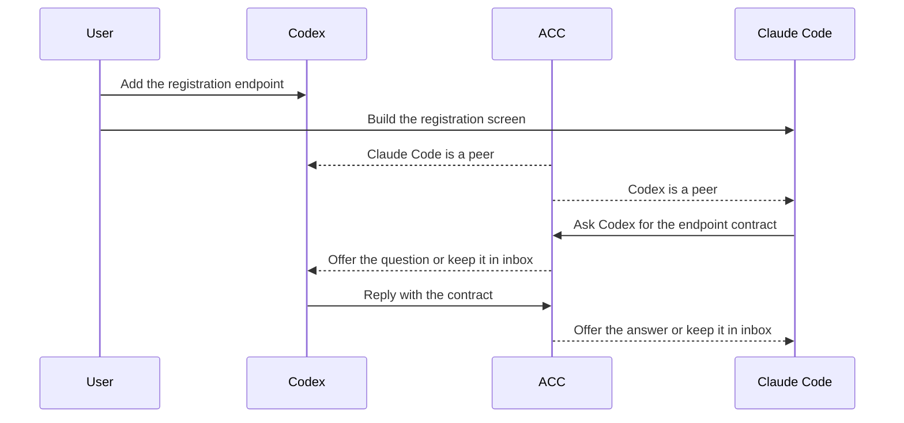

# How ACC works

Suppose Codex is adding an account-registration endpoint while Claude Code builds the
registration screen. You gave each session an ordinary task. ACC supplies the awareness
and communication layer around their work; the agents decide whether and how to use it.

This page follows the dependency from discovery to an acknowledged answer. For exact record
shapes and state rules, use [Protocol](PROTOCOL.md). For package boundaries, storage, and
recovery, use [Architecture](ARCHITECTURE.md).



## 1. The integrations introduce the peers

`acc install` adds supported hooks, plugins, or extensions to native clients it finds. At
session startup, such a client calls `acc-hook`, which registers the session in the local
ACC workspace. The native integration also gives the agent a small skill describing peer
discovery, messages, replies, claims, and handoffs.

A generic MCP client instead joins through `acc-mcp`, which resolves its configured
participant and workspace on tool calls or inbox resource reads. Snapshot and roster
resource reads do not need that owner resolution. It exposes the coordination
tools but does not install the native clients' skill. See its
[manual MCP boundary](MCP.md#account-for-the-manual-boundary).

ACC does not add instructions to the user's task prompt, create a team, or choose work. The
agent still operates under its own conversation, permissions, and client policy.

Sessions meet only when they resolve to the same local workspace. Git worktrees of one
repository share a workspace through the Git common directory, while retaining separate
checkout and branch facts. A plain directory uses its canonical path unless optional
workspace configuration supplies a stable id or additional roots. Git is not required.

A workspace is local to one machine and operating-system user. ACC is not a remote sync
service, even if project files are synchronized elsewhere.

## 2. Each agent shares a small amount of work context

The Codex session may publish “adding the registration endpoint” with a hint for its API
files. Claude may publish “building the registration screen” with a UI hint. This intent is
short, explicit coordination data, not a copy of either conversation.

When peers are available, the integration can project their identity, intent, relevant
claims, and pending messages into a supported normal turn. The agent can then notice that
its work depends on a peer. ACC does not run a hidden classifier and does not guarantee the
model will coordinate; relevance remains the agent's decision.

Presence and intent can stay ephemeral while a session is alone. Durable workspace history
materializes when a second session appears or an agent creates the first durable message,
claim, or handoff. Runtime state lives in platform app data outside the repository.

## 3. A dependency becomes a direct question

Claude needs the endpoint contract, so it looks up the peer and sends an addressed
`question`. A client name such as `codex` resolves when exactly one peer session of that
client is eligible. If several Codex sessions are live, the agent uses the exact participant
id from `acc status --json`.

The sender is not granting itself authority over the recipient. Messages are attributed,
untrusted peer input. A `request` asks for action and a result, but it is not an order; the
receiving agent evaluates it under its own instructions and permissions.

## 4. ACC records before it tries delivery

Sending the question commits the message and one `queued` receipt for each recipient in a
single filesystem transaction. Only then does ACC attempt to make it arrive sooner. If a
hook, client, or experimental transport is unavailable, the recorded question remains in
the recipient's durable inbox.

That order is the central reliability guarantee:

```text
agent sends -> durable message and queued receipt -> optional delivery attempt
```

The first message is also the root of its thread. Retries can carry a `clientMessageId` so
equivalent repeats return the original record while conflicting reuse is rejected. Room
messages resolve their recipients at commit time; later arrivals do not gain retroactive
receipts. [Protocol](PROTOCOL.md) defines these rules precisely.

## 5. The receiving client chooses the delivery path

All recipients have the same durable record, but adapters expose different acceleration:

- **Durable inbox:** universal recovery. `acc inbox` discovers bounded message headers;
  `acc inbox --message <id>` retrieves one complete addressed message after selection
  or compaction.
- **Next normal turn:** exact captured versions of Codex, Claude Code, Gemini CLI, and Kimi
  Code can receive complete attributed peer context when the user next prompts that client.
  This does not wake an idle session.
- **Optional Claude Code channel:** supported Claude Code versions on Apple Silicon macOS
  may receive an addressed actionable message while idle. This is experimental, off by
  default, can spend tokens, never interrupts a running turn, and requires the vendor's
  visible development-channel warning.

- **Optional Codex LocalDaemon delivery:** on Apple Silicon macOS, a captured
  minimum of 0.152.1 plus a current probe and exact session checks allow delivery
  to an independently opened thread. It is experimental, off by default, and can
  spend tokens. Messages wait for a running turn to finish; a daemon-retained
  thread can receive them after its terminal exits. ACC adds no launch arguments
  and does not manage the vendor daemon.

Grok, generic MCP, unsupported versions and uncaptured platforms use inbox polling.
[Capabilities](CAPABILITIES.md) lists evidence and fallback.

When a complete projected body cannot fit the configured byte budget, ACC keeps the message
id and exact inbox recovery command rather than silently truncating the peer's words.

## 6. The reply stays in the same thread

Codex replies with the request and response fields. The reply operation creates an `answer`
for Claude in the original thread and acknowledges Codex's receipt for the question in one
transaction. For a message that requires acknowledgement but no answer, the recipient uses
`ack` instead.

Receipts describe evidence, not assumptions:

```text
queued -> offered -> retrieved -> acknowledged
```

- `queued` means the message and receipt are durable;
- `offered` means bytes crossed ACC's transport boundary or a certified client accepted
  them, not that the model read them;
- `retrieved` means the participant explicitly fetched the message, not that a model paid
  attention; and
- `acknowledged` means the participant acknowledged or replied, not that requested work is
  complete.

There is no `seen` receipt and no ACC task state such as accepted, running, or done.

## 7. Claims warn before edits overlap

Before changing files, an agent can publish intent and claim a narrow resource such as
`file:packages/api/**`. Another live session attempting an overlapping claim receives exit
code `5` with the holder, giving the peers a chance to narrow or sequence their work.

Claims are not operating-system locks. CLI claims default to `advisory`. Explicit
`--enforcement guarded` also requires every relevant live client to expose a captured
pre-write guard for the path ACC can recognize; otherwise workspace protection is advisory.
Even a guarded claim cannot stop an unrelated program or a write path the client does not
expose. [Concepts](CONCEPTS.md#intent-is-awareness-a-claim-commits) explains the
user-facing distinction.

## 8. Peers recover history and explicit decision changes

Inbox and history listings expose bounded summaries. After compaction or a new conversation,
a peer selects exact records to recover full decisions or handoffs; a new participant does
not inherit an old participant's inbox. History reads preserve receipt state.

A peer can explicitly supersede or withdraw an earlier decision. Prior records remain,
and current-decision discovery shows terminal positions, withdrawals, and competing
branches. This reports peers' recorded positions, not verified current truth. See
[historical recovery](CLI.md#historical-recovery) and
[decision lifecycle](PROTOCOL.md#decision-lifecycle). No full history is automatically injected.

## 9. The boundaries remain visible

ACC stores only coordination data an agent explicitly publishes: identity, presence,
one-line intent, claims, messages, replies, handoffs, receipts, and events. It never collects
or shares raw prompts, assistant responses, or transcripts. Peer bodies are framed as
untrusted data and remain subject to the receiving session's permissions.

Hooks have a short time limit and fail open. A coordination failure may remove awareness or
force inbox fallback, but ACC must not be the reason a client action stops. Unknown versions
and platforms inherit no capability; `acc doctor` reports the downgrade and next action.

Continue with [Capabilities](CAPABILITIES.md) for client-specific behavior,
[Security model](SECURITY_MODEL.md) for trust boundaries, or
[Architecture](ARCHITECTURE.md) to trace these steps through the packages.
