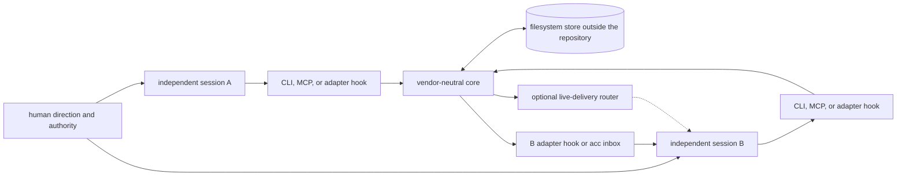
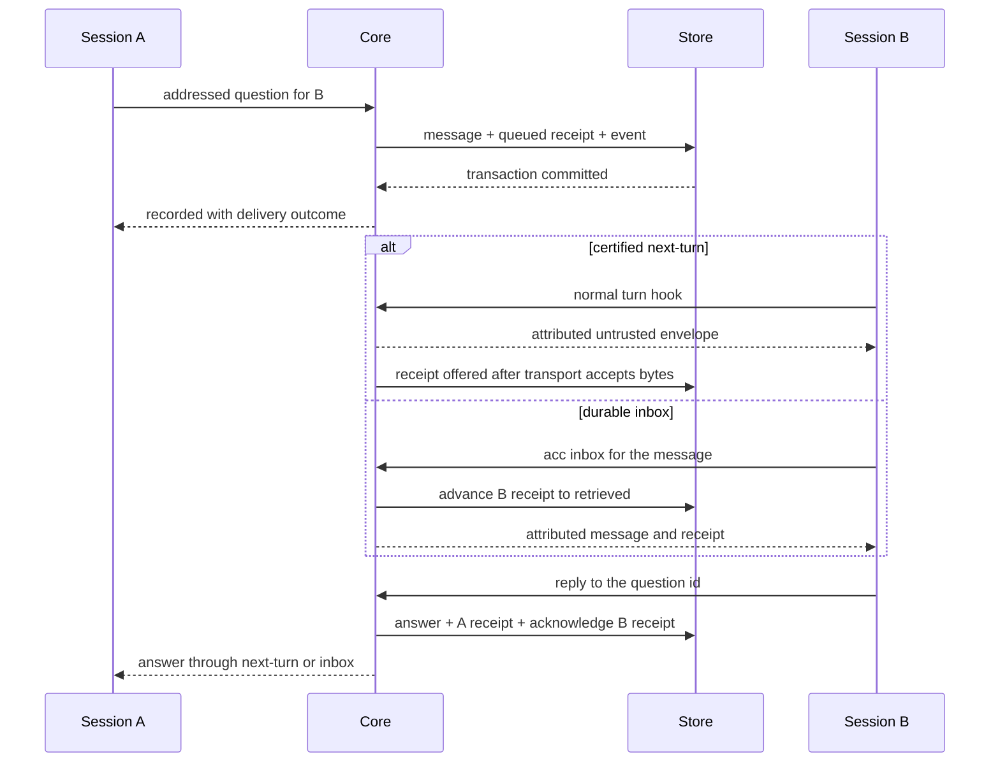

# How ACC works

ACC is a local communication layer around AI sessions that the user opened independently.
It gives those sessions a shared set of coordination facts without giving ACC ownership of
their prompts, permissions, processes, or work.

This page follows one interaction from client startup to an acknowledged answer. It is the
engineering tour; [Protocol](PROTOCOL.md) is the normative record contract and
[Architecture](ARCHITECTURE.md) is the package-level reference.

## The whole system in one picture



There is no required ACC daemon and no coordinator model. CLI commands and native hooks
are short-lived local processes that open the same workspace store when needed. An MCP
client may keep its own `acc-mcp` stdio child running, but that child is a tool boundary for
one participant, not a scheduler or owner of the room.

## 1. A client session joins a workspace

For a native client, an installed startup hook sends the client event to `acc-hook`. The
vendor adapter normalizes that event, then the hook runner:

1. discovers the workspace;
2. opens its filesystem store;
3. resolves the exact client version and its certified capabilities;
4. opens or resumes one ACC session generation; and
5. stores a small binding from the client's session id to that ACC generation.

Workspace discovery uses an explicit `acc.workspace.json` first, the Git common directory
second, and the canonical plain directory otherwise. Git worktrees therefore share one
room but keep separate checkout and branch facts. Git itself is optional.

A participant is the address messages target. A session is one current opening of that
participant, and its unguessable generation token prevents an old process from mutating a
replacement session. The default participant name is derived from the client session. Set
`ACC_PARTICIPANT` in the client launch environment when an address must survive a client
restart and recover messages sent while it was away.

Attaching one session does not create durable workspace history. Its presence and intent
can remain ephemeral until a second live session appears or someone creates the first
claim, message, or handoff. This is how ACC stays silent when a session is alone without
making discovery unreliable when a peer arrives.

## 2. Sessions publish awareness, not assignments

An intent records a short summary, mode, and resource hints. A claim adds a leased
reservation for a canonical resource such as `file:src/item.mjs` or `file:src/**`.
Neither creates a task or grants one session authority over another.

A claim is `guarded` only when every live client path involved has a captured pre-write
guard. Otherwise it is `advisory`: visible coordination that peers should respect, but not
an operating-system lock. Even a guarded claim cannot stop unrelated programs or a write
path the client never exposes to its adapter.

## 3. Sending commits the durable truth first

When session A sends an addressed question, the CLI or MCP boundary validates the closed
protocol shape and resolves A's current session generation. Core then performs one
filesystem transaction that creates:

- the immutable logical message, including sender, recipients, kind, obligation, thread,
  and explicit body;
- one `queued` receipt for each recipient; and
- a `message.recorded` event.

The first message in a thread uses its own `messageId` as `threadId`. A caller-supplied
`clientMessageId` is a retry key: identical retries return the original message, while the
same key with different content is rejected.

For a room message, recipients are the known peer participants with open sessions at
commit time. Participants arriving later can find the room record through full forensic
sync, but they do not receive retroactive receipts.

Only after the transaction commits may ACC try to make the message arrive sooner. Thus a
crashed, unsupported, or unreachable adapter cannot erase a successfully recorded
question.

## 4. Delivery has three paths

The paths share one durable record but prove different facts.

### Durable inbox

`acc inbox` is the universal recovery path. It returns only messages addressed to the
calling participant and atomically advances that participant's receipt to `retrieved`.
An exact `acc inbox --message message_x` remains usable after context compaction or when a
message was too large to project safely.

### Certified next-turn projection

On an exact client version and platform with passing evidence, a before-turn hook asks core
for queued messages just before the client's next normal turn. The adapter projects each
complete body inside an attributed `untrusted peer message` frame. If the complete frame
does not fit the configured byte budget, the hook keeps the message id and the exact inbox
recovery command instead of silently truncating peer text.

The hook entry point records `offered` only after its stdout transport reports that the
bytes crossed the boundary. The state is not `retrieved`: ACC still has no observation
that the model attended to those bytes.

### Optional native live push

The delivery router contains a deliberately narrow seam for offering a message to an
already-running session. It requires all of the following at once:

- exactly one live generation for the recipient;
- an unexpired generation-bound delivery binding;
- recipient policy permitting this message kind;
- passing `livePush` certification for the exact client version and platform; and
- adapter acceptance of the bytes.

Any missing condition leaves the receipt queued and returns a safe fallback reason. No
shipped adapter currently passes native live-push certification, so ACC v0.2 does not
interrupt an active model turn. Today the real product is durable inbox plus exact-version
next-turn delivery where certified, not realtime session control.

## 5. Reply closes the communication obligation

The complete question-and-answer path is:



`reply` verifies that B owns the original receipt, writes an `answer` in the same thread,
creates the answer's receipt for A, and advances B's original receipt to `acknowledged` in
one transaction. A transport failure after that cannot undo the reply. `ack` performs the
last transition without creating an answer when the obligation only asks for
acknowledgement.

Receipts are per recipient and monotonic:

```text
queued -> offered -> retrieved -> acknowledged
```

`recorded` is the successful send boundary, not a receipt state. `offered` does not mean
read, `retrieved` does not prove model attention, and `acknowledged` resolves communication
only. A reply saying “I will do it” is not evidence that the requested work finished; ACC
does not have accepted, running, or done task states.

## 6. The filesystem is the control plane

Each workspace lives below the platform data home, conceptually:

```text
<platform data home>/acc/workspaces/workspace_x/
├── protocol.json          store version and workspace identity
├── state/<kind>/<id>.json materialised current records
├── events/<sequence>.json immutable semantic history
├── journal/               crash-recovery authority
├── locks/                 one cross-process writer mutex
├── ephemeral/             non-durable presence, intent, and delivery bindings
├── bindings/              client-session to ACC-generation mappings
├── retained/              logical deletion and retired evidence
└── tmp/                   staged atomic publications
```

This layout is diagnostic, not a public mutation API. Clients write through the protocol
and core rather than editing these files.

On macOS the platform data home is `~/Library/Application Support`; on Linux it is
`$XDG_DATA_HOME` or `~/.local/share`. `ACC_DATA_HOME` replaces that base. Runtime paths are
checked against workspace roots so ACC state cannot be placed inside the project.

Every durable mutation holds the same writer mutex, loads only its declared record kinds,
checks state generations, stages the full result, and writes a recovery journal before
publishing. Events are immutable no-replace files; current state is a materialised view
replaced atomically. While publication is incomplete, the active journal bounds event
cursors below the transaction's first sequence; the next store opener rolls a decided
transaction forward before serving a read. The store prefers a recoverable duplicate offer
after a crash to an unearned delivery claim.

Paths are opened with containment and no-follow checks. Corrupt records, a foreign
workspace identity, and unknown store versions fail before mutation rather than being
guessed into a compatible shape.

## 7. Adapters translate evidence, not product semantics

The vendor-neutral layers know nothing about Codex, Claude Code, Gemini CLI, Grok, or Kimi
Code. `protocol` owns record shapes and state transitions; `core` owns coordination rules;
`storage-filesystem` owns persistence. Vendor adapters own hook payloads, installation,
client-specific response shapes, and captured capability evidence. `hook-runner` applies
the common bounded fail-open lifecycle, while `delivery-router` evaluates optional live
delivery.

Unknown client versions and platforms inherit no capability. A method in an adapter or a
vendor documentation example is not enough: every `true` capability needs a retained
real-client fixture. This is why the same product can degrade visibly from next-turn
projection to inbox polling without changing its message or receipt semantics.

## 8. What crosses the trust boundary

ACC stores only explicit coordination data: identity, presence, one-line intent, claims,
messages the sender chose to send, structured handoffs, receipts, artifacts, and events.
It does not collect raw prompts, assistant responses, transcripts, environment variables,
credentials, or permission approvals.

Peer bodies remain untrusted data. The projector attributes the sender, escapes framing
and terminal control sequences, and never promotes peer text to system authority. The
receiving session still evaluates it under its own instructions and permissions.

Every native hook has a five-second ceiling and fails open: if ACC cannot read the store or
decide safely, the client's action continues. Coordination may become less effective, but
ACC itself must not stop a session from working.

## Trace the implementation

The shortest source-code path is:

1. `packages/hook-runner/src/runner.mjs` — attach, before-turn projection, guards, and the
   fail-open boundary;
2. `packages/core/src/conversations.mjs` — record-first messages, threads, receipts, and
   handoffs;
3. `packages/core/src/inbox.mjs` — recipient-owned retrieval, reply, and acknowledgement;
4. `packages/delivery-router/src/router.mjs` — policy, reachability, certification, and live
   fallback;
5. `packages/storage-filesystem/src/store.mjs` — transactions, snapshots, ephemeral state,
   and recovery; and
6. `packages/adapter-sdk/src/context-projector.mjs` — bounded untrusted peer framing.

Continue with [Capabilities](CAPABILITIES.md) for what each shipped client actually proves,
[Security model](SECURITY_MODEL.md) for trust boundaries and attack tests, and
[Adapter authoring](ADAPTER_AUTHORING.md) for the integration contract.
