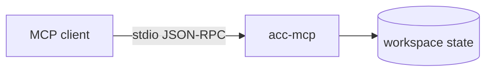
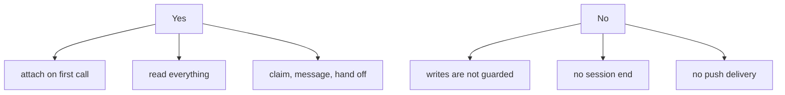

# MCP

MCP is how a client with no native ACC adapter joins a workspace: a generic Model Context
Protocol client talking to a bundled server, `acc-mcp`, over stdio. This page is the
canonical explanation of native vs. MCP — every other doc that draws that line links here.

## Native adapter vs. MCP client

A **native adapter** (Codex, Claude Code, Gemini CLI, Kimi) is wired into the client's own
hook or plugin system. It attaches to the workspace by itself when the client starts,
guards the writes its session makes, injects peer context straight into the conversation,
and tells the workspace cleanly when the session ends.

A generic **MCP client** gets none of that integration — it only gets `acc-mcp`, a stdio
server exposing ACC's coordination tools. This is the **participation tier**: full access
to the durable, shared state (roster, claims, messages, workstreams, tasks, decisions) but
no hook into the client's own lifecycle or file writes. Nothing intercepts what the client
writes, there is no session-end signal when it disconnects, and there is no push delivery —
an MCP client only sees new mail, claims, or roster changes when it next calls a tool.

Each session records two independent readings, taken from what the adapter can actually
prove rather than from the client's name:

- **enforcement**: `guarded` (a clashing write from another session is refused and the
  owner named) or `advisory` (the claim only warns).
- **lifecycle**: `managed` (ACC controls attach and session-end) or `manual` (it does not).

A native adapter earns `guarded` / `managed`. An MCP client defaults to the weaker reading
on both axes: `advisory` / `manual`. Both default weak because neither can be proven any
other way for a generic tool surface.

That downgrade is not scoped to the MCP session alone: a workspace reports
`protection: guarded` only when *every* live session in it can be stopped. One MCP
participant in the room is enough to drop the whole workspace to `advisory`, even for
sessions whose own claims were declared `guarded`. This is deliberate, not a bug — ACC
would rather report a true weaker guarantee than a false stronger one — and it is reported:
the roster shows the downgrade and why, it is never silent.



## Register

```json
{ "command": "acc-mcp", "env": {
  "ACC_MCP_PARTICIPANT": "research",
  "ACC_MCP_WORKSPACE": "/path/to/the/project"
} }
```

`acc-mcp` takes no command-line arguments — there is nothing to pass on the command line,
and it says so rather than silently ignoring extra flags.

- `ACC_MCP_PARTICIPANT` names the session. It comes from this configuration, never from
  the client's `initialize` or `clientInfo` — restarting the process with the same env
  resolves to the same session.
- `ACC_MCP_WORKSPACE` is the project this server joins. Without it, the server falls back
  to the directory the client happened to launch it in — rarely the project — and does so
  silently: `acc_sync` then answers `solo` from a workspace nobody else is actually in.

## Tools

| Tool | Does |
|---|---|
| `acc_sync` | New events, roster, attention, and (for compatibility) pending mail |
| `acc_work` | Publish intent |
| `acc_claim` | Reserve a resource, or release one |
| `acc_message` | Send a message |
| `acc_inbox` | Read unresolved messages addressed to this participant, optionally one by id |
| `acc_reply` | Reply to one message and acknowledge the original, atomically |
| `acc_ack` | Acknowledge without a written reply |
| `acc_request` | Ask another agent to do something |
| `acc_task` | Create work, take it, or move it along |
| `acc_workstream` | Group related work. Optional |
| `acc_decide` | Record a durable decision |
| `acc_finish` | Handoff and release |

That is all twelve — there is no `acc_status` and no `acc_release` tool. Roster and status
come from `acc_sync`; releasing a claim is `acc_claim` with a release action, not a
separate tool.

`acc_inbox` and `acc_reply` are the recent, preferred path for addressed mail. `acc_sync`
still returns pending mail too, purely for compatibility with clients built before
`acc_inbox` existed — use `acc_inbox` going forward, not `acc_sync --scope full`, to recover
an addressed message.

Resources: `acc://snapshot`, `acc://roster`, `acc://workstreams`, `acc://tasks`,
`acc://inbox`.

## What you don't get



The roster is explicit about it: an MCP participant always reads `advisory` / `manual`,
and — per the downgrade rule above — a workspace with one connected reports `advisory`
protection even for a claim that was declared `guarded`.

## When this tier fits

Reach for MCP when shared presence, requests, claims, and handoffs matter more than
guarded writes or automatic delivery — a research tool, a script, a client with no adapter
yet. Move to a native adapter once the client exposes hooks strong enough to prove
`guarded` / `managed`. The underlying coordination model is identical either way; only the
integration's reach changes.

Protocol revision `2026-07-28`. Wire-level detail lives in
`packages/mcp-server/COMPATIBILITY.md`.

---

See also: [README](index.md) for navigation, [Glossary](GLOSSARY.md) for terms, and
[Capabilities](CAPABILITIES.md) for the full per-client matrix.
