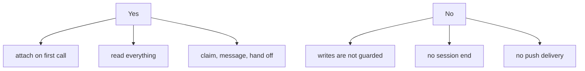

# MCP

For clients with no ACC adapter. Tier 1: it can read and take part; nothing intercepts it.


## Register

```json
{ "command": "acc-mcp", "env": { "ACC_MCP_PARTICIPANT": "research" } }
```

The session comes from **this configuration**, never from `initialize` or `clientInfo`.
Restarting the process resolves to the same session.

## Tools

| Tool | Does |
|---|---|
| `acc_sync` | New events, roster, attention |
| `acc_work` | Publish intent |
| `acc_claim` | Reserve a resource |
| `acc_message` | Send a message |
| `acc_task` | Create a task |
| `acc_finish` | Handoff and release |

Resources: `acc://snapshot`, `acc://roster`.

## What you do not get



The roster says so: an MCP participant reads `advisory` / `manual`, and a workspace with
one connected reports `advisory` protection even when a claim was declared `guarded`.

Protocol revision `2026-07-28`. Details in `packages/mcp-server/COMPATIBILITY.md`.
