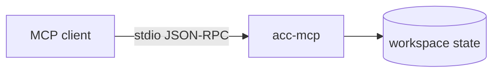
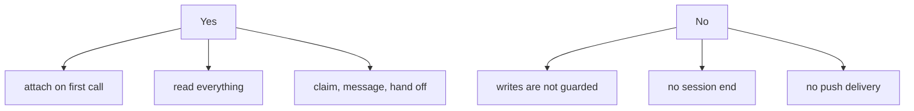

# MCP

For clients with no ACC adapter. Tier 1: it can read and take part; nothing intercepts it.



## Register

```json
{ "command": "acc-mcp", "env": {
  "ACC_MCP_PARTICIPANT": "research",
  "ACC_MCP_WORKSPACE": "/path/to/the/project"
} }
```

The session comes from **this configuration**, never from `initialize` or `clientInfo`.
Restarting the process resolves to the same session.

`ACC_MCP_WORKSPACE` is the project this server joins. Without it the server takes the
directory the client launched it in, which is rarely the project and is silent about it —
`acc_sync` answers `solo` from a workspace nobody else is in. There is nothing to pass on
the command line: `acc-mcp` takes no arguments and says so rather than ignoring them.

## Tools

| Tool | Does |
|---|---|
| `acc_sync` | New events, roster, attention |
| `acc_work` | Publish intent |
| `acc_claim` | Reserve a resource |
| `acc_message` | Send a message |
| `acc_request` | Ask another agent to do something |
| `acc_task` | Create work, take it, or move it along |
| `acc_workstream` | Group related work. Optional |
| `acc_finish` | Handoff and release |

Resources: `acc://snapshot`, `acc://roster`.

## What you do not get



The roster says so: an MCP participant reads `advisory` / `manual`, and a workspace with
one connected reports `advisory` protection even when a claim was declared `guarded`.

Protocol revision `2026-07-28`. Details in `packages/mcp-server/COMPATIBILITY.md`.
