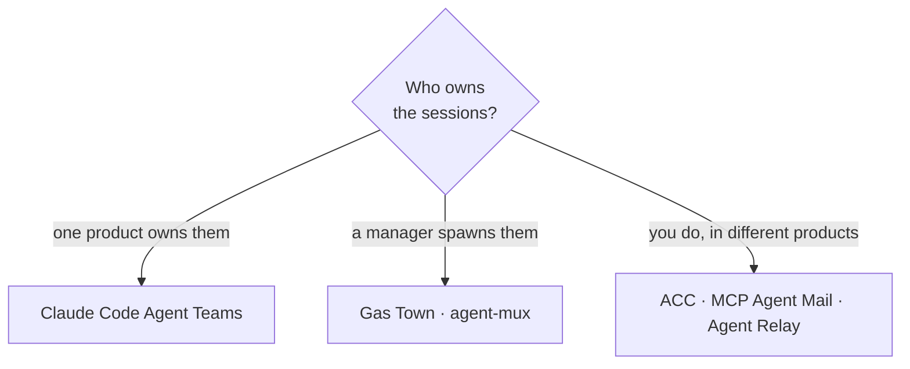

# Prior art

Researched 2026-08-15 from project and vendor documentation. If you are choosing between
these, the question is usually *who owns the sessions*.

| Project | What it does | How ACC differs |
|---|---|---|
| [Claude Code Agent Teams](https://code.claude.com/docs/en/agent-teams) | Shared tasks, dependencies, teammate messaging, idle notifications | Every participant is a Claude Code session, created by a lead. ACC is cross-vendor and has no lead. |
| [MCP Agent Mail](https://github.com/Dicklesworthstone/mcp_agent_mail_rust) | Closest feature competitor: identities, inboxes, threads, advisory file reservations | Agents must explicitly register, fetch, and reserve through tools. ACC attaches through hooks and guards writes without the model asking. |
| [Agent Relay](https://github.com/AgentWorkforce/relay) | Harness adapter contract, capability declarations, durable-then-realtime delivery | Channels and chat are central there; conflict prevention is central here. |
| [Gas Town](https://github.com/gastownhall/gastown) | Work ledger, handoffs, integration tiers, many providers | Owns tmux and process lifecycle and imposes one topology. ACC owns nothing. |
| [agent-mux](https://github.com/buildoak/agent-mux) | Unified boundary that dispatches Codex/Claude/Gemini as workers | One-shot delegation, not ambient awareness among human-driven sessions. |

## What ACC took from them

- capability declarations and delivery receipts (Agent Relay);
- reservation semantics and threat-model discipline (MCP Agent Mail);
- integration tiers and graceful degradation (Gas Town);
- task dependencies and a visible roster (Agent Teams);
- high-level macro operations rather than dozens of model-facing tools.

## MCP and A2A

[MCP](https://modelcontextprotocol.io/specification/2024-11-05/server/tools) is the right
generic tool surface and nothing more — tools are model-controlled, and the spec
deliberately does not mandate the host interaction model. So MCP-only clients poll, native
adapters add attach and guards, and ACC never claims MCP can wake a dormant model.

[A2A](https://a2a-protocol.org/dev/specification/) contributes portable vocabulary —
capability cards, stateful tasks, messages distinct from artifacts. ACC's names align where
practical, without requiring every local CLI session to run an HTTP server.

## The position

> Automatic, low-noise, project-wide awareness and conflict prevention across already-open,
> independently owned sessions from different vendors.

Not mail for agents. Not a manager that spawns them.
