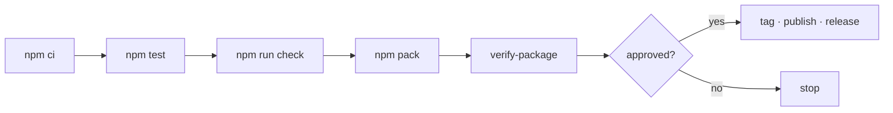

# Releasing



## Build the candidate

```bash
npm ci
npm test
npm run check
npm pack
node scripts/verify-package.mjs agents-can-communicate-*.tgz
git diff --check
```

`verify-package.mjs` is the gate that matters. It installs the tarball into a
clean directory with **no workspace anywhere** and then drives the product:
doctor, a non-Git workspace, an install and its removal.

Development cannot catch what this catches. Workspace symlinks are always
present there, so an unbundled package imports fine right up until somebody else
installs it.

## What it refuses

| Refused | Why |
|---|---|
| `tests/`, `test/` | test suite |
| `fixtures/` | capture material carrying paths from one machine |
| `.github/`, `.githooks/`, `.agents/` | local configuration |
| `*.jsonl` | looks like a transcript |
| Workspaces missing from `node_modules/` | every internal import would fail |

## Record the evidence

Put the tarball name, sha256, **the commit it was built from**, test counts,
capability matrix, and known limitations in `CHANGELOG.md`. A release without
them is a release nobody can audit later.

The commit is not optional detail. Every workspace travels inside the tarball,
so any change to shipped code changes the digest — a digest recorded alone goes
stale on the next merge and then reads as a false claim about the current tree
rather than a true one about an older commit. `verify-package.mjs` prints both
on one line for exactly this reason, and refuses to imply reproducibility when
the working tree is dirty:

```text
PASS  agents-can-communicate-0.0.0.tgz  sha256 a5c8bb1d…  built from 39d0dcf
```

## Then stop

Publishing, tagging, and cutting a GitHub release are **external mutations**.
They need explicit approval from the maintainer, every time. The `Release`
workflow builds and verifies a candidate and uploads it as an artifact; it does
not publish.
