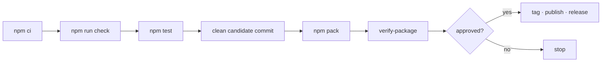

# Releasing



## Build the candidate

```bash
npm ci
npm run check
env npm_config_cache=/private/tmp/acc-npm-cache-v02 npm test
git status --short
git commit -m "release: prepare ACC v0.2.0"
candidate_dir="$(mktemp -d /private/tmp/acc-v0.2.XXXXXX)"
env npm_config_cache=/private/tmp/acc-npm-cache-v02 npm pack --pack-destination "$candidate_dir"
env npm_config_cache=/private/tmp/acc-npm-cache-v02 node scripts/verify-package.mjs \
  "$candidate_dir/agents-can-communicate-0.2.0.tgz"
git diff --check
```

`verify-package.mjs` is the gate that matters. It installs the tarball into a
clean directory with **no workspace anywhere** and then drives the product. The
acceptance suite additionally opens independent Claude/Codex hook sessions from
the installed artifact, completes both message directions, proves downgrade and
restart behavior, exercises the installed MCP binary, and removes client wiring twice.

Development cannot catch what this catches. Workspace symlinks are always
present there, so an unbundled package imports fine right up until somebody
else installs it.

## What it refuses

| Refused | Why |
|---|---|
| `tests/`, `test/` | test suite |
| unreferenced `fixtures/` | material that is not exact redacted certification evidence |
| `scripts/spikes/`, `*.sock` | development probes and local endpoints |
| runtime, transcript, or secret directories | machine state and private material |
| `.github/`, `.githooks/`, `.agents/` | local configuration |
| `*.jsonl` | looks like a transcript |
| Workspaces missing from `node_modules/` | every internal import would fail |

## Record the evidence

Put the tarball name, sha256, **the commit it was built from**, exact platform/client
facts, fallback result, and known limitations in `docs/release-evidence/v0.3.0.md` and
the current `CHANGELOG.md` release table. A release without them is a release nobody can
audit later. Test count is deliberately left out: nothing verifies it, so it only
decorates or, when it drifts, misleads.

The commit matters because every workspace travels inside the tarball, so any
change to shipped code changes the digest. A digest recorded alone goes stale
on the next merge and then reads as a false claim about the current tree
rather than a true one about an older commit. `verify-package.mjs` prints
both on one line for exactly this reason, and refuses to imply
reproducibility when the working tree is dirty:

```text
PASS  agents-can-communicate-0.0.0.tgz  sha256 a5c8bb1d…  built from 39d0dcf
```

It went stale four times in a row anyway, each caught by hand and only
because someone happened to run the script. So `npm test` now checks it:
`tests/acceptance/recorded-candidate.test.mjs` fails when shipped code has
changed since the recorded commit, and names the files. A shallow clone that
does not have the commit reports that instead of failing — the check is of
the record, not of the checkout depth.

The candidate therefore uses two commits. Commit A contains every packed file and every
release gate. Pack and verify clean commit A, then commit B records its digest and evidence
only in files that are not packed. Never record a dirty-tree digest: changing a packed file
after commit A means making a new candidate commit and packing again.

Native real-client tests run only where the retained capture proved that native boundary.
For v0.2.0 neither Codex 0.152.0 nor Claude Code 2.1.252 did: the Codex control socket was
absent and Claude stopped at the development-channel warning. Record those exact failed
captures and run the packed inbox/next-turn fallback instead of promoting an unobserved
native path. Windows is an explicit unsupported-platform skip, not a passing capture.

By v0.3.0 that had gone both ways, which is the point of doing it per release rather than
once. Claude Code passed and ships a live Channel; Codex's queue capture passed and the
capability was **withdrawn anyway**, because the mode it needs hides which workspace the
session belongs to, and a session that cannot be placed must not be addressed. A capture
that works is not the same claim as a capability that is safe to ship.

A published version's record is history and is not rewritten; later changes
get a new `## Unreleased` entry at the top, checked the same way against the
current tree.

## Then stop

Publishing, tagging, and cutting a GitHub release are **external mutations**.
They need explicit approval from the maintainer, every time.

Which credential is configured decides whether a code is needed, so check
rather than assume. Publishing v0.3.0 needed no code at all:

```bash
npm publish agents-can-communicate-0.3.0.tgz   # no --otp; it succeeded
npm profile get                                # 403 Forbidden on /-/npm/v1/user
```

That pair is the whole diagnosis. A credential that can publish but cannot read
the account's own profile is a token rather than an interactive login, and a
token with write access bypasses two-factor entirely. This page previously said
every publish needs a code, which sent the next release looking for one it did
not need.

With an interactive login and two-factor set to `auth-and-writes`, a code *is*
required and npm does not prompt for it:

```bash
npm publish --otp=123456
```

Publish the tarball by name rather than bare `npm publish`. A bare publish
repacks, and what reaches the registry is then an artifact nobody verified; the
file named above is the one the digest and the evidence page describe. After
publishing, compare `npm view <pkg>@<version> dist.shasum` with `shasum` of the
local file — they must be equal, and the registry can take a few minutes to
answer at all.

A granular token scoped to selected packages cannot create a package that does
not exist yet, which is the case exactly once per package. The `Release`
workflow builds and verifies a candidate and uploads it as an artifact; it does
not publish.

**This route has an expiry.** npm now prints, on any authenticated command:

> npm tokens that bypass 2FA are being restricted for account changes and
> direct publishing

So the token that made the v0.3.0 publish possible without a code is on a path
to being refused. Worth settling before it turns a release into an outage:
either move publishing to a trusted-publisher workflow, or accept the
interactive login and its code.

---

See also: [README](index.md) for navigation and [Glossary](GLOSSARY.md) for terms.
