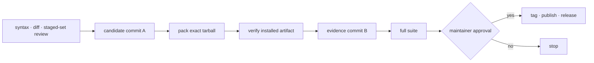

# Releasing

Use this procedure to build one auditable npm artifact, verify that exact tarball, and keep
its evidence tied to the commit that supplied its bytes. The package is currently `0.3.0`;
the commands derive the version from `package.json` so the filename cannot drift.



## Prepare candidate commit A

Commit A must contain every file npm will pack and every release gate. Start from a clean,
dedicated release worktree, update the version and candidate files, then run:

```bash
release_cache="$(mktemp -d "${TMPDIR:-/tmp}/acc-npm-cache.XXXXXX")"
candidate_dir="$(mktemp -d "${TMPDIR:-/tmp}/acc-candidate.XXXXXX")"
package_version="$(node -p "require('./package.json').version")"

env npm_config_cache="$release_cache" npm ci
npm run check
git diff --check
git status --short
git diff --name-only
# Repeat with every reviewed candidate path; never use `.` or `-A` here.
git add -- path/to/reviewed-file
git diff --cached --name-status
git diff --cached --check
git commit -m "release: prepare ACC v$package_version"
candidate_commit="$(git rev-parse HEAD)"
test -z "$(git status --short)"
```

Replace `path/to/reviewed-file` with each explicit path you just reviewed. Never use
`git add .` or `git add -A` in this procedure: an unrelated file does not become release
content merely because it shares a worktree. Check `git diff --cached --name-status` before
committing and stop if `git status --short` after the commit is not empty.

Never bypass the pre-push hook. The full suite belongs after commit B because the
recorded-candidate gate deliberately includes working-tree and committed packed changes;
before refreshed evidence exists, that one check is expected to fail.

## Pack and verify the exact artifact

```bash
env npm_config_cache="$release_cache" npm pack --pack-destination "$candidate_dir"
tarball="$candidate_dir/agents-can-communicate-$package_version.tgz"
shasum -a 256 "$tarball"
env npm_config_cache="$release_cache" node scripts/verify-package.mjs "$tarball"
```

`verify-package.mjs` installs the supplied tarball into a clean directory with no workspace
symlinks, then exercises doctor, a non-Git workspace, client install/uninstall, bundled
workspaces, certification evidence, and packed documentation links. It rejects tests,
development probes, sockets, transcript-shaped data, runtime state, and unreferenced
fixtures.

When passed an existing tarball, the verifier intentionally prints `revision unknown`:
the current checkout cannot prove which commit produced arbitrary supplied bytes. Record
`$candidate_commit`, captured while the tree was clean immediately before packing, as the
artifact's source. Running the verifier without a tarball makes it pack the current tree
itself and can report that tree's revision, but it does not verify a separately saved
release artifact.

## Record evidence in commit B

Write the tarball name, SHA-256, `$candidate_commit`, platform and client facts, fallback
result, and known limitations to `docs/release-evidence/v$package_version.md` and the
matching `CHANGELOG.md` section. Do not record an unverifiable test count.

Commit B contains only evidence files that npm does not pack. If a packed file changes,
discard the candidate artifact, make a new commit A, and repeat the pack and verification.

```bash
git diff --check
git status --short
git add -- CHANGELOG.md "docs/release-evidence/v$package_version.md"
git diff --cached --name-status
git diff --cached --check
git commit -m "release: record ACC v$package_version candidate"
test -z "$(git status --short)"
env npm_config_cache="$release_cache" npm test
```

The staged-set review for commit B must name only those two evidence files. The final full
suite now sees candidate A's packed bytes plus candidate B's matching record, so candidate
freshness is a normal passing gate rather than an expected failure.

Published evidence is history. Do not rewrite it into a current capability claim; later
work belongs under `Unreleased` and gets a new candidate record.

## Capture only capabilities you observed

Run native real-client checks only on the versions and platforms where retained fixtures
prove that boundary. Exact-version evidence governs normal-turn and guard behavior. Claude
Code live delivery instead uses its captured macOS arm64 minimum plus a current feature
probe and per-session handshake, and its vendor development-channel warning remains part
of startup. Codex's queue capture passed but live delivery was withdrawn because the
required mode hides session workspace identity.

Record failed and unavailable paths as such, then exercise the packed next-turn or inbox
fallback. An unsupported platform is an explicit skip, never a passing capture. See
[Capabilities](CAPABILITIES.md) and each adapter's `COMPATIBILITY.md` for current evidence.

## Publish only after explicit approval

Tagging, npm publication, and creating a GitHub release are external mutations. Stop after
commit B until a maintainer explicitly approves them. The manual `Release` workflow builds
and uploads a candidate; it does not publish.

Authentication requirements depend on the credential and npm policy in effect at release
time. Consult npm's current documentation and inspect the configured route instead of
copying a historical command. For example, the v0.3.0 publication succeeded without an OTP
while `npm profile get` returned `403`; that is a historical observation, not a universal
claim about current npm authentication or credential type.

After approval, publish the verified tarball by filename. Bare `npm publish` repacks the
tree and would send different, unverified bytes.

```bash
npm publish "$tarball"
npm view "agents-can-communicate@$package_version" dist.shasum
shasum "$tarball"
```

Add `--otp` only when the current authenticated npm route requires it. Compare the registry
SHA-1 with the local `shasum`, allowing for registry propagation delay, before creating the
tag or release record.

See also: [documentation map](index.md) · [Security model](SECURITY_MODEL.md)
