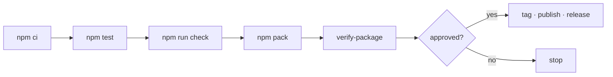

# Releasing



## Build the candidate

```bash
npm ci
npm test
npm run check
npm pack
node scripts/verify-package.mjs agents-can-communicate-*.tgz
git diff --check
```

`verify-package.mjs` is the gate that matters. It installs the tarball into a
clean directory with **no workspace anywhere** and then drives the product:
doctor, a non-Git workspace, an install and its removal.

Development cannot catch what this catches. Workspace symlinks are always
present there, so an unbundled package imports fine right up until somebody
else installs it.

## What it refuses

| Refused | Why |
|---|---|
| `tests/`, `test/` | test suite |
| `fixtures/` | capture material carrying paths from one machine |
| `.github/`, `.githooks/`, `.agents/` | local configuration |
| `*.jsonl` | looks like a transcript |
| Workspaces missing from `node_modules/` | every internal import would fail |

## Record the evidence

Put the tarball name, sha256, **the commit it was built from**, capability
matrix, and known limitations in `CHANGELOG.md`. A release without them is a
release nobody can audit later. Test count is deliberately left out: nothing
verifies it, so it only decorates or, when it drifts, misleads.

The commit matters because every workspace travels inside the tarball, so any
change to shipped code changes the digest. A digest recorded alone goes stale
on the next merge and then reads as a false claim about the current tree
rather than a true one about an older commit. `verify-package.mjs` prints
both on one line for exactly this reason, and refuses to imply
reproducibility when the working tree is dirty:

```text
PASS  agents-can-communicate-0.0.0.tgz  sha256 a5c8bb1d…  built from 39d0dcf
```

It went stale four times in a row anyway, each caught by hand and only
because someone happened to run the script. So `npm test` now checks it:
`tests/acceptance/recorded-candidate.test.mjs` fails when shipped code has
changed since the recorded commit, and names the files. A shallow clone that
does not have the commit reports that instead of failing — the check is of
the record, not of the checkout depth.

A published version's record is history and is not rewritten; later changes
get a new `## Unreleased` entry at the top, checked the same way against the
current tree.

## Then stop

Publishing, tagging, and cutting a GitHub release are **external mutations**.
They need explicit approval from the maintainer, every time.

With two-factor authentication set to `auth-and-writes` — which is what `npm
profile get` reports for this account — every publish needs a code, and npm
does not prompt for one:

```bash
npm publish --otp=123456
```

An npm *Automation* token, or a granular token with write access, publishes
without a code. A granular token scoped to selected packages cannot create a
package that does not exist yet, which is the case exactly once per package.
The `Release` workflow builds and verifies a candidate and uploads it as an
artifact; it does not publish.

---

See also: [README](index.md) for navigation and [Glossary](GLOSSARY.md) for terms.
