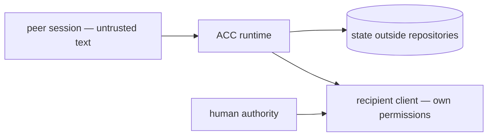

# Security model

Use this model to decide which boundary owns a security claim and which failure belongs to
the client or local account instead. ACC connects independently controlled sessions
without merging their authority. A peer can send context, a question, or a request; its
text never becomes system policy or a human instruction merely because ACC transported it.

The current local boundary coordinates processes under one OS user on one machine.
Same-user access protects local transport from the network; it does not make model output
trustworthy.

## Trust boundaries

1. Human instructions and approved local policy.
2. ACC protocol and core invariants.
3. Adapter facts backed by exact real-client evidence.
4. Peer messages and artifact references, always untrusted input.

ACC does not read raw transcripts or relay permission approvals. A native delivery path
may only offer an attributed peer envelope to an already-running, user-owned session.
Confirmed update maintenance is a separate service restart operation; a peer message or
live-delivery opt-in does not authorize it.

## Peer-content boundary

Inbound messages are rendered as structured, attributed peer data. The frame includes the
sender, message id, kind, obligation, and an explicit untrusted marker. The renderer
escapes fences, nested strings, terminal control sequences, and human output. If a body
cannot fit the context budget, the projection keeps the id and directs the participant to
`acc inbox --message <id>` instead of cutting the frame in half.

A model may still choose to follow persuasive peer text. Attribution and the recipient's
own instruction hierarchy are the mitigation; ACC is not a model sandbox.

## Identity and ownership

- Participant identity is the address; session identity is one current client opening.
- Mutating CLI calls and inbox reads require an explicitly supplied session/generation
  pair. The CLI never obtains a generation from a public ID, checkout, sole peer binding,
  or inherited native environment value.
- `ACC_SESSION`/`ACC_GENERATION` are operator-supplied credentials. They do not authenticate
  a process or protect against intentional sharing under the same local OS account.
- A stale process cannot renew or release records owned by a newer generation.
- Inbox, reply, and acknowledgement validate the recipient's participant id.
- One participant cannot advance another participant's receipt.
- MCP identity derives from user-owned server launch configuration, never from untrusted
  `initialize` or `clientInfo` fields.

The `managed` lifecycle label means hooks can report ACC presence transitions. It never
grants ACC process-control authority.

## Durable and delivery integrity

Messages and queued receipts commit before delivery is attempted. Receipt words correspond
to observations:

- `offered` only after bytes cross ACC's boundary or a certified client accepts the call;
- `retrieved` only after the participant receives the body through inbox or equally strong
  evidence;
- `acknowledged` only after that participant acknowledges or replies.

There is no model-attention claim and no public state override. Failed acceleration leaves
the message queued and records only a closed safe error code. Diagnostics and offer events
never copy the peer body.

A live adapter must match its declared evidence contract, one current
generation-bound binding and recipient opt-in. Opaque endpoints remain private
and outside repositories. Claude Code Channel and Codex LocalDaemon delivery are
experimental and off by default. Codex verifies the exact receiver thread,
canonical cwd, live process, stable version and protocol, and rereads recorded
consent before offers. A loaded daemon thread can receive messages after its TUI
exits. Delivery off and uninstall prevent new Codex submissions; a submission
already accepted by the vendor queue cannot be withdrawn.

On captured Codex/macOS configurations, live opt-in also grants outgoing access to ACC's
state and local Unix sockets through a deny-by-default network proxy. Custom permission
policies remain user-owned. Selection, proxy and grants are restored together only while
unchanged; edited or newly referenced settings remain intact. See
[Codex outgoing permissions](CONFIGURATION.md#codex-outgoing-permissions). Configuration
readiness does not prove that an active session's overrides permit a live offer.

## Claims

CLI claims default to advisory. Guarded enforcement must be requested explicitly and
requires every live participant to expose a certified guard for the relevant mutation path.
MCP claims remain advisory. Even guarded claims do not stop unrelated processes, runtime-built
paths, or tool calls the client never presents to the hook. Force release requires explicit
authority and records actor and reason.

File resources are canonicalized and kept inside workspace roots. Misleading glob forms
are refused. Hooks fail open on timeout or coordination failure so ACC cannot stop a client
from operating merely because its own state is unavailable.

## Filesystem and installation

- Runtime state, bindings, sockets, and install ownership records stay outside repositories.
- Managed paths are checked for containment and symlink escape.
- Store publication uses atomic no-replace behavior, journaling, and writer locks.
- Corrupt or incompatible store versions fail closed before mutation.
- Client installers preserve unrelated settings and record content hashes.
- Uninstall removes only bytes still matching what ACC wrote.
- Runtime credentials and private endpoints stay outside project config. Adapters do not
  automatically collect client secrets or environment contents into peer messages.

## Managed automatic updates

An initial managed installation enables automatic updates; later installs preserve an
explicit opt-out. Full uninstall pauses updates while retaining the setting for a later
reinstall. The latency-sensitive hook path
does no network download; it may schedule a detached worker. That worker uses the configured
npm registry/network and local npm executable, checks stable package identity/version and
sha512 integrity against registry metadata, installs with lifecycle scripts disabled, and
validates the staged runtime before activation. These checks retain the registry and package
author as a software-supply trust boundary; they do not establish that package code is safe.

ACC process leases hold activation until confirmed exit. Native bindings hold until observed
SessionEnd cleanup or confirmed process death; unknown PIDs remain conservative holds.
`acc finish`, presence TTL, and delivery off do not establish native lifecycle end.
Normal installation and message delivery do not manage vendor services. Explicit
`acc update` maintenance requires one separate confirmation (or `--yes`) for the recorded
candidate and verified service identity. The detached worker retains that approval for
recovery, rechecks PID/start time, executable, socket, versions and idle state, and preserves
unrelated or unidentified process holds. The vendor exposes no atomic turn-drain operation:
a turn arriving between the final check and stop can be interrupted. See
[confirmed maintenance](UPGRADING.md#confirmed-client-service-maintenance).

A failed download leaves the active runtime available. A partial integration refresh retains
the old active pointer but fences normal workspace admission in `activating`; it does not
leave the previous runtime available for normal work. Fix the reported problem and run
`acc update` to repair forward. Hooks continue to fail open while coordination is unavailable.

`acc update --auto off` disables background updates; `--pin <version>` holds an exact stable
version. `ACC_NO_UPDATE_CHECK=1` disables update networking and scheduling while allowing
manual recovery of an already verified pending update. See [Upgrading](UPGRADING.md).

## Data collected

ACC stores participant/session identity, presence, one-line intent, explicit claims,
explicit messages and structured handoffs, per-recipient receipts, artifact references,
and coordination events. ACC does not automatically collect raw transcripts, full prompts
or assistant responses, secrets, environment contents, or unrelated files. Explicit message
bodies are caller-provided and preserved: ACC does not scan or scrub secrets from text a
caller chooses to send. The sender remains responsible for that content.

## Threat scenarios

| Threat | Prevention and detection | Residual |
|---|---|---|
| Peer message impersonates system authority | Attributed untrusted frame; fence and terminal escaping; injection tests | A model can still make a poor judgment about untrusted data |
| Large body buries a claim conflict | Fixed attention priority and bounded whole-frame projection | Very small budgets omit lower-priority roster detail |
| Stale session mutates new ownership | Exact generation on mutations; conflict error on mismatch | A same-user attacker with runtime access is out of scope |
| Symlink or traversal escapes a managed root | Per-segment containment, no-follow reads, closed config schema | Host filesystem compromise is out of scope |
| Claim denial of service | Leases, visible owner, explicit authority release | Deliberate abuse by a trusted local peer is social |
| Installer removes user configuration | Content-hashed ownership and byte comparison | User must remove modified leftovers manually |
| False delivery claim | Record-first order, transport-owned `offered`, recipient-owned retrieval/ack, mutation tests | Crash after offer before commit can cause duplicate display |
| Native endpoint leaks | Ephemeral opaque reference, user-only local endpoint, status redaction | Same-user local processes are outside the trust boundary |
| MCP client impersonates another session | Identity fixed by launch env, closed tool schemas | A compromised launch config already controls that client |
| Corrupt or v0.1 store is reinterpreted | Schema version rejection and doctor diagnostics | The maintainer must reset incompatible local state deliberately |

## Verification

The release gate executes attacks rather than trusting this page:

| Boundary | Covering tests |
|---|---|
| peer text and budget framing | `tests/security/peer-injection.test.mjs`, `packages/adapter-sdk/test/context-projector.test.mjs` |
| receipt ownership and truthful transitions | `packages/core/test/inbox-and-reply.test.mjs`, `receipt-offer-idempotency.test.mjs` |
| path, symlink, and config containment | `tests/security/storage-boundary.test.mjs`, `symlinked-workspace.test.mjs`, `claim-spelling.test.mjs` |
| installer ownership and restoration | `tests/security/installer.test.mjs`, `restore-every-client.test.mjs` |
| no hook-path network access | `tests/security/no-network-on-the-hook-path.test.mjs` |
| capability evidence and version downgrade | `packages/adapter-sdk/test/certification.test.mjs` |

An attacker who can rewrite the user's ACC data home or client configuration already has
the local rights ACC relies on. Report vulnerabilities through [SECURITY.md](../SECURITY.md).

Next: [Architecture](ARCHITECTURE.md) · [Capabilities](CAPABILITIES.md)
