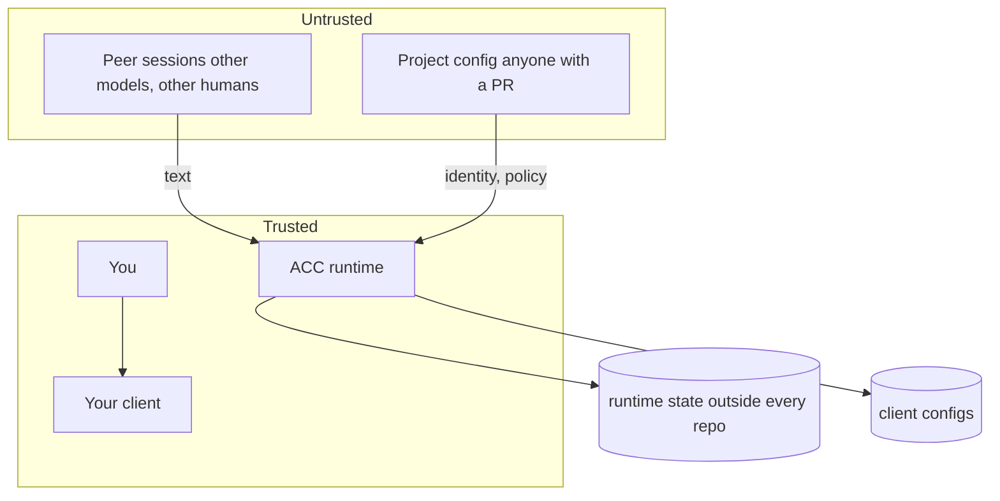

# Security model

Independent peers need an explicit authority boundary. No session owns another, so peer
text can carry context and requests but can never silently become policy or human
instruction. This is what lets ACC connect differently trusted sessions without merging
their conversations or trust models.

ACC runs with your rights, edits four other tools' configs, and carries text written by
models other people are prompting. Its value comes from connecting independently
controlled sessions; its main risk comes from confusing that connection with trust. The
boundaries below keep coordination useful without treating a peer as a manager.

## Trust boundaries

ACC coordinates processes running under the same local user in the first release. Same-user access is not equivalent to trusted model output.

Trust levels:

1. human instructions and approved policy;
2. local ACC core invariants;
3. adapter-reported lifecycle facts;
4. peer-agent messages and summaries;
5. referenced external artifacts.

Peer messages are never automatically promoted to human authority.

**Trusted:** you, your client, ACC's own code, the machine.
**Untrusted:** everything a peer writes, and everything in a committed file.

## Assets

| Asset | Why it matters |
|---|---|
| Your client's config | ACC edits it; a bad edit breaks your tooling |
| Runtime state | Presence, claims, messages — decides what other sessions believe |
| The model's turn | Injected text reaches a model that can act |
| The repository | ACC must never write into it |

## Prompt injection

Inbound messages are rendered as structured, attributed peer data. Adapters must not concatenate them into system instructions without a boundary.

Required rendering properties:

- sender and harness visible;
- message type visible;
- authority visible;
- referenced artifacts separate from instructions;
- suspicious content cannot masquerade as ACC policy;
- raw HTML or terminal control sequences escaped in human views.

## Identity and session generations

- Persistent participant identity and ephemeral session identity are different.
- Every mutable ownership record includes an unguessable session generation token.
- Resume, heartbeat, release, and close require the current generation.
- Stale recovery never deletes a new generation after observing an old one.
- Workspace identity is validated before every mutation, including doctor and initialization paths.

## Claims

- Claims are advisory unless the active adapter declares and proves a guard capability.
- Guarded does not imply protection from out-of-band writes by unrelated applications.
- Force release requires a human or explicit policy authority and records reason, actor, and prior owner.
- Generic resource matching must reject ambiguous or non-canonical file paths.

## Durable records

- Messages, decisions, events, and acknowledgements are immutable or append-only.
- Publication uses no-replace semantics.
- Idempotent retries accept only byte- or semantic-equivalent destinations.
- Record filenames and IDs are bound.
- Symlink traversal outside managed storage is rejected.
- Corruption and incompatible protocol versions fail closed before mutation.

## Adapter installation

- Detect and present every settings file that will change.
- Preserve unrelated config keys and ordering where the format permits.
- Record ownership markers so uninstall removes only ACC-managed entries.
- Never copy API keys into project or ACC configuration.
- Do not ask for broader filesystem or shell privileges than the hook requires.

## Privacy

Default collected data:

- session and harness identity;
- one-line Intent summaries;
- explicit messages and decisions;
- claim and task metadata;
- artifact references;
- delivery and health events.

Default excluded data:

- complete prompts;
- complete assistant responses;
- raw transcripts;
- environment variables;
- secrets and credentials;
- unrelated filesystem contents.

Transcript or artifact ingestion must be an explicit, scoped action.

## Threat scenarios

Ten scenarios, each with its prevention, detection, and residual risk:

| # | Attack | Consequence if it works | Prevention | Detection | Residual |
|---|---|---|---|---|---|
| 1 | **Malicious peer** writes a message that reads as an instruction | Your agent releases claims or leaks work | Peer text is fenced, attributed, labelled untrusted; fences and control chars escaped | Block markers are balanced; test asserts nothing escapes the fence | A model may still *choose* to obey persuasive text. Attribution is the mitigation, not a guarantee |
| 2 | **Peer floods** the turn to bury a conflict warning | Agent writes into a claimed file unwarned | Fixed priority; budget spent on conflicts first, roster last | Budget test with a 50 KB body | Very small budgets drop roster detail |
| 3 | **Stale process** acts as a session it no longer owns | Claims released or renewed by a dead generation | Every mutation carries the exact generation token | Generation mismatch is a hard error | A process killed mid-write is handled by the journal, not by this |
| 4 | **Symlink escape** — config or store path points elsewhere | ACC reads or writes outside the boundary | `O_NOFOLLOW` on config reads; managed-root containment on every path | Refused with a data error | A root replaced between check and open is bounded by the store's own O_NOFOLLOW reads |
| 5 | **Replay** of an old event or record | Peers believe stale presence or claims | Optimistic generations; leases expire; journal roll-forward is idempotent | Generation conflict, exit 5 | — |
| 6 | **Claim denial of service** — one session claims everything | Others cannot work | Leases expire; `release --authority` exists; claims are visible with owners | `acc status` names the owner | Deliberate abuse by a trusted peer is a social problem |
| 7 | **Installer takeover** — a record names a file ACC never wrote | Uninstall deletes unrelated config | Records are content-hashed; only matching bytes are removed; shared files are never deleted | Modified files reported as kept | A record written by an attacker with filesystem access is out of scope — so is everything else at that point |
| 8 | **MCP tool poisoning** — a client claims a session it does not own | One session impersonates another | Session derives from the server's own launch config, never from `initialize` or `clientInfo` | Restart resolves to the same session | — |
| 9 | **Corrupt store** | Ambiguous state read as truth | Doctor fails closed and refuses to repair what it cannot read | `acc doctor` reports blocked and corrupt paths | — |
| 10 | **Project config carries runtime state** | A committed file hands a peer sessions or tokens | Runtime keys refused by name; unknown keys refused | Data error naming the key | — |

### Boundaries in one line each

- **Peer text never becomes ACC's voice** — it is fenced, escaped, and attributed.
- **No path leaves the managed root** — checked per segment, not by string prefix.
- **Nothing ACC writes lands in a repository** — enforced, not conventional.
- **Uninstall removes only bytes it still recognises.**
- **A hook never fails closed** — a coordination tool must not be why a session stops.

### Not in scope

An attacker with write access to your data home or your client's config already
has what ACC would protect. ACC is not a sandbox and does not claim to contain a
malicious local process.

## Enforced, not documented

Everything above is asserted by `tests/security/*.test.mjs`, which the release
gate runs. Each rule is written as an attack rather than a description:

| Rule | Test |
|---|---|
| Peer text cannot leave its quoted block | `peer-injection.test.mjs` |
| Peer text cannot forge or close the fence | `peer-injection.test.mjs` |
| Peer text cannot repaint the terminal | `peer-injection.test.mjs` |
| Flooding cannot bury a conflict warning | `peer-injection.test.mjs` |
| The budget never cuts a peer block in half | `context-projector.test.mjs` |
| A message nobody was shown is never reported delivered | `message-delivery.test.mjs` |
| No path escapes the managed root | `storage-boundary.test.mjs` |
| A claim holds however the path is spelled | `symlinked-workspace.test.mjs` |
| A workspace id cannot traverse | `storage-boundary.test.mjs` |
| A config cannot point roots outside itself | `storage-boundary.test.mjs` |
| A symlinked config is refused, not followed | `storage-boundary.test.mjs` |
| A committed config cannot carry runtime state | `storage-boundary.test.mjs` |
| Uninstall deletes only bytes it recognises | `installer.test.mjs` |
| A shared config is never deleted | `installer.test.mjs` |
| A corrupt install record stops the run | `installer.test.mjs` |
| A dry run cannot be tricked into writing | `installer.test.mjs` |

Reporting a vulnerability: [SECURITY.md](../SECURITY.md) at the repository root.

---

See also: [README](README.md) for navigation, [Glossary](GLOSSARY.md) for terms, and
[Architecture](ARCHITECTURE.md) for the control-plane boundary this model assumes.
