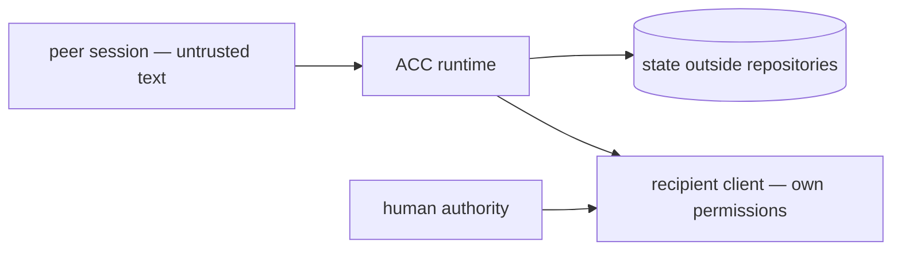

# Security model

ACC connects independently controlled sessions without merging their authority. A peer can
send useful context, a question, or a request; its text never becomes system policy or a
human instruction merely because ACC transported it.

The first release coordinates processes under one local OS user. Same-user access protects
local transport from the network; it does not make model output trustworthy.

## Trust boundaries

1. Human instructions and approved local policy.
2. ACC protocol and core invariants.
3. Adapter facts backed by exact real-client evidence.
4. Peer messages and artifact references, always untrusted input.

ACC does not read raw transcripts, relay permission approvals, or start target clients. A
native delivery path may only offer an attributed peer envelope to an already-running,
user-owned session.

## Peer-content boundary

Inbound messages are rendered as structured, attributed peer data. The frame includes the
sender, message id, kind, obligation, and an explicit untrusted marker. The renderer
escapes fences, nested strings, terminal control sequences, and human output. If a body
cannot fit the context budget, the projection keeps the id and directs the participant to
`acc inbox --message <id>` instead of cutting the frame in half.

A model may still choose to follow persuasive peer text. Attribution and the recipient's
own instruction hierarchy are the mitigation; ACC is not a model sandbox.

## Identity and ownership

- Participant identity is the address; session identity is one current client opening.
- Mutating calls prove their owner with the session generation.
- A stale process cannot renew or release records owned by a newer generation.
- Inbox, reply, and acknowledgement validate the recipient's participant id.
- One participant cannot advance another participant's receipt.
- MCP identity derives from user-owned server launch configuration, never from untrusted
  `initialize` or `clientInfo` fields.

The `managed` lifecycle label means hooks can report ACC presence transitions. It never
grants ACC process-control authority.

## Durable and delivery integrity

Messages and queued receipts commit before delivery is attempted. Receipt words correspond
to observations:

- `offered` only after bytes cross ACC's boundary or a certified client accepts the call;
- `retrieved` only after the participant receives the body through inbox or equally strong
  evidence;
- `acknowledged` only after that participant acknowledges or replies.

There is no model-attention claim and no public state override. Failed acceleration leaves
the message queued and records only a closed safe error code. Diagnostics and offer events
never copy the peer body.

A future live adapter must match exact passing evidence, one unexpired generation-bound
binding, and the recipient's opt-in policy. Opaque endpoint references remain inside the
adapter and outside repositories. Current Codex and Claude native captures failed, so no
live transport is enabled.

## Claims

Claims are advisory unless every live participant exposes a certified guard for the
relevant mutation path. Even guarded claims do not stop unrelated processes, runtime-built
paths, or tool calls the client never presents to the hook. Force release requires explicit
authority and records actor and reason.

File resources are canonicalized and kept inside workspace roots. Misleading glob forms
are refused. Hooks fail open on timeout or coordination failure so ACC cannot stop a client
from operating merely because its own state is unavailable.

## Filesystem and installation

- Runtime state, bindings, sockets, and install ownership records stay outside repositories.
- Managed paths are checked for containment and symlink escape.
- Store publication uses atomic no-replace behavior, journaling, and writer locks.
- Corrupt or incompatible store versions fail closed before mutation.
- Client installers preserve unrelated settings and record content hashes.
- Uninstall removes only bytes still matching what ACC wrote.
- Tokens, credentials, and environment contents are never copied into ACC or project config.

## Data collected

ACC stores participant/session identity, presence, one-line intent, explicit claims,
explicit messages and structured handoffs, per-recipient receipts, artifact references,
and coordination events. It excludes complete prompts, assistant responses, raw
transcripts, secrets, environment variables, and unrelated files.

## Threat scenarios

| Threat | Prevention and detection | Residual |
|---|---|---|
| Peer message impersonates system authority | Attributed untrusted frame; fence and terminal escaping; injection tests | A model can still make a poor judgment about untrusted data |
| Large body buries a claim conflict | Fixed attention priority and bounded whole-frame projection | Very small budgets omit lower-priority roster detail |
| Stale session mutates new ownership | Exact generation on mutations; conflict error on mismatch | A same-user attacker with runtime access is out of scope |
| Symlink or traversal escapes a managed root | Per-segment containment, no-follow reads, closed config schema | Host filesystem compromise is out of scope |
| Claim denial of service | Leases, visible owner, explicit authority release | Deliberate abuse by a trusted local peer is social |
| Installer removes user configuration | Content-hashed ownership and byte comparison | User must remove modified leftovers manually |
| False delivery claim | Record-first order, transport-owned `offered`, recipient-owned retrieval/ack, mutation tests | Crash after offer before commit can cause duplicate display |
| Native endpoint leaks | Ephemeral opaque reference, user-only local endpoint, status redaction | Same-user local processes are outside the trust boundary |
| MCP client impersonates another session | Identity fixed by launch env, closed tool schemas | A compromised launch config already controls that client |
| Corrupt or v0.1 store is reinterpreted | Schema version rejection and doctor diagnostics | The maintainer must reset incompatible local state deliberately |

## Verification

The release gate executes attacks rather than trusting this page:

| Boundary | Covering tests |
|---|---|
| peer text and budget framing | `tests/security/peer-injection.test.mjs`, `packages/adapter-sdk/test/context-projector.test.mjs` |
| receipt ownership and truthful transitions | `packages/core/test/inbox-and-reply.test.mjs`, `receipt-offer-idempotency.test.mjs` |
| path, symlink, and config containment | `tests/security/storage-boundary.test.mjs`, `symlinked-workspace.test.mjs`, `claim-spelling.test.mjs` |
| installer ownership and restoration | `tests/security/installer.test.mjs`, `restore-every-client.test.mjs` |
| no hook-path network access | `tests/security/no-network-on-the-hook-path.test.mjs` |
| capability evidence and version downgrade | `packages/adapter-sdk/test/certification.test.mjs` |

An attacker who can rewrite the user's ACC data home or client configuration already has
the local rights ACC relies on. Report vulnerabilities through [SECURITY.md](../SECURITY.md).

Next: [Architecture](ARCHITECTURE.md) · [Capabilities](CAPABILITIES.md)
