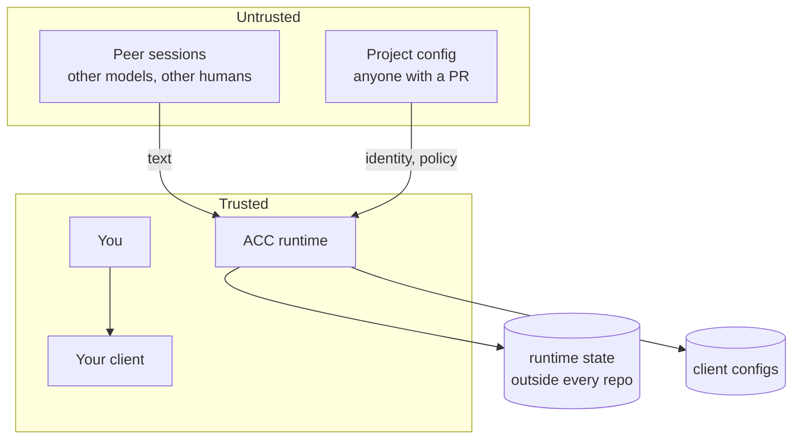

# Threat model

ACC runs with your rights, edits four other tools' configs, and carries text
written by models other people are prompting.

Its value comes from connecting independently controlled sessions; its main risk comes
from confusing that connection with trust. The boundaries below keep coordination useful
without treating a peer as a manager.

**Trusted:** you, your client, ACC's own code, the machine.
**Untrusted:** everything a peer writes, and everything in a committed file.

## Assets

| Asset | Why it matters |
|---|---|
| Your client's config | ACC edits it; a bad edit breaks your tooling |
| Runtime state | Presence, claims, messages — decides what other sessions believe |
| The model's turn | Injected text reaches a model that can act |
| The repository | ACC must never write into it |

## Scenarios

| # | Attack | Consequence if it works | Prevention | Detection | Residual |
|---|---|---|---|---|---|
| 1 | **Malicious peer** writes a message that reads as an instruction | Your agent releases claims or leaks work | Peer text is fenced, attributed, labelled untrusted; fences and control chars escaped | Block markers are balanced; test asserts nothing escapes the fence | A model may still *choose* to obey persuasive text. Attribution is the mitigation, not a guarantee |
| 2 | **Peer floods** the turn to bury a conflict warning | Agent writes into a claimed file unwarned | Fixed priority; budget spent on conflicts first, roster last | Budget test with a 50 KB body | Very small budgets drop roster detail |
| 3 | **Stale process** acts as a session it no longer owns | Claims released or renewed by a dead generation | Every mutation carries the exact generation token | Generation mismatch is a hard error | A process killed mid-write is handled by the journal, not by this |
| 4 | **Symlink escape** — config or store path points elsewhere | ACC reads or writes outside the boundary | `O_NOFOLLOW` on config reads; managed-root containment on every path | Refused with a data error | A root replaced between check and open is bounded by the store's own O_NOFOLLOW reads |
| 5 | **Replay** of an old event or record | Peers believe stale presence or claims | Optimistic generations; leases expire; journal roll-forward is idempotent | Generation conflict, exit 5 | — |
| 6 | **Claim denial of service** — one session claims everything | Others cannot work | Leases expire; `release --authority` exists; claims are visible with owners | `acc status` names the owner | Deliberate abuse by a trusted peer is a social problem |
| 7 | **Installer takeover** — a record names a file ACC never wrote | Uninstall deletes unrelated config | Records are content-hashed; only matching bytes are removed; shared files are never deleted | Modified files reported as kept | A record written by an attacker with filesystem access is out of scope — so is everything else at that point |
| 8 | **MCP tool poisoning** — a client claims a session it does not own | One session impersonates another | Session derives from the server's own launch config, never from `initialize` or `clientInfo` | Restart resolves to the same session | — |
| 9 | **Corrupt store** | Ambiguous state read as truth | Doctor fails closed and refuses to repair what it cannot read | `acc doctor` reports blocked and corrupt paths | — |
| 10 | **Project config carries runtime state** | A committed file hands a peer sessions or tokens | Runtime keys refused by name; unknown keys refused | Data error naming the key | — |

## Boundaries in one line each

- **Peer text never becomes ACC's voice** — it is fenced, escaped, and attributed.
- **No path leaves the managed root** — checked per segment, not by string prefix.
- **Nothing ACC writes lands in a repository** — enforced, not conventional.
- **Uninstall removes only bytes it still recognises.**
- **A hook never fails closed** — a coordination tool must not be why a session stops.

## Not in scope

An attacker with write access to your data home or your client's config already
has what ACC would protect. ACC is not a sandbox and does not claim to contain a
malicious local process.

Enforced by `tests/security/*.test.mjs`, which is part of the release gate.
