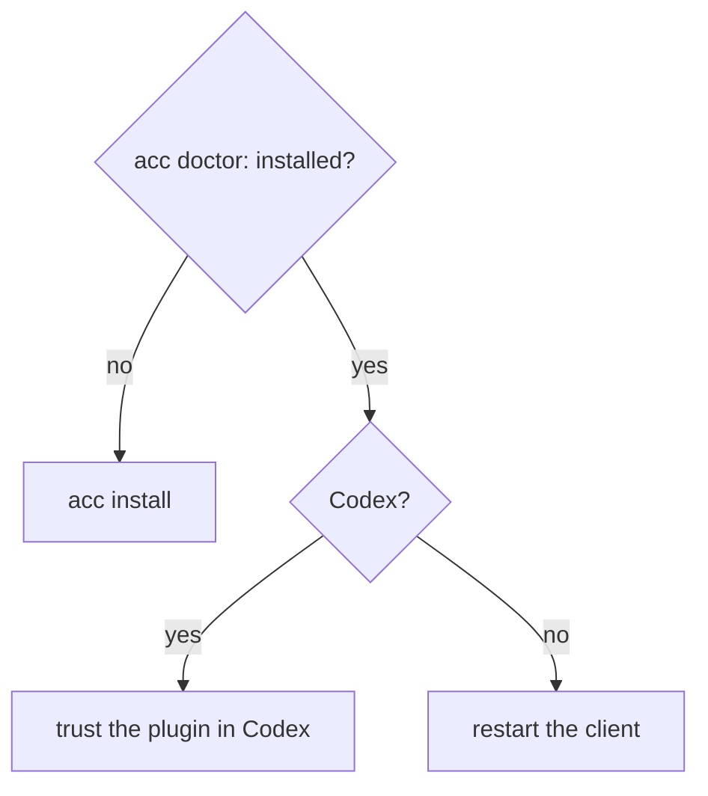

# Troubleshooting

Start here:

```bash
acc doctor
```

It names the client, its version, whether ACC is installed, whether what it wrote is
still intact, and the command to fix it.

Restart the client after `acc install` — hooks load at startup, so an already-running
session never picks up a fresh install.

## Nothing happens in my session



## Codex: plugin listed as `not installed`

ACC writes the cache copy, but hook trust is Codex's own step. Until you trust the
plugin, nothing runs.

## Gemini: guard never fires

Default and `plan` modes expose no write tool at all. Use `--approval-mode auto_edit`.

## Kimi: sessions pile up in `acc status`

Kimi fires no `SessionEnd`, so a `kimi -p` run never closes its session — it just stops
taking turns. With no pid to resolve, presence is the only signal: the session reads
`offline` after thirty minutes of silence, not on a fixed schedule.

It isn't gone. `acc status --all` lists it, and every session before it, on purpose — it's
how you find which worktree an agent was working in after it has left.

## My write was blocked

Exit code `5`, with the owner and the claim id named. Ask them, or force it:

```bash
acc release --claim claim_x --authority "agreed with models" --reason "handing over"
```

## A claim says `advisory`

Someone in the workspace can't be guarded — an MCP client, or a client whose model edits
through the shell. Respecting the claim is then the agent's own job; the turn context
says so. See [MCP.md](MCP.md) for why MCP participation is always advisory.

## `acc uninstall` left files

It removes only what still matches what it wrote. Anything you edited is reported as kept
and left alone. Delete it yourself if you want it gone.

## Nothing is written into my repo

By design. Runtime state lives under the platform data directory, not the workspace.
Override with `ACC_DATA_HOME`; ACC refuses any location inside a workspace.

---

Terms above (participant, claim, guarded/advisory) are defined in the
[Glossary](GLOSSARY.md). For everything else, see the [docs index](index.md).
