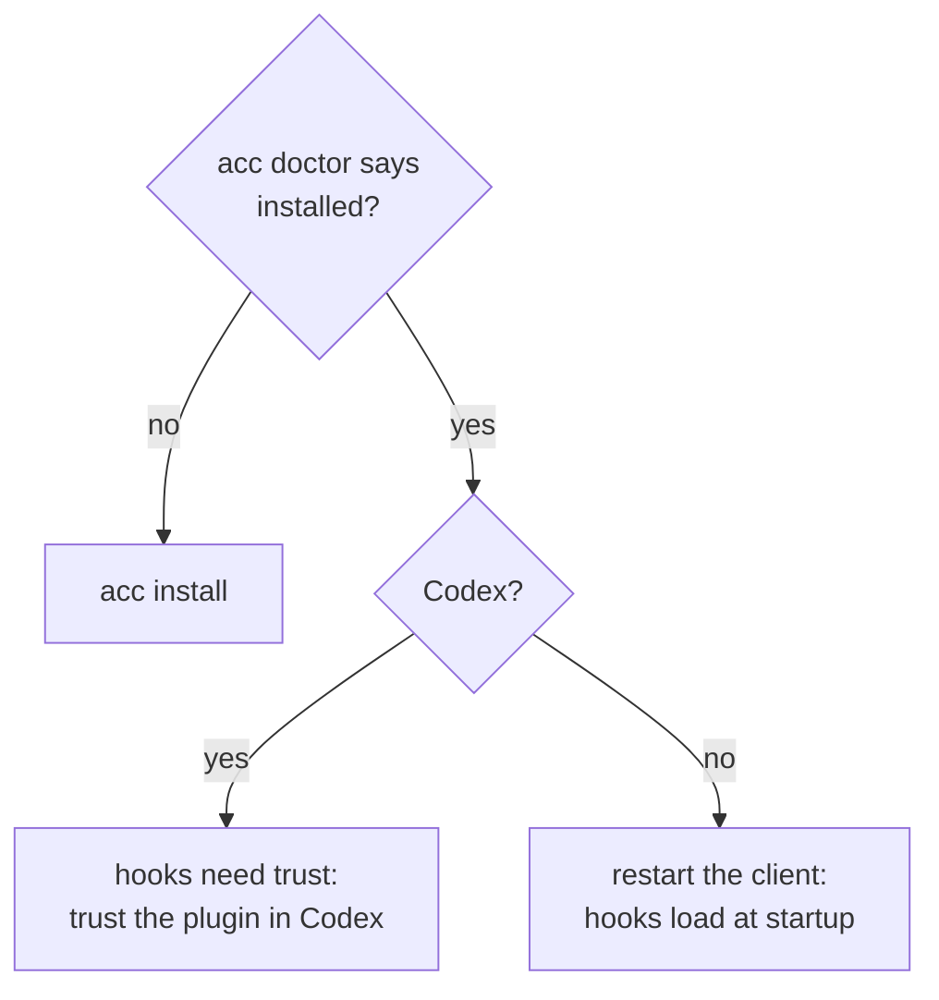

# Troubleshooting

Start here:

```bash
acc doctor
```

It names the client, its version, whether ACC is installed, whether what ACC wrote is
still intact, and the command to fix it.

## Nothing happens in my session



## Codex: plugin listed as `not installed`

ACC writes the cache copy, but hook **trust** is Codex's own step. Until you trust the
plugin, nothing runs.

## Gemini: guard never fires

Default and `plan` modes expose no write tool at all. Use `--approval-mode auto_edit`.

## Kimi: sessions pile up in `acc status`

Kimi fires no `SessionEnd`. Finished prompt-mode sessions age out on their 60s cadence.
Not a leak.

## My write was blocked

Exit code `5`, with the owner named. Ask them, or:

```bash
acc release --claim "$CLAIM" --authority "agreed with models" --reason "handing over"
```

## A claim says `advisory`

Someone in the workspace cannot be guarded — an MCP client, or a client whose model edits
through the shell. Respecting the claim is then the agent's own job, and the turn context
says so.

## `acc uninstall` left files

It removes only what still matches what ACC wrote. Anything you edited is reported as kept
and left alone. Delete it yourself if you want it gone.

## Nothing is written into my repo

By design. Runtime state lives under the platform data directory. Override with
`ACC_DATA_HOME`; ACC refuses any location inside a workspace.
