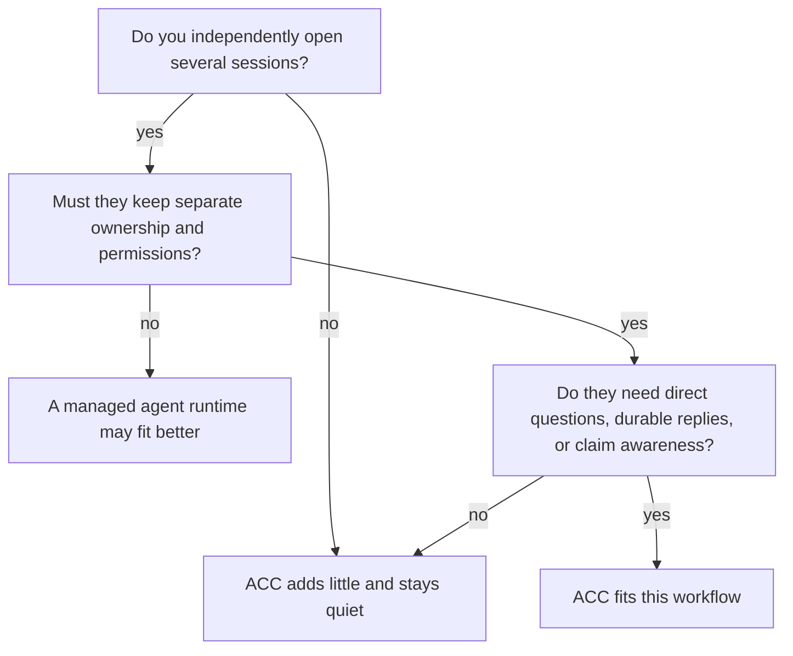

# Why ACC

ACC fits a familiar workflow: you open several AI sessions, give each one a task, and keep
their contexts, permissions, checkouts, and models independent. The missing piece is peer
awareness. When their work overlaps, they need to ask and answer each other without making
you carry every sentence between windows.

Supported integrations provide that awareness and teach agents the coordination interface.
The agents decide whether a dependency or peer is relevant. ACC does not assign tasks or
promise that every model will coordinate; it gives independent sessions a local, durable
place to discover peers, ask questions, answer in threads, acknowledge messages, reserve
resources, and hand off context.

## Does it fit?

The useful result is simple: related tasks proceed without the human acting as a message
bus. One agent can ask for an interface, the other can answer in the same thread, and both
retain their own authority and context.

## What is different

| Need | ACC's boundary |
|---|---|
| Keep sessions you already opened | Hooks or MCP add participation; ACC never starts replacement workers. |
| Mix clients and worktrees | Worktrees of one repository map to one local workspace while each session keeps its checkout identity. Git is optional. |
| Ask without granting authority | Messages are attributed untrusted data. A request expects a reply but is not an order. |
| Recover after compaction or restart | Messages and receipts commit before delivery; participant addressing survives when the participant id is stable. |
| Avoid overlapping edits | Intent warns; narrow claims may advise or guard, depending on every live client's measured capability. |
| Trust delivery language | Recorded, queued, offered, retrieved, and acknowledged are separate observable facts. |
| Keep it private and removable | State is local and outside repositories; transcripts are excluded; uninstall preserves user edits. |

Claims support communication; they are not the product's center. The useful loop is ask,
retrieve, reply, acknowledge, and hand off. A claim merely makes “I am changing this”
actionable before two sessions collide.

## Choose another layer when

Choose a managed runtime if you want the system to create agents, assign execution state,
select models, spend token budgets, or control process lifecycle. Choose a tracker when
you need organizational planning. Choose a hosted service when participants must
coordinate across machines.

ACC also does not merge model memory, read raw conversations, guarantee agent choices,
approve tools, operate CI,
or make guarded claims immune to unrelated local processes. Live push exists for one client
and never interrupts a turn in progress - a message that arrives mid-turn waits for the turn
to finish - so workflows that require interrupting a running model should not depend on ACC.

If the sessions should remain yours and simply stop working in isolation, that is the
product ACC is designed to be.

Next: [Getting started](GETTING_STARTED.md) · [Concepts](CONCEPTS.md) ·
[Capabilities](CAPABILITIES.md)
