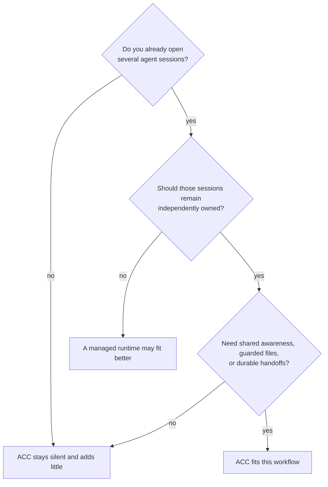

# Why ACC

ACC is for one awkward but common setup: several agent sessions are already open, each
with its own client, context, permissions, checkout, and human direction. They need to
coordinate, but none should become the owner of the others.

That constraint defines the product. ACC is a control plane around sessions you own, not
an execution plane that replaces them.

## The decision

## When ACC is the better fit

| You need | What ACC does differently |
|---|---|
| Keep existing sessions | Attaches through client hooks or MCP instead of launching replacement workers. |
| Mix clients and worktrees | Resolves every checkout of one repository to one workspace while preserving which session is where. Git enriches identity but is optional. |
| Coordinate without hierarchy | Any peer may ask, answer, claim, or hand off. A coordinator is a replaceable workstream role, never workspace authority. |
| Avoid duplicate edits | Native adapters can intercept supported file writes and compare them with workspace-wide claims before the write happens. |
| Let work outlive a terminal | Records requests, tasks, decisions, and receipts durably before attempting delivery. Work is addressed to a participant, not a process. |
| Know what really happened | Reports capability and delivery stages separately. A polling client is not called realtime; an advisory claim is not called guarded. |
| Keep coordination private and removable | Stores state locally outside repositories, excludes raw transcripts, and uninstalls only bytes it still recognises as its own. |
| Preserve work when ACC fails | Hooks allow the client action when ACC cannot answer within its budget. A coordination failure cannot stop the session. |

## How the niche shapes the product

ACC has no permanent leader because durable state cannot depend on one model staying
alive. It has no process launcher because session ownership belongs to you. It separates
intent from claims because awareness should be cheap while blocking another edit should
be explicit. It treats peer text as untrusted data because independent sessions may have
different humans and instructions.

The result is intentionally quiet. A lone session gets no injected banner and leaves no
durable workspace behind. Coordination materialises only when a peer, claim, message,
task, or handoff makes it useful.

## When to choose a different layer

ACC is not designed to:

- create, schedule, wake, resume, or terminate agent processes;
- share full conversations or merge model memory;
- coordinate machines through a hosted service;
- guarantee protection from shell commands or unrelated local applications;
- replace a project tracker, CI system, or source-control workflow;
- support Windows in the current release.

If those are the primary requirement, ACC's deliberately narrow control plane is not the
right boundary. If the sessions should stay yours and simply stop working in isolation,
that boundary is the point.

Next: [Getting started](GETTING_STARTED.md) · [Concepts](CONCEPTS.md) ·
[Capabilities](CAPABILITIES.md)
