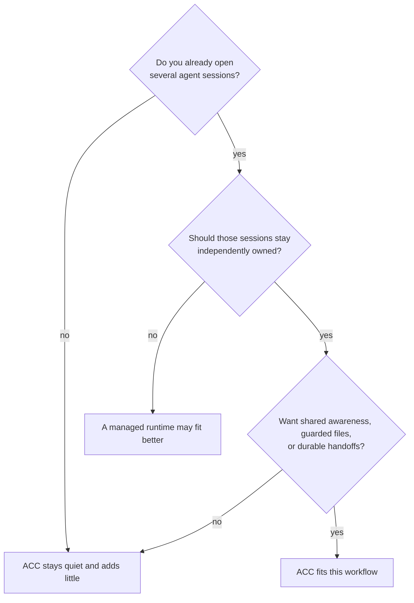

# Why ACC

ACC is for one awkward but common setup: several agent sessions are already open — each
with its own client, context, permissions, checkout, and human direction. They need to
coordinate, but none should become the owner of the others.

That single constraint defines the product. **ACC is a control plane around sessions you
own, not an execution plane that replaces them.** It has no permanent leader (durable
state can't depend on one model staying alive), no process launcher (session ownership is
yours), and it treats every peer's text as untrusted data (independent sessions may answer
to different people). The result is intentionally quiet: a lone session gets no banner and
leaves nothing behind — coordination materialises only when a peer, claim, message, task,
or handoff makes it useful.

## Does it fit you?

## What it does differently

| You need | What ACC does |
|---|---|
| Keep the sessions you already opened | Attaches through client hooks or MCP — it never launches replacement workers. |
| Mix clients and worktrees | Resolves every checkout of one repo to one room, while remembering which session is where. Git enriches identity but is optional. |
| Coordinate without a hierarchy | Any peer may ask, answer, claim, or hand off. A coordinator is a replaceable workstream role, never authority over the room. |
| Stop duplicate edits before they happen | Native adapters compare a pending write against room-wide claims first, and refuse the clash by name. |
| Let work outlive a terminal | Requests, tasks, decisions, and receipts are recorded durably before delivery, and addressed to a participant, not a process. |
| Trust what the tool tells you | Capability and delivery are reported separately — a polling client is not called realtime, an advisory claim is not called guarded. |
| Keep coordination private and removable | State lives locally, outside your repo; raw transcripts are excluded; uninstall removes only bytes ACC still recognises as its own. |

## When to choose a different layer

ACC does **not** set out to create, schedule, wake, resume, or terminate agent processes;
share full conversations or merge model memory; coordinate machines through a hosted
service; guarantee protection from shell commands or unrelated local apps; replace a
tracker, CI, or source control; or support Windows in the current release. If one of those
is your primary need, ACC's deliberately narrow control plane is the wrong boundary.

If instead the sessions should stay yours and simply stop working in isolation — that
boundary is the whole point.

---

Next: [Getting started](GETTING_STARTED.md) · [Concepts](CONCEPTS.md) · [Capabilities](CAPABILITIES.md)
