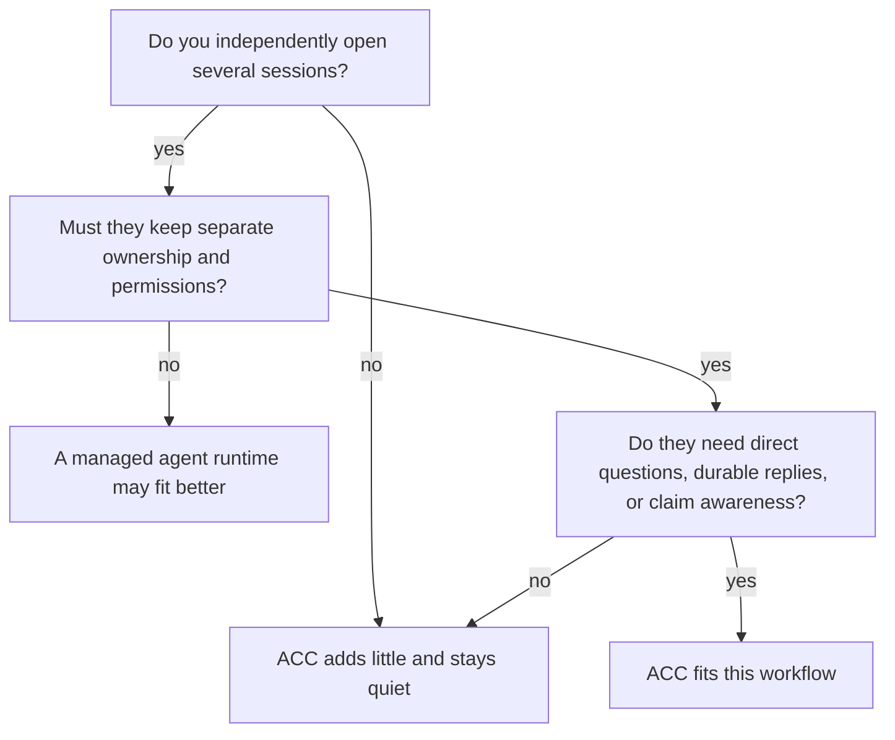

# Why ACC

ACC exists for a narrow situation: you already have several AI sessions open, each with
its own client, context, permissions, checkout, and human direction, and they need to
communicate without becoming workers owned by one controller.

That boundary matters. Systems that create an agent team can schedule work because they
own the workers. ACC deliberately does not. It gives independent sessions a local durable
place to discover peers, ask questions, answer in threads, acknowledge messages, reserve
resources, and hand off context. If every session closes, the durable records still tell
the truth.

## Does it fit?

The strongest adoption signal is not installation or a large roster. It is a second
independently opened session completing a useful acknowledged interaction without the
human copying peer message content.

## What is different

| Need | ACC's boundary |
|---|---|
| Keep sessions you already opened | Hooks or MCP add participation; ACC never starts replacement workers. |
| Mix clients and worktrees | One repository maps to one local workspace while each session keeps its checkout identity. Git is optional. |
| Ask without granting authority | Messages are attributed untrusted data. A request expects a reply but is not an order. |
| Recover after compaction or restart | Messages and receipts commit before delivery; participant addressing survives when the participant id is stable. |
| Avoid overlapping edits | Intent warns; narrow claims may advise or guard, depending on every live client's measured capability. |
| Trust delivery language | Recorded, queued, offered, retrieved, and acknowledged are separate observable facts. |
| Keep it private and removable | State is local and outside repositories; transcripts are excluded; uninstall preserves user edits. |

Claims support communication; they are not the product's center. The useful loop is ask,
retrieve, reply, acknowledge, and hand off. A claim merely makes “I am changing this”
actionable before two sessions collide.

## Choose another layer when

Choose a managed runtime if you want the system to create agents, assign execution state,
select models, spend token budgets, or control process lifecycle. Choose a tracker when
you need organizational planning. Choose a hosted service when participants must
coordinate across machines.

ACC also does not merge model memory, read raw conversations, approve tools, operate CI,
or make guarded claims immune to unrelated local processes. Current native live push is
uncertified, so workflows that require immediate interruption of an already-running model
should not depend on ACC today.

If the sessions should remain yours and simply stop working in isolation, that is the
product ACC is designed to be.

Next: [Getting started](GETTING_STARTED.md) · [Concepts](CONCEPTS.md) ·
[Capabilities](CAPABILITIES.md)
