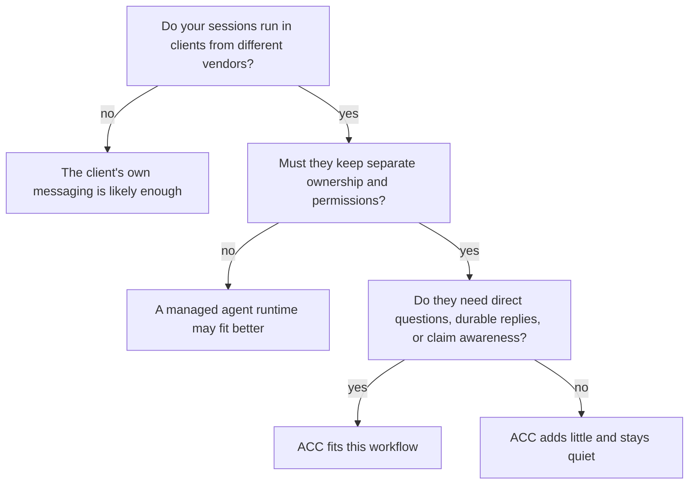

# Why ACC

ACC fits work that spans clients from different vendors. Claude Code sessions can message
each other through Claude Code's
[cross-session messaging](https://code.claude.com/docs/en/cross-session-messaging), and Codex
sessions can queue messages for each other with `codex queue`. A Claude Code session and a
Codex session still cannot reach each other. When you ask another vendor's model for a review,
build related features in two clients, or switch clients in the middle of a feature, the
sessions need to ask and answer each other without making you carry every sentence between
windows.

Each session keeps its own context, permissions, checkout, and model.

Supported integrations make peers visible and teach agents the coordination interface.
The agents decide whether a dependency or peer is relevant. ACC does not assign tasks or
promise that every model will coordinate; it gives independent sessions a local, durable
place to discover peers, ask questions, answer in threads, acknowledge messages, reserve
resources, and hand off context.

## Does it fit?

```mermaid
flowchart TD
  A["Do your sessions run in clients from different vendors?"] -->|no| V["The client's own messaging is likely enough"]
  A -->|yes| B["Must they keep separate ownership and permissions?"]
  B -->|no| M["A managed agent runtime may fit better"]
  B -->|yes| C["Do they need direct questions, durable replies, or claim awareness?"]
  C -->|yes| Y["ACC fits this workflow"]
  C -->|no| N["ACC adds little and stays quiet"]
```

The useful result is simple: related tasks proceed without the human acting as a message
bus. One agent can ask for an interface, the other can answer in the same thread, and both
retain their own authority and context.

## What is different

| Need | ACC's boundary |
|---|---|
| Keep sessions you already opened | Hooks or MCP add participation; ACC never starts replacement workers. |
| Mix clients and worktrees | Worktrees of one repository map to one local workspace while each session keeps its checkout identity. Git is optional. |
| Ask without granting authority | Messages are attributed untrusted data. A request expects a reply but is not an order. |
| Recover after compaction or restart | Messages and receipts commit before delivery; participant addressing survives when the participant id is stable. |
| Avoid overlapping edits | Intent warns; CLI claims default to advisory. Explicit guarded enforcement also requires every live client's measured guard. |
| Trust delivery language | Recorded, queued, offered, retrieved, and acknowledged are separate observable facts. |
| Keep it private and removable | State is local and outside repositories; transcripts are excluded; uninstall preserves user edits. |

Claims support communication; they are not the product's center. The useful loop is ask,
retrieve, reply, acknowledge, and hand off. A claim merely makes “I am changing this”
actionable before two sessions collide.

## Why not an MCP server alone?

A model calls an MCP tool only when it decides to: the tool sits in its list, and the session
remembers it or does not. ACC installs hooks in each supported client, so peers and their
messages arrive in the turn by themselves, and with live delivery enabled a message can wake a
session that is not polling for anything. The sender also sees what happened to a message,
not only that it was sent. For clients without an integration, ACC offers its own
[MCP server](MCP.md); without hooks, the agent there reads its inbox when it chooses to.

## Choose another layer when

Use the client's own messaging when every session runs in Claude Code, or every one in Codex.
Choose a managed runtime if you want the system to create agents, assign execution state,
select models, spend token budgets, or control ongoing agent execution. Choose a tracker when
you need organizational planning. Choose a hosted service when participants must
coordinate across machines.

ACC also does not merge model memory, read raw conversations, guarantee agent choices,
approve tools, operate CI,
or make guarded claims immune to unrelated local processes. Experimental live delivery is
available through the Claude Code inbox wake and Codex LocalDaemon on supported versions and
platforms, behind recipient opt-in and with possible token spend. Both work inside the
session you opened with your ordinary command, and Claude Code needs no launcher shim.
Neither interrupts a turn in progress. A busy Claude Code session takes the message between
two tool calls, and Codex waits for the turn to finish. See [Capabilities](CAPABILITIES.md).

If the sessions should remain yours and simply stop working in isolation, that is the
product ACC is designed to be.

Next: [Getting started](GETTING_STARTED.md) · [Concepts](CONCEPTS.md) ·
[Capabilities](CAPABILITIES.md)
